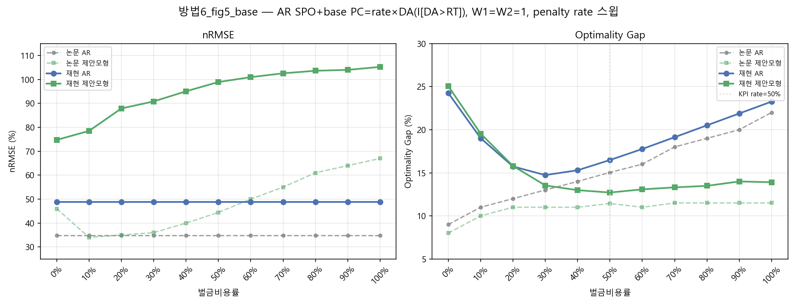
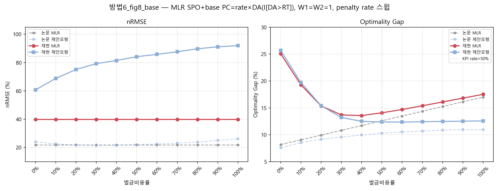
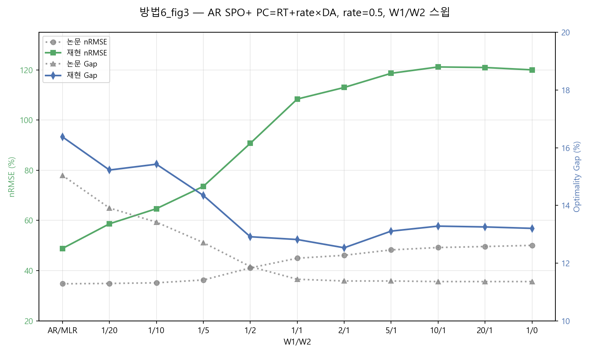
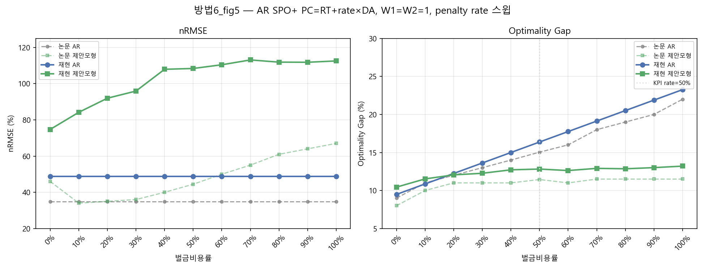
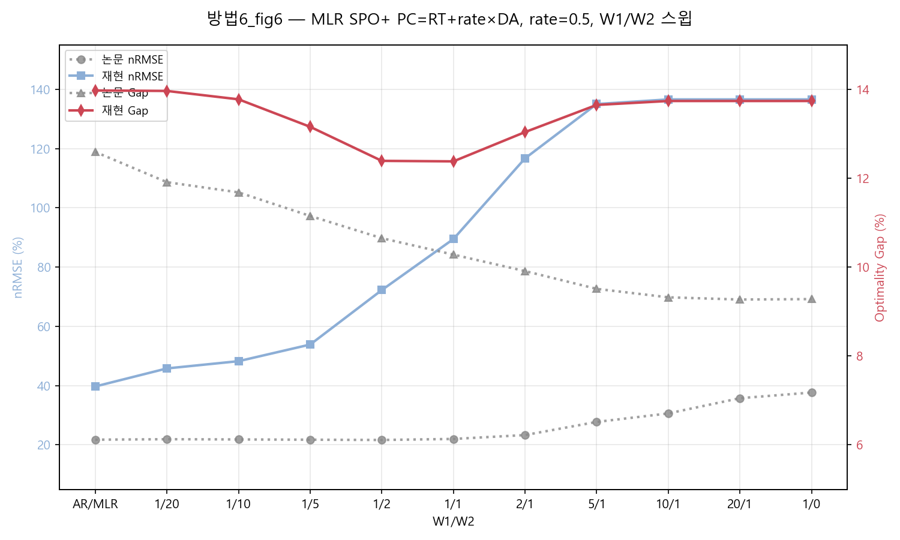
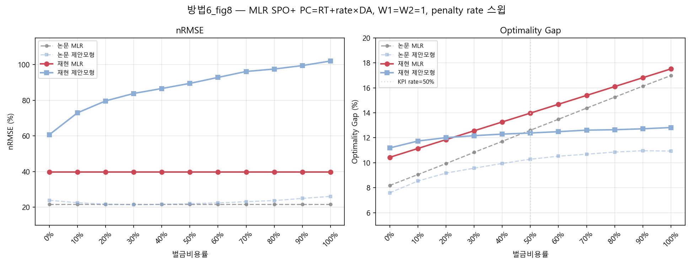

# APEN 실험결과 보고서

논문 제안 모형 재현 실험 정리 (원본 결과 문서 "APEN 결과, z03 block 18"의 내용을 각 절에 통합)

---

## 1. 서론

이 글은 APEN 논문(Karimi & Kwon, *Applied Energy* 326, 2022)을 보고, 그 안의 제안 모형을 직접 코드로 짜서 따라 해본 과정을 정리한 글이다. 태양광 발전량을 다음 날 예측해서 하루 전 시장에 얼마나 팔지 정하는 문제인데, 그냥 예측만 잘하는 게 아니라 "예측이 틀렸을 때 돈이 얼마나 새는지"까지 같이 고려해서 회귀 계수를 정하는 게 이 논문의 핵심 아이디어다.

---

## 2. 논문 분석 및 고려 사항

논문을 재현하는 과정에서 실제로 부딪혔던 구현 이슈들을 정리한다. (2.1~2.4절은 원본 결과 문서 "APEN 결과 (z03 block 18)"의 1~5절 내용을 그대로 옮겼고, 2.5절부터는 그 이후 세션에서 추가로 파고든 내용이다.)

### 2.1 Optimality gap이 음수로 나오던 문제

기존 구현에서는 평가용 오라클을 max{DP_t, RP_t}·S_t (약정량이 0인 경우와 실제 발전량만큼인 경우, 이 두 가지만 비교)로 계산하고 있었다. 그런데 코드를 다시 살펴보던 중, 이 모델의 이익함수가 x_t = S_t 를 기준으로 꺾이는 구간별 선형함수이고 약정범위가 [0,1] 로 정해져 있다 보니, 벌금율이 100%보다 낮을 때는 실제 발전량보다 더 많이 약정하는 쪽( x_t > S_t )이 더 유리해지는 구간이 존재할 수 있다는 걸 발견했다.

즉 기존에 쓰던 2가지 후보만으로는 x_t=1 (설비 최대 약정)인 경우를 놓치고 있었고, 그래서 계산된 오라클 값이 실제로 가능한 최댓값보다 작을 수 있었던 것으로 보인다. 이 때문에 모델이 초과약정을 하는 경우, 실현이익이 이 오라클 값을 넘어서면서 gap이 음수로 계산되는 현상이 나타난 것 같다.

이 부분은, 이익함수가 [0, S_t, 1] 구간에서 구간별 선형이라는 성질을 이용해서, 최댓값이 나올 수 있는 지점(양 끝점과 꺾이는 점) 세 곳을 전부 후보로 넣는 방식으로 보완했다. 학습용과 평가용 오라클 모두 {0, S_t, 1} 세 후보 중 최댓값을 쓰도록 수정했고, 이렇게 하면 모델의 약정량도 항상 [0,1] 안에 있으니 오라클이 실현이익보다 항상 같거나 크게 되어(오라클 ≥ 실현이익), 그 이후로는 gap이 음수로 나오는 경우가 없어진 것을 확인했다.

> **실제로 찾은 사례**: 2013년 12월 9일 오전 9시 데이터를 보면, 실제 발전량은 설비의 13%(S=0.13)였고, 하루전가격은 54.98, 실시간가격은 36.53, 벌금단가는 그 절반인 27.49였다.
>
> - 기존: "실제 발전량(13%)만큼만 약정" → 대략 215원 정도 버는 게 최선이라고 계산했다.
> - 그런데 실제로 "설비 최대(100%)까지 약정"해버리면 → 부족분(87%)에 대한 벌금을 다 물어도 대략 **932원**을 번다.

### 2.2 Gurobi solver 사용

이 작업에서는 기존에 쓰던 scipy(HiGHS) 기반 코드를 Gurobi(gurobipy)로 바꿔서 다시 구현했다. (이 변환 작업은 AI 도구의 도움을 받아 진행했다.)

바꾸는 과정에서, AR 모형은 무료 라이선스로도 문제 없이 잘 돌아갔지만, MLR 모형은 학습 관측치 수가 약 1,080개로 많아, Gurobi의 무료(size-limited) 라이선스 한도(변수·제약 약 2,000개)를 초과해서 (`Model too large for size-limited license` 오류) 실행되지 않았다. 이에 따라, scipy(HiGHS)가 Gurobi와 수학적으로 동일한 해를 낸다는 점에 근거하여, MLR 결과는 scipy(HiGHS)로 산출한 값을 사용했다. 추후 학교의 정식 Gurobi 라이선스를 발급받으면 동일 코드로 재실행하여 재확인할 계획이다.

### 2.3 Optimality gap이 논문과 안 맞던 문제

오라클을 위와 같이 고치고 나서도, gap 값이 논문에 보고된 값(대략 10~15% 수준)보다 훨씬 크게(25~35% 수준) 나오는 현상이 계속 있었다. 그리고 W1/W2 비율을 바꿔가며 Fig.3·Fig.6 형태로 그려보면, 특정 지점을 넘어가면 값이 갑자기 크게 튀어버리고 그 뒤로는 W1을 아무리 더 키워도 똑같은 값에 멈춰 있는(더 이상 안 움직이는) 모습이 계속 나타났다.

이걸 살펴본 결과, 논문 Eq.(1a)에 나온 그대로의 이익함수( DA·x + RT·surplus − PC·shortage , PC=0.5·DA )에 원인이 있는 것 같았다. 부족한 만큼 약정했을 때의 이익 기울기가 DA−PC = DA·(1−벌금율) 인데, 벌금율이 100%보다 낮으면 이 값이 항상 양수라서, 약정을 설비 최대( x=1 )까지 늘릴수록 계산상 이익이 계속 커지는 구조였다. 이 부분 때문에 학습이 "일단 최대한 많이 약정하자"는 쪽으로 쏠리면서, nRMSE가 100%를 넘는 수준까지 튀고 gap도 같이 왜곡되는 현상이 나타났던 것 같다.

이 부분을 보완해보기 위해, 부족비용에 실시간시장 가격을 함께 반영하는 두 가지 방식을 시도했고, 각각 생각한 근거는 다음과 같다.

- **(1) PC = RT + rate×DA 방식 (부족비용 = RT + rate×DA)**: 실제 전력시장에서는 하루전 약정을 못 지켰을 때, 계약상 벌금( PC )을 무는 것과는 별개로 부족한 만큼을 실시간시장에서 그 가격( RT )에 직접 사와야 하는 경우가 일반적인 정산 구조로 알고 있다. 벌금과 매입비용이 서로 다른 성격의 항목이라 둘 다 반영하는 게 맞지 않을까 싶어서 추가해본 것으로, 특정 논문에서 그대로 가져온 건 아니고 시장 정산 구조를 참고해서 자체적으로 시도해본 부분이다.
- **(2) Zhang et al.(2024)**("Improving Sequential Market Coordination via Value-oriented Renewable Energy Forecasting") **방식 (ρ₊=C·RT, ρ₋=RT)**: 이 논문에서, 상향조정가격(ρ₊)과 하향조정가격(ρ₋)을 하루전가격(ρ)과 다르게 두면서 ρ₊ > ρ > ρ₋ 가 성립해야 한다는 조건을 제시하고 있었다. 다만 논문에서는 이 세 가격을 각각 독립된 값으로 직접 지정하고 있었다(예시로 든 Table II에서도 발전기별 입찰가를 그렇게 따로따로 정해뒀다). 이 조건을 반영해보고 싶었으나 MISO 데이터의 하루전가격(DA)과 실시간가격(RT)에서는, ρ₊ 에 해당할 만한 별도 데이터가 없었다. 그래서 이미 잉여 가격으로 쓰고 있던 RT가 자연스럽게 ρ₋ 역할을 하고 있다고 보고, ρ₊ 만 새로 만들어야 하는 상황이었는데, 가장 간단한 방법으로 RT에 배수 C를 곱해서(ρ₊=C·RT) 만들었다. 이렇게 하면 ρ₊ > ρ > ρ₋ 라는 논문의 조건을 만족시킬 수 있고, C 하나만 조절해가며 차익거래가 남아있는 정도를 스윕해볼 수 있었다.

두 방식 모두 적용해본 결과, 초과약정 쪽으로 쏠리던 경향이 완화되면서 W1/W2 전 구간에서 비교적 안정적인 곡선을 얻을 수 있었고, gap 값도 원래보다 절반 이하 수준으로 줄어들어 논문에 보고된 값에 좀 더 가까워지는 것을 확인했다.

### 2.4 Zone 3, Block 18을 대표 사례로 선정

GEFCom2014의 3개 zone(z01, z02, z03) 각각에 대해 90일 학습/30일 테스트로 구성된 120일 롤링 블록 24개를 전수 평가했다. 그 중 기본(baseline) 모형의 nRMSE가 논문이 보고한 값에 가장 가깝게 나온 조합이 zone 3의 블록18(학습 2013-08-25~2013-11-22, 테스트 2013-11-23~2013-12-22)이었으며, 이후 모든 MLR 비교(Fig.6, Table 4 재현 등)는 이 블록을 대표 사례로 사용했다.

### 2.5 학습용 오라클과 평가용 오라클을 다르게 쓰는 이유

제안 모형(Eq.9)의 목적함수는 W1 항(달러 단위 경제손실)과 W2 항(0~1 비율 단위 예측오차, MAE)을 정수 비율(1,2,5,10,20 등)로 그냥 더한다. 두 항의 물리적 단위가 완전히 다르므로, W1 항을 "그 시간대에서 이론상 가능한 최대 이익"(`denom_h`)으로 나눠서 0~1 근처 크기로 맞춰주는 정규화가 필요했다. 이 `denom_h`를 구하는 오라클(학습용)과, nRMSE·gap을 최종 채점하는 오라클(평가용)은 서로 다른 후보 집합을 쓴다.

| | 학습용 오라클(`denom_h` 계산) | 평가용 오라클(Eq.13, 최종 gap 계산) |
|---|---|---|
| 후보 | {0, 실제발전량, 설비최대(1.0)} 3개 | {0, 실제발전량} 2개 |
| 근거 | 논문에 없음 — 외부 참고 구현(`operational_corrected`)에서 차용 | 논문 Eq.(13) + 5.1절 본문 그대로 |
| 후보를 줄이면(③ 제외) | 논문의 정상 비교점(W1=1,W2=20)에서조차 계수가 발산 — AR nRMSE가 38.6%→103.5%로 붕괴 | (해당 없음, 원래 이 정의를 씀) |

두 오라클을 똑같이 맞추고 싶은 게 자연스러운 직관이지만, 직접 실험해보니 **평가용 정의(2후보)를 학습에도 그대로 쓰면 W1=1,W2=20이라는, 논문이 실제로 검증한 "정상" 지점에서도 회귀계수가 발산**했다 — 시간대 11(오후 8시, 일몰 직전)에서는 학습표본 300개 중 286개가 극단(이진변수 필요) 상태로 몰렸다. 반대로 설비최대(③) 후보를 학습에만 남겨두면 같은 지점에서 안정적으로 수렴한다. 그래서 부득이하게 "학습은 3후보, 평가는 2후보"라는 비대칭 구성을 유지하고 있다.

### 2.6 W1/W2 정규화(denom) 자체가 논문 원문에 없다

PDF 원문(6페이지)의 Eq.(9a)를 다시 정밀 대조해봤는데, `denom_h` 정규화도 `scale = CAPACITY_MW × DURATION_HOURS`도 원문 어디에도 없었다. 논문은 그냥 "W1×(달러 단위 손실) + W2×(비율 단위 MAE)"를 정수 비율로 더하라고만 적어놨을 뿐, 두 항의 스케일을 어떻게 맞추는지는 서술하지 않는다. 즉 `denom_h` 정규화는 **논문을 그대로 구현하려다 발산해서, 외부 프로젝트의 임시방편을 빌려온 패치**였다는 걸 이번에 확인했다.

같은 분야("가치지향/decision-focused 재생에너지 예측")의 후속 연구들(예: arXiv:2310.00571 등)을 찾아봤는데, 이들은 대체로 W1/W2 같은 임의 가중치 없이, 이층 최적화(bilevel program)의 KKT 조건에서 손실함수를 직접 유도하는 방식을 쓴다 — 정확히 우리가 겪은 스케일 불일치 문제를 구조적으로 피해가는 방향이다. Eq.(9a)의 임의 가중합 방식이 사후적으로 보면 다소 임시방편적이었을 가능성을 뒷받침하는 정황이라고 볼 수 있다.

### 2.7 여러 solver로 교차검증 — 계수가 무너지는 게 정말 목적식 때문인지 확인

2.3절에서 짚은 "3항 이익식을 쓰면 계수가 한쪽 극단으로 쏠린다"는 현상이 혹시 우리가 쓰던 solver(scipy)만의 특이한 버릇은 아닌지 의심이 들어서, 성격이 서로 다른 solver 7종으로 같은 문제를 다시 풀어봤다.

| # | solver | 종류 | 비고 |
|---|---|---|---|
| 1 | scipy L-BFGS-B | 비선형(경사하강) | closed-form 목적함수를 직접 미분(수치미분), iteration마다 계수 궤적을 기록할 수 있음 |
| 2 | scipy linprog (HiGHS) | LP | y+/y- 를 [0,1] 상한을 가진 부가변수로 풀어서 LP로 변환 |
| 3 | scipy milp (HiGHS) | MILP | 위 LP에 상호배타 이진변수를 더해 정확한 해(`mip_rel_gap=1e-9`)를 구함 — 본문에서 주로 쓴 방식 |
| 4 | PuLP (CBC) | LP | 오픈소스 CBC 엔진 |
| 5 | cvxpy (SCS) | LP/conic | splitting 기반 conic solver |
| 6 | cvxpy (OSQP) | LP/QP | operator-splitting 방식 |
| 7 | cvxpy (CLARABEL) | LP/conic | 내부점법 |

(Gurobi도 시도했지만 2.2절에서 적은 것과 같은 이유로, MLR 쪽은 무료 라이선스 한도를 넘어서 이번 비교에서는 뺐다.)

결과는 명확했다 — **7종 solver가 전부 같은 해로 수렴했다.** 3항 이익식에서는 solver 종류와 관계없이 회귀계수가 똑같이 한쪽 극단(절편 β0→1, 나머지 계수→0)으로 쏠렸고, 방법2·Zhang처럼 이익식을 고친 버전에서는 7종 모두 완만한 곡선으로 수렴했다. 즉 2.3절에서 본 붕괴 현상은 **solver가 잘못 짜여서가 아니라, 3항 이익식 자체가 갖고 있는 구조적인 문제**라는 걸 이번 교차검증으로 다시 한 번 확인한 셈이다. 참고로 L-BFGS-B는 iteration별로 계수가 움직이는 과정을 그대로 기록할 수 있어서, α(절편)가 1.0으로 수렴해가는 모습을 궤적으로도 확인했다. LP 계열 solver들 사이에는 수렴 공차(tolerance) 차이로 소수점 이하 수준의 미세한 차이만 있었다.

---

## 3. 논문 재현 및 시도 방법

### 3.1 시도 방법 비교 정리

여섯 가지 방법을 한번에 놓고 보면, **방법 1(논문 수식)은 W1/W2를 어떻게 돌려도 특정 지점을 넘는 순간 nRMSE·Gap이 극단값으로 튀어 고정되는 포화 현상이 예외 없이 나타난다.** 이건 3항 이익식 자체에 "약정을 무조건 늘리는 게 유리해지는" 구조적인 허점이 있기 때문으로, 2.3절에서 짚은 문제와 같은 이야기다.

반면 **방법 2(PC=RT+rate×DA)와 방법 3(Zhang)은 그 포화 없이 완만한 곡선을 그리면서**, 논문 Table 3 지점(W1=1, W2=20)에서 각각 nRMSE +0.8%p, Gap +0.3~0.6%p 수준까지 좁혀졌다 — 여섯 방법 중 논문에 가장 가깝다. 방법 2는 논문 이익식(Eq.1a)에 빠져 있던 항을 그대로 살린 가장 직접적인 고침이고, 방법 3은 전력시장의 상향/하향 조정가격 구조를 반영한, 이론적으로 더 그럴듯한 설명이라는 차이가 있다.

**방법 4, 5는 벌금율(rate)이라는 손잡이가 하나 더 있어서**, rate=0.5로 고정한 지점만 보면 방법 1급으로 벌어지지만, 각자 잘 맞는 rate(방법4는 0.9, 방법5는 0.7)를 따로 찾으면 방법 2·3과 비슷한 수준까지 가까워진다. 다만 이건 손잡이가 하나 늘어난 만큼 맞춰야 할 게 하나 더 생긴다는 뜻이라, 방법 2·3보다 손이 더 간다.

**방법 6(SPO+)은 접근 자체가 다르다** — 이익식은 건드리지 않고 학습 목적함수를 SPO+로 바꿨다. Gap의 부호(음수→양수)는 고쳐졌지만 nRMSE는 여섯 방법 중 가장 크게 벌어져서, 근본 문제(DA−PC>0)를 없애지는 못했다 — PC를 방법2처럼 RT+rate×DA로 바꿔도 이 문제는 별로 나아지지 않는다(5.6절 참고).

**정리하면**: 3항 이익식을 문자 그대로 쓰는 한 재현은 어렵고, 부족분에 대한 값을 이익식에 제대로 반영해야(PC를 RT+rate×DA로 재정의하든, Zhang 비대칭이든, 혹은 벌금가 정의를 바꾸든) 논문 결과에 가까워진다는 게 여섯 방법을 통틀어 공통적으로 확인된 점이다.

**표. 시도 방법 6가지 요약**

| 방법 | 한 줄 요약 |
|---|---|
| 방법 1 | 논문을 문자 그대로 짠 것 (3항 이익식, PC = 0.5×DA, 보정 없음) |
| 방법 2 | 벌금가를 PC=RT+rate×DA로 재정의한 것 (3항 구조 유지) |
| 방법 3 | Zhang 방식 — 부족할 때 가격과 남을 때 가격을 다르게 둠 (부족가 = c×RT) |
| 방법 4 | 벌금가를 PC = rate×max(DA, RT)로 바꾼 것 |
| 방법 5 | 벌금가를 PC = rate×(DA + RT)로 바꾼 것 |
| 방법 6 | 이익식은 그대로 두고, W1 항의 내용을 손실(-profit) 대신 Smart SPO+ 후회(regret)로 바꾼 것 |

### 3.2 시도 방법 정리

아래 6가지 방법은 모두 논문 Eq.1a의 이익함수를 출발점으로 삼는다. 공통 표기:

$$x = \text{약정량}, \quad S = \text{실제발전량}, \quad y^+ = \max(S-x,\,0)\ (\text{잉여}), \quad y^- = \max(x-S,\,0)\ (\text{부족})$$
$$DA = \text{일간전력가격}, \quad RT = \text{실시간전력가격}, \quad PC = \text{부족 벌금가}$$

시험 결과(Fig.3/5/6/8)는 각 방법에 대응하는 5장으로 정리했다 — 방법 1~6 순서대로 5.1~5.6절 참고.

#### 3.2.1 방법 1 — 논문 공식

논문 Eq. 1a를 문자 그대로 3항으로 짜고, 벌금가도 PC = 0.5×DA로 그대로 뒀다.

$$\pi = DA \cdot x + RT \cdot y^+ - PC \cdot y^-, \qquad PC = 0.5 \cdot DA$$

부족분(shortage)이 나는 시간대($x>S$)만 떼어놓고 정리하면

$$\pi = DA \cdot x - PC \cdot (x - S) = (DA - PC) \cdot x + PC \cdot S$$

$PC = 0.5 \cdot DA$를 대입하면 $(DA-PC) = 0.5 \cdot DA > 0$이라, $x$(약정량)를 키울수록 이익이 계속 커지는 항이 남는다 — 즉 아무 제약 없이 약정을 최대한 늘리는 게 항상 유리한 구조다. 벌금율이 100%($PC=DA$)가 아닌 한 이 구조는 사라지지 않는다.

#### 3.2.2 방법 2 — PC = RT + rate × DA

방법 1처럼 부족분에 벌금(PC)만 물리는 대신, **부족분 비용 자체를 "실시간시장 매입비용(RT) + 벌금(rate×DA)"으로 재정의**했다. 논문 본문(Sec 3.1)이 "부족분은 실시간시장에서 사 와야 한다"와 "벌금은 하루전가격의 비율"을 각각 서술하고 있는데, Eq.1a에는 이 중 벌금(PC)만 반영돼 있고 매입비용(RT)이 빠져 있다 — 그 근거는 첨부 1 참고.

$$\pi = DA \cdot x + RT \cdot y^+ - PC \cdot y^-, \qquad PC = RT + rate \cdot DA \ \ (rate=0.5)$$

형태만 보면 방법 1과 똑같은 3항 구조(이익 = DA 수입 + RT 잉여매도 − PC×부족)다. 다만 PC 자체가 상수(0.5·DA)가 아니라 $RT + 0.5 \cdot DA$로 매 시간대 바뀐다는 게 다르다 — $PC$ 안에 $RT$가 들어가 있으므로, 예전에 "이익식에 −RT×부족 항을 따로 추가한 4항식"이라고 부르던 것과 대수적으로 정확히 같은 값이 나온다(부족분 비용 = $RT \cdot y^- + PC \cdot y^- = (RT+0.5DA) \cdot y^-$, 재정의된 $PC$를 쓰면 부족분 비용 = $PC \cdot y^- = (RT+0.5DA) \cdot y^-$로 동일). 즉 "항을 하나 더 추가한 것"이 아니라 "PC를 논문 서술에 맞게 다시 정의한 것"이라는 게 이번에 명확해진 부분이다.

부족분(shortage)이 나는 시간대만 떼어놓고 보면 이익 $= (DA-PC) \cdot x + PC \cdot S = (DA-RT-0.5DA) \cdot x + PC \cdot S = (0.5DA-RT) \cdot x + PC \cdot S$다. 논문 Fig.1이 보고하듯 대부분의 시간대에서 $DA > RT$이지만 $0.5DA$가 $RT$보다 작은 시간대(RT가 DA의 절반보다 큰 시간대)에서는 이 계수가 음수가 돼, 방법 1의 "약정을 무작정 늘리는 게 항상 유리한" 구조가 없어진다.

#### 3.2.3 방법 3 — Zhang 방식 (비대칭 가격)

**참조 논문**: Yufan Zhang, Honglin Wen, Yuexin Bian, Yuanyuan Shi, *"Improving Sequential Market Coordination via Value-Oriented Renewable Energy Forecasting"* (2024), arXiv:2405.09004 — GEFCom2014 **풍력** 발전량 데이터를 쓴다(이 프로젝트의 태양광과는 발전원이 다르지만 전력시장 정산 구조는 동일하게 적용된다). 같은 저자 그룹의 전신 연구인 *"Toward Value-Oriented Renewable Energy Forecasting"* (Zhang, Jia, Wen, Bian, Shi, 2023, arXiv:2309.00803, bilevel 프로그램 방식)도 참고했다.

**핵심 아이디어**: 전력시장에서는 "부족분을 급히 사오는 값"과 "남는 걸 파는 값"이 원래 다르다 — 과일가게가 마감 세일로 싸게 팔지만, 급히 물건이 모자라면 도매상에서 비싸게 사와야 하는 것과 같은 구조다. Zhang(2024)은 이 비대칭을 하루전-실시간 시장(day-ahead vs real-time)에 그대로 적용해, 상향조정가격(ρ₊, 부족분을 사오는 값)과 하향조정가격(ρ₋, 잉여를 파는 값)을 원문에서 서로 다른 값으로 둔다(ρ₊ > ρ > ρ₋, ρ는 하루전가격). 우리는 이 비대칭 아이디어만 빌려와 MISO 데이터에 맞게 근사했다 — 별도의 벌금(PC) 항 없이, 부족가 자체를 RT의 c배로 정의한다.

$$\pi = DA \cdot x + \rho_- \cdot y^+ - \rho_+ \cdot y^-, \qquad \rho_- = RT, \quad \rho_+ = c \cdot RT \ \ (c > 1,\ \text{본문 } c=1.0\sim3.0)$$

**왜 구조적으로 무너지지 않는가**: 방법 1(3.2.1절)이 무너진 원인은 부족 시간대의 이익 기울기가 $DA - PC = 0.5 \cdot DA > 0$으로 항상 양수라서, 약정을 늘릴수록 이익이 커졌기 때문이다. Zhang 방식에서는 이 기울기가 $DA - \rho_+ = DA - c \cdot RT$가 된다. 예를 들어 $DA=50$, $RT=40$, $c=1.5$면 $\rho_+=60$이고 $DA-\rho_+=-10<0$ — 약정을 0.1 늘리면 DA 수입은 5원 늘지만 $\rho_+$ 손실은 6원 늘어 순손해가 난다. 즉 인위적인 벌금 없이 **시장 가격 구조 자체가 과다 약정을 막는다**.

**방법 2(3.2.2절)와의 차이**: 두 방식 모두 부족분 손해를 RT보다 크게 만들지만 방식이 다르다.

| | 부족분 손해 | 특징 |
|---|---|---|
| 방법 2 | $RT + rate \cdot DA$ | PC(=$rate \cdot DA$)를 RT에 더함 — DA가 변하면 손해액도 변함 |
| 방법 3(Zhang) | $c \cdot RT$ | RT에 배수 c를 곱함 — RT만 보면 되는 더 단순한 구조 |

이론적으로는 방법 3이 더 그럴듯한 설명이다 — 방법 2의 "RT 매입비용 + 벌금"은 시장 정산 구조를 참고해 자체적으로 구성한 것(첨부 1)인 반면, 방법 3은 Zhang(2024)이 실제 전력시장 데이터로 뒷받침한 비대칭 가격 구조를 그대로 가져온 것이기 때문이다.

**c값은 어떻게 골랐나**: c=1.0(대칭, ρ₊=ρ₋)부터 3.0까지 스윕해서 논문(Table 3, W1=1·W2=20 지점)과 가장 가까운 값을 찾았다.

| c | $\rho_+$ | 평가 |
|---:|---|---|
| 1.0 | RT | 비대칭 없음 — 방법 1과 비슷하게 무너짐 |
| 1.2 | 1.2·RT | 비대칭이 약해 무너짐이 덜 줄어듦 |
| **1.5** | **1.5·RT** | **✅ 논문과 가장 가까움 (AR nRMSE 35.68%, Gap 14.19%, 5.3절 참고)** |
| 2.0 | 2.0·RT | 부족분 손해가 과해져 Gap이 다시 벌어짐 |
| 3.0 | 3.0·RT | 손해가 지나치게 커져 Gap 20~30%대로 악화 |

**장단점**: (+) 인위적 벌금(PC) 없이 시장 가격 구조만으로 과다 약정을 방지한다. (+) 조정 변수가 c 하나뿐이라 방법 4·5의 rate보다 단순하다. (+) Zhang(2024)의 실제 시장 데이터로 뒷받침된 이론적 근거가 있다. (−) c값을 정하는 기준이 명확하지 않다 — 실제로는 ρ₊가 시간대별로 달라질 수 있는데 여기서는 상수배로 단순화했다. (−) 실험 결과는 방법 2와 거의 차이가 없다(5.3절).

#### 3.2.4 방법 4 — PC = rate × max(DA, RT)

벌금가를 DA와 RT 중 더 큰 쪽에 비례하게 정했다.

$$\pi = DA \cdot x + RT \cdot y^+ - PC \cdot y^-, \qquad PC = rate \cdot \max(DA, RT)$$

RT가 DA보다 비싼 시간대라면 벌금이 더 세지니까, 방법 1의 허점(무조건 약정을 늘리는 게 유리한 구조)이 그 시간대만큼은 없어진다. 다만 $RT<DA$인 시간대에는 $PC<DA$(=0.5DA 기준 방법1과 동일)가 남아 그 구간에서는 여전히 허점이 존재한다.

#### 3.2.5 방법 5 — PC = rate × (DA + RT)

벌금가를 DA와 RT를 더한 값에 비례하게 정했다.

$$\pi = DA \cdot x + RT \cdot y^+ - PC \cdot y^-, \qquad PC = rate \cdot (DA + RT)$$

방법 4와 같은 형태지만, RT가 충분히 크면 PC가 DA를 넘어설 수 있어($rate \geq 0.5$일 때 $RT \geq DA$만 되면 $PC>DA$) 방법 4가 갖고 있던 "PC<DA인 구간"의 허점이 메워진다.

#### 3.2.6 방법 6 — Smart SPO+

**참조 논문**: Elmachtoub, A. N., & Grigas, P., *"Smart 'Predict, then Optimize'"* (2022), Management Science 68(1), 9–26 (arXiv:1710.08005) — SPO+를 처음 제안한 논문이다.

방법 1~5는 전부 **이익식(profit formula)** 자체를 고치는 접근이었다. 방법 6은 반대로 이익식(PC=rate×DA 또는 방법2의 PC=RT+rate×DA)은 그대로 두고, **학습 목적함수**의 내용을 바꿨다 — "예측이 얼마나 틀렸는가"가 아니라 "그 예측으로 내린 약정 결정이 최선의 결정(oracle)보다 얼마나 손해를 봤는가"(**후회, regret**)를 직접 줄이는 방식이다.

**원 논문과 이 프로젝트에서 바꾼 점**: 원 논문의 SPO+는 예측값이 연속적인 **선형계획(LP)** 문제에 그대로 흘러 들어가는 일반적인 decision-focused learning 틀이고, 후회(regret)를 볼록(convex)하게 근사한 손실(surrogate loss)을 LP 쌍대(dual)에서 유도한 닫힌 형태 그래디언트로 학습한다 — W1/W2 같은 가중치 개념 자체가 없다. 이 프로젝트에서는 세 가지를 바꿔서 적용했다: ① 원 논문의 연속 LP가 아니라, 이진변수(초과/부족 여부)가 있는 **MILP**(이 프로젝트의 day-ahead commitment 문제)에 맞춰 후회를 세 개의 부등식 제약(ζ_i ≥ oracle 후보별 이익 − 실현 이익)으로 직접 표현했다. ② LP 쌍대에서 유도하는 원 논문의 오라클 대신, 2.5절에서 쓴 **3후보 오라클**(약정 0, 실제발전량, 설비최대)을 그대로 재사용했다. ③ 원 논문은 SPO+ loss 하나만 최소화하지만, 이 프로젝트는 논문 Eq.(9a)의 **W1/W2 가중합 구조를 그대로 유지**한 채 W1 항의 내용만 "손실(−profit)"에서 "후회(ζ)"로 바꿨다(목적함수: $\min W1/n \cdot \Sigma\zeta_i + W2/n \cdot \Sigma|e_i|$) — 원 논문에는 없는, 이 프로젝트의 방법1~5와 비교하기 위한 절충이다.

**후회(regret) 정의**: 시간대 $i$의 후회 $\zeta_i$ = oracle이 벌 수 있었던 최대 이익 − 내 예측(β)으로 실제로 번 이익. oracle은 2.5절에서 쓴 3후보(약정 0, 실제발전량 $S_i$, 설비최대 1.0) 중 가장 이익이 큰 것이다. MILP에서는 이를 세 개의 부등식으로 표현한다 — 가장 큰 하한이 곧 $\zeta_i$ 값이 되므로, 세 후보 중 가장 후회가 큰 쪽이 자동으로 선택된다.

$$\zeta_i \geq \pi_i(x{=}0) - \pi_i(\beta), \quad \zeta_i \geq \pi_i(x{=}S_i) - \pi_i(\beta), \quad \zeta_i \geq \pi_i(x{=}1) - \pi_i(\beta), \quad \zeta_i \geq 0$$

**목적함수 비교**(W2/MAE 항은 두 방법이 동일하고, W1 항만 다르다):

$$\text{방법 2:}\ \ \min\ \frac{W_1}{n}\sum_i \big(-\pi_i(\beta)\big) + \frac{W_2}{n}\sum_i |e_i| \qquad\qquad \text{방법 6:}\ \ \min\ \frac{W_1}{n}\sum_i \zeta_i + \frac{W_2}{n}\sum_i |e_i|$$

이 후회 상한 제약(3개 부등식×n) + $\zeta_i \geq 0$(n개)이 추가되면서, 방법 6의 제약 개수는 방법 2(등식 2개×n)의 2.5배(5×n)로 늘어난다. (실제 z01 스크립트에서는 이를 surplus/shortage 방향별 선형 비용 계수(`surplus_cost = -W_1 \cdot RT + W_2/n`, `shortage_cost = W_1 \cdot RT + W_2/n`)로 분해해 구현했다.)

**결론**: 구현은 방법 2보다 훨씬 복잡해졌지만, 근본적인 $DA-PC>0$ 문제 자체를 바꾸지는 못했다 — 이익식(틀) 자체가 기울어 있으면 목적함수만 바꿔서는 해결되지 않는다는 뜻이다. 다만 Gap의 부호(음수→양수)는 고쳐져서, 이익식이 이미 올바른 방법 2·3과 같이 쓸 보조적 접근으로는 가능성이 있다. 자세한 결과는 5.6절 참고.

### 3.3 KPI 비교 (W1=1, W2=20, 벌금율 50%)

논문 Table 3(AR)·Table 4(MLR)이 비교 기준으로 삼는 지점(W1=1, W2=20, 벌금율 50%)에서, "AR+MLR 통합, W1/W2·penalty rate 스윕, Fig.3/5/6/8을 한 파일에서 바로 생성"하는 2세대 통합 스크립트로 여섯 방법을 나란히 놓고 논문과의 격차(Δ)를 정리했다. 데이터셋은 2.4절 대표 사례(z03/블록18)가 기본이고, 방법6+2만 z01/블록21이다(표에 표기).

#### 3.3.1 AR KPI 비교

**표 1. AR KPI 논문 대비 Δ** (2세대 통합 스크립트, 논문 Table 3 대응)

| 방법 | AR nRMSE | AR Gap | 논문 대비 Δ nRMSE | 논문 대비 Δ Gap | 평가 |
|---|---:|---:|---:|---:|---|
| 방법2 (PC=RT+rate×DA) | 35.69% | 14.54% | +0.80%p | +0.63%p | 가장 가까움 |
| 방법3 (Zhang c=1.5) | 35.68% | 14.19% | +0.79%p | +0.28%p | 가장 가까움 |
| 방법5 (PC=DA+RT) | 37.63% | 10.33% | +2.74%p | -3.58%p | Gap이 논문보다 작음 |
| 방법1 (논문 원식 3항) | 36.29% | -1.09% | +1.40%p | -15.00%p | Gap 부호까지 반전 (구조적 붕괴) |
| 방법4 (PC=max(DA,RT)) | 43.64% | 22.04% | +8.75%p | +8.13%p | 가장 크게 벌어짐 (rate=50%가 이 방법의 최적점이 아니라서 그렇다 — 5.4절 참고) |
| 방법6+2 (SPO+×방법2, z01) | 48.93% | 16.23% | — | — | 다른 블록(z01) 데이터라 직접 비교는 참고만 |
| AR baseline (일반 회귀) | 36.11% | 10.7~25.0%\* | +1.22%p | — | 참고 |
| 논문(Table 3) | 34.89% | 13.91% | — | — | 기준 |

\* baseline(AR을 그냥 bounded LAD로만 학습한 값)의 nRMSE는 PC 정의와 무관하게 항상 36.11%로 같지만, Gap은 각 방법의 PC 정의로 채점하기 때문에 방법마다 다르게 나온다.

방법2·3(PC=RT+rate×DA·Zhang 비대칭)이 Δ nRMSE 1%p 이내, Δ Gap 0.7%p 이내로 논문에 가장 가깝다. 방법1(논문 원식)은 nRMSE는 그럭저럭 맞지만 Gap 부호까지 반전되는 구조적 붕괴를 보이고, 방법4(PC=max)는 rate=50% 고정 지점에서 nRMSE·Gap 둘 다 가장 크게 벌어진다(최적 rate는 0.9 근처 — 5.4절). 방법6+2(SPO+×방법2)는 z01/블록21 데이터라 직접 비교는 참고용이다.

#### 3.3.2 MLR KPI 비교

같은 2세대 통합 스크립트의 MLR 결과(논문 Table 4 대응)를 같은 형식으로 정리했다.

**표 2. MLR KPI 논문 대비 Δ** (2세대 통합 스크립트, 논문 Table 4 대응)

| 방법 | MLR nRMSE | MLR Gap | 논문 대비 Δ nRMSE | 논문 대비 Δ Gap | 평가 |
|---|---:|---:|---:|---:|---|
| 방법2 (PC=RT+rate×DA) | 24.07% | 11.49% | +2.15%p | -0.42%p | 거의 일치 |
| 방법3 (Zhang c=1.5) | 24.07% | 11.36% | +2.15%p | -0.55%p | 거의 일치 |
| 방법5 (PC=DA+RT) | 24.25% | 10.94% | +2.33%p | -0.97%p | 거의 일치 |
| 방법4 (PC=max(DA,RT)) | 29.03% | 24.92% | +7.11%p | +13.01%p | 많이 벌어짐 (rate=50%가 이 방법의 최적점이 아니라서 그렇다 — 5.4절 참고) |
| 방법6+2 (SPO+×방법2, z01) | 43.03% | 14.78% | — | — | 다른 블록(z01) 데이터라 직접 비교는 참고만 |
| MLR baseline (일반 회귀) | 24.43% | 10.9~27.7%\* | +2.67%p | — | 참고 |
| 논문(Table 4) | 21.92% | 11.91% | — | — | 기준 |

방법2·3·5는 MLR에서도 Δ nRMSE +2%p대, Δ Gap 1%p 이내로 AR과 비슷하게 잘 맞는다 — 3.1절에서 AR 기준으로 내린 "이익식에 부족분 비용을 제대로 반영해야 재현된다"는 결론이 MLR에서도 그대로 성립한다는 뜻이다. 방법4는 AR·MLR 둘 다 가장 크게 벌어진다는 점도 일관되며, nRMSE는 방법에 관계없이 MLR 쪽이 전반적으로 논문보다 +2%p 안팎 높게 나오는 경향이 있다 — 외생 변수(dSSRD, dTSR)를 쓰는 MLR 특성상 90일(z03/블록18) 학습 데이터로는 논문(정확한 기간 미공개)만큼 변수 관계를 못 잡는 것으로 보인다.

---

## 4. Dataset 분석

### 4.1 계절별 전수조사 (호주 기준, AR baseline nRMSE)

GEFCom2014 3개 zone(z01, z02, z03) × 24~25개 블록 = 75개 블록을 전수조사해서, 계절에 따라 AR baseline(LAD 회귀) 예측 난이도가 얼마나 다른지 확인했다. 계절은 호주(남반구) 기준 — 여름(12~2월), 가을(3~5월), 겨울(6~8월), 봄(9~11월) — 이며, 발전 시간대만 계산했다.

#### 4.1.1 계절별 요약 통계

| 계절 | 개수 | 평균 | 최소 | 최대 | 표준편차 |
|------|------|------|------|------|---------|
| **여름** | 18 | **40.9%** | **27.6%** | 56.0% | **8.2** |
| 겨울 | 18 | 57.7% | 43.0% | 82.4% | 10.9 |
| 봄 | 18 | 68.9% | 41.8% | 122.2% | 23.1 |
| 가을 | 21 | 168.6% | 58.7% | 722.7% | 165.4 |

- **여름(12~2월)**이 압도적으로 nRMSE가 낮고 표준편차도 작다 — 가장 예측이 쉽고 안정적인 계절. 전체 75개 블록 중 AR nRMSE 상위 10개도 전부 여름 블록이라, 이 결론을 그대로 뒷받침한다(1위 Z1/블록7 27.59%).
- **가을(3~5월)**이 가장 어렵고 표준편차도 매우 크다 — 블록에 따라 예측 난이도 편차가 심하다.

#### 4.1.2 계절별 가장 좋은 블록 1개씩

| 계절 | 존 | 블록 | 전체 구간(120일 = 학습90+테스트30) | 테스트 구간(30일) | AR nRMSE |
|------|-----|------|-----------|-----------|----------|
| **여름** | Z3 | 18 | 2013-08-25~2013-12-22 | 2013-11-23~2013-12-22 | **34.01%** |
| 겨울 | Z1 | 1 | 2012-04-02~2012-07-30 | 2012-07-01~2012-07-30 | 42.95% |
| 봄 | Z3 | 3 | 2012-06-01~2012-09-28 | 2012-08-30~2012-09-28 | 41.79% |
| 가을 | Z1 | 21 | 2013-01-26~2013-05-25 | 2013-04-26~2013-05-25 | 48.84% |

*(여름 자리는 75개 블록 전수조사에서 계절별 최고 성능 블록 대신, 이 보고서가 실제로 쓴 대표 블록 **z03/블록18**로 바꿔 넣었다 — 여름 계절 내 진짜 최고는 Z1/블록7(27.59%, 4.1.1절)이지만, z03/블록18도 6위(34.01%)로 여름 블록 중 상위권이라 큰 무리는 없다. 가을 자리도 같은 이유로 **z01/블록21**로 바꿔 넣었다 — 이 블록이 이 보고서에서 방법6+2 교차검증(4.1.3절, 5.6절)에 실제로 쓰인 가을 대표 블록이다. nRMSE 48.84%는 75개 블록 전수조사 값(159.9%, 출처 스크립트 소실로 검증 불가)이 아니라 `integrated_4term_ar_mlr_z01_block21.py`를 다시 돌려 확인한 값이다.)*

계절 내에서 대표적으로 좋은 블록만 골라도 여름(34.01%)과 가을(48.84%)의 격차는 1.4배 정도다 — 데이터셋 자체의 계절성이 nRMSE에 미치는 영향이 있다는 방향은 유지되지만, 격차 자체는 75개 블록 전수조사가 보여주던 것만큼 극단적이지는 않다.

#### 4.1.3 이 보고서가 쓴 두 블록은 어디에 해당하나

이 보고서 전체에서 대표 사례로 쓴 **z03/블록18**은 75개 블록 중 **호주 여름**에 해당하는, 전체적으로 예측이 쉬운 축에 속하는 블록이다(2.4절에서 이 블록을 고른 기준은 "baseline nRMSE가 논문 값에 가장 가깝다"는 것이었는데, 결과적으로 계절 난이도 면에서도 가장 유리한 축에 속해 있었던 셈이다). 반대로 방법6+2 교차검증에 쓴 **z01/블록21**은 **호주 가을**에 해당하고, baseline nRMSE도 z03/블록18(36%대)보다 다소 높다(48.8%대) — 방법6+2의 nRMSE가 다른 방법들보다 훨씬 높게 나온 이유(5.6절) 중 일부는 이 계절 난이도 차이로 설명될 수 있다.

### 4.2 선택된 데이터세트 분석

4.1절에서 고른 계절별 대표 블록 4개(여름 z03/블록18, 겨울 z01/블록1, 봄 z03/블록3, 가을 z01/블록21)에 대해, 논문 Fig.1이 보여주는 **"시간대별 DA(하루전가격) vs RT(실시간가격)"** 구조를 직접 그려보고, "DA는 하루 중 모든 시간대에서 RT보다 높다"는 논문의 데이터셋 특성이 이 프로젝트가 쓰는 GEFCom2014 데이터에서도 그대로 성립하는지 확인한다. 태양광 발전 프로파일도 같이 그려서, 가격 구조와 발전 시점이 어떻게 맞물리는지도 함께 본다.

#### 4.2.1 그림

각 블록의 120일치 데이터를 `local_hour`(0~23) 기준으로 묶어서 시간대별 평균 DA·RT 가격, 평균 태양광 발전량을 계산했다.

- **위 행(4칸)**: 논문 Fig.1과 같은 형식 — 시간대(0~23시)별 DA(파랑)·RT(주황) 가격을 **박스플롯**으로 그렸다. 박스는 25~75% 구간(사분위), 안쪽 선은 중앙값, 수염은 박스 경계에서 1.5×IQR까지다. 논문 Fig.1과 마찬가지로 범례를 그림 맨 위에 한 번만 뒀다.
- **아래 행(4칸)**: 같은 시간축에서 평균 태양광 발전량(주황) — 논문에는 없는, 가격과 발전 시점이 어떻게 맞물리는지 보려고 추가한 그래프다.

#### 4.2.2 시간대별 통계 요약

| 계절(블록) | 24시간 전체 중 DA>RT | 발전시간대만 DA>RT | 발전시간대 평균(DA−RT) | 평균 DA가격 | 평균 RT가격 | 발전 피크 시각 |
|---|---:|---:|---:|---:|---:|---:|
| 여름 z03/18 | 14/24 (58%) | **12/13 (92%)** | +1.03 | 30.2 | 30.0 | 12시 |
| 겨울 z01/1 | 18/24 (75%) | **9/10 (90%)** | +2.00 | 28.2 | 27.6 | 12시 |
| 봄 z03/3 | 16/24 (67%) | **10/11 (91%)** | +2.32 | 29.0 | 28.4 | 12시 |
| 가을 z01/21 | 13/24 (54%) | **5/12 (42%)** | -0.56 | 30.3 | 30.3 | 12시 |

#### 4.2.3 논문 데이터셋 특성(첨부 1 근거5: "DA > RT at all hours")과 비교

**24시간 전체로 보면 논문 주장이 정확히 맞지 않는다.** 네 블록 다 DA>RT가 "모든 시간대"가 아니라 **54~75%에서만** 성립한다. RT가 DA를 넘는 시간대는 주로 새벽·야간(발전이 없는 시간)에 몰려 있다 — 그림에서 DA·RT 박스가 하루 두 번(새벽·저녁) 높아지는데, 그 부근에서 RT 중앙값이 DA를 잠깐씩 추월하는 게 보인다.

**발전시간대만 보면 대체로 논문 주장이 더 잘 맞지만, 가을은 예외다.** 여름·겨울·봄 세 블록은 발전 중인 시간(발전량 > 0)만 걸러서 보면 DA>RT가 **90~92%**로 거의 모든 발전시간대에서 성립하고, 평균 격차도 뚜렷한 양수(+1.0~+2.3)다. 방법1(3항식)의 DA−PC>0 붕괴 문제는 애초에 발전량이 있을 때만 작동하는 메커니즘이므로, 세 블록만 보면 첨부 1의 "DA>RT" 근거는 24시간 전체가 아니라 **발전시간대로 좁혀서 읽어야 더 정확**하다고 말할 수 있었다.

그런데 가을(z01/블록21, 2013-01-26~2013-05-25)로 보니 이야기가 달라진다. 발전시간대(12시간) 중 DA>RT는 **5/12(42%)뿐**이고, 평균 격차도 **-0.56으로 오히려 음수**다 — 발전 중일 때조차 RT가 DA보다 살짝 더 비싼 쪽으로 기운 블록이라는 뜻이다. 세 블록만 보고 내린 "발전시간대로 좁히면 논문과 잘 맞는다"는 결론이 모든 블록에 그대로 적용되는 게 아니라, **블록(계절·시기)에 따라 DA>RT 구조 자체가 깨질 수 있다**는 걸 이 가을 블록이 보여준다.

**발전 피크와 가격 저점이 겹친다(여름·겨울·봄).** 여름·겨울·봄 세 블록은 DA/RT 둘 다 이중 봉우리(새벽·저녁 높고 낮 12~14시 부근 저점) 모양인데, 태양광 발전은 정확히 그 저점 시간대(10~14시)에 최고점을 찍는다 — **발전량이 가장 많을 때 팔 수 있는 가격은 가장 낮다.** 논문이 명시적으로 다루지 않는 부분인데, 방법1(3항식)이 무너지는 구조(DA−PC>0)에 "정작 남는 전기가 제일 많을 때 마진이 제일 얇다"는 현실적 압박이 하나 더 얹히는 셈이다. 가을 블록은 낮 시간대 가격이 다른 세 블록만큼 뚜렷하게 저점을 그리지 않아서, 이 특징이 계절 공통이 아니라 **블록마다 다르게 나타날 수 있는 현상**이라는 것도 같이 확인됐다.

**가을(z01/블록21)은 가격 수준이 아니라 DA/RT 구조 자체가 다른 블록이다.** 평균 DA(30.3)·평균 RT(30.3)는 나머지 세 블록(28~30)과 비슷한 수준이라, "가격 레짐 자체가 다르다"는 설명은 맞지 않는다. 대신 이 블록은 **DA와 RT의 우열 관계 자체가 나머지 세 블록과 반대로 뒤집혀 있다**(발전시간대 기준 DA>RT 42%, 평균 격차 음수). AR baseline nRMSE가 48.84%로 다른 세 블록보다 훨씬 나쁘게 나오는 것도(4.1절), 단순히 계절적 발전 패턴 차이가 아니라 이 DA/RT 역전 구조와 관련이 있을 가능성이 있다.

---

## 5. 실험 및 개선 결과

방법별로 W1/W2 스윕(Fig.3/6 계열)과 벌금율 스윕(Fig.5/8 계열) 그래프를 논문값과 나란히 놓고 비교한 결과다. 각 방법(5.1~5.6절)마다 Fig.3(AR, W1/W2)·Fig.5(AR, 벌금율)·Fig.6(MLR, W1/W2)·Fig.8(MLR, 벌금율) 4종을 전부 실었다. 이후 6가지 방법 전부를 "AR+MLR 통합, W1/W2·penalty rate 스윕, Fig.3/5/6/8을 한 파일에서 바로 생성"하는 동일한 틀로 다시 짠 2세대 스크립트로도 교차검증했다 — 각 절 말미에 그 결과를 같이 적어뒀다.

*(그림 범례의 한글이 네모(□)로 깨져 보이는 건 이 실행 환경에 한글 폰트가 없어서다 — 축 제목 등 영문은 정상 표시되고, 데이터 자체에는 영향 없다.)*

### 5.1 시도방법 1: 논문 공식

방법 1은 논문 Eq. 1a를 문자 그대로 3항으로 짠 것이다(PC=0.5×DA, 수식은 3.2.1절 참고). AR·MLR, W1/W2·벌금율 스윕 전 구간(Fig.3/5/6/8)에서 논문 곡선과 겹쳐 비교한 결과는 다음과 같다.

#### 5.1.1 First Simulation Result

- **Fig.3(AR, W1/W2 스윕)**: W1 비중이 커질수록 nRMSE가 36%(AR)에서 76%(1/10)를 거쳐 1/5 지점부터 116% 안팎으로 튀어 오른 뒤 그 이후(1/2~1/0)로는 전혀 움직이지 않고 고정된다 (완전히 극단에 붙어버린 상태). gap은 반대로 25%(AR)에서 시작해 1/5 지점부터 3.4%까지 뚝 떨어진 뒤 역시 고정된다.
- **Fig.5(AR, 벌금율 스윕, W1=W2=1)**: nRMSE는 벌금율 0~70% 구간 내내 115% 안팎에서 고정돼 있다가, 80~90%에서 잠깐 120%까지 더 올라간 뒤 100%에서야 68%로 뚝 떨어진다. gap은 기본 AR(36%→8%로 선형 감소)과 제안 모형(2%에서 시작해 8%까지 서서히 증가)이 서로 반대 방향으로 움직이다가 100% 지점에서 둘 다 8% 근처로 만나는 모양이다.
- **Fig.6(MLR, W1/W2 스윕)**: nRMSE가 MLR(24%)에서 1/20(31%)까지 오르다가 1/10 지점부터 115% 안팎으로 튀어 고정된다. gap은 반대로 29% 안팎에서 시작해 1/10 지점부터 3~4% 선으로 떨어진 뒤 고정된다.
- **Fig.8(MLR, 벌금율 스윕)**: nRMSE는 MLR 24% 고정, 제안 모형은 90%까지 115% 안팎에 머물다가 100%에서 MLR 수준(약 28%)까지 큰 폭으로 떨어진다. gap은 MLR이 41%에서 8% 안팎까지 거의 선형으로 감소하고, 제안 모형은 2%에서 시작해 100%에서 8% 안팎까지 서서히 올라 두 선이 끝에서 서로 만나는, AR Fig.5와 방향이 반대로 움직이는 모양이다.

_AR_MLR_baseline_proposed_3가지_profit_figure코드/fig3_ar_original.png)

_AR_MLR_baseline_proposed_3가지_profit_figure코드/fig5_ar_original.png)

_AR_MLR_baseline_proposed_3가지_profit_figure코드/fig6_mlr_original.png)

_AR_MLR_baseline_proposed_3가지_profit_figure코드/fig8_mlr_original.png)

W1 비중이 커지면(z03 기준 5/1 이상) 116.45%/4.62%로 포화된다 — 이건 **방법1(PC=0.5×DA)의 구조적 한계**다. 3.2.1절에서 본 것처럼 PC=0.5·DA는 항상 DA보다 작아서 "약정을 늘릴수록 유리한" 구간이 모든 시간대에 남아있는데, W1 비중이 낮을 때는 W2(예측오차) 항이 이 유인을 눌러주다가 W1이 일정 임계값을 넘어서면 이 구조적 유인이 우세해지면서 다시 포화가 나타나는 것으로 보인다(방법4·5는 PC 정의를 바꿔 이 구간 자체를 줄이거나 없앤다 — 자세한 비교는 5.4·5.5절 참고).

### 5.2 시도방법 2: PC = RT + rate × DA

#### 5.2.1 초기 시험 (1세대)

방법 2는 방법 1의 벌금가(PC)를 $RT + rate \cdot DA$로 재정의해, 3항 구조를 유지하면서 부족분의 실시간시장 매입비용을 반영한 것이다(수식은 3.2.2절, 논문 근거는 첨부 1 참고). 원본 결과 문서("APEN 결과 (z03 block 18)")의 "5. 3가지 profit 식 비교 결과 종합" 중 이 방법(문서에서는 "4항 수정"이라 불렀다) 부분을 옮기면 다음과 같다.

**AR — Fig.3 (W1/W2 비율 스윕)**: 포화 없이 36%에서 68%까지 W1 비중에 따라 완만하게 상승하고, Gap은 15%에서 10.7% 선까지 완만하게 하락한 뒤 거의 평평하게 유지된다. 논문 곡선과 비교하면 초반(AR~1/5 구간)에는 nRMSE가 논문보다 낮게 나오다가, W1 비중이 커지는 후반부로 갈수록 논문보다 높게 벌어지는 모습이다.

**AR — Fig.5 (벌금율 스윕, W1=W2=1)**: nRMSE가 0%에서 95%로 시작해 10%만 돼도 65%까지 급락하고, 이후 완만하게 내려가 60% 부근에서 53%로 최저점을 찍은 뒤 다시 68%까지 서서히 올라가는 U자형이다. 기본 AR은 벌금율과 무관하게 여전히 36%로 평평하다.

**MLR — Fig.6 (W1/W2 비율 스윕)**: nRMSE가 24%(MLR)~23%(1/20~1/10) 선에서 거의 안 움직이다가 1/5 지점부터 서서히 올라 1/0에서 53%까지 상승한다. Gap은 11%대에서 시작해 1/2 부근에서 10% 선으로 최저점을 찍고, 이후 10.2~10.3% 선에서 거의 평평하게 유지된다.

**MLR — Fig.8 (벌금율 스윕, W1=W2=1)**: nRMSE가 0%에서 51%로 높게 시작했다가 10%에 24%로 급락하고, 이후 서서히 올라 100%에서 54%에 도달한다(U자형에 가깝지만 저점이 아주 초반에 있는 모양). Gap은 MLR이 14%에서 시작해 30% 부근에서 10%로 최저점을 찍은 뒤 다시 16%까지 올라가는 U자형이고, 제안 모형은 13%에서 시작해 같은 30~40% 부근에서 9.8~10% 선으로 내려간 뒤 10.5% 선까지만 완만하게 오른다 — MLR은 U자로 크게 출렁이는데 제안 모형은 그보다 훨씬 좁은 범위 안에서 움직인다.

_AR_MLR_baseline_proposed_3가지_profit_figure코드/fig3_ar_profit_change.png)

_AR_MLR_baseline_proposed_3가지_profit_figure코드/fig5_ar_profit_change.png)

_AR_MLR_baseline_proposed_3가지_profit_figure코드/fig6_mlr_profit_change.png)

_AR_MLR_baseline_proposed_3가지_profit_figure코드/fig8_mlr_profit_change.png)

#### 5.2.2 확장 검증 (2세대)

*여기서 "개선"은 PC = RT + rate×DA라는 수식 자체가 바뀐 게 아니라, 검증 범위를 넓힌 것이다 — AR 단독 → AR+MLR, 단일 블록(z03/block18) → 교차 블록(z01/block21), 개별 스크립트 → 통합 스크립트 재검증.*

같은 z03/block18 데이터로 MLR(외생적 예측)도 Fig.6/8을 그렸다 — 아래 세부 비교 표의 수치와 같은 그림이다.

|  |  |
|---|---|
|  |  |
| 방법2 Fig.6 (z03,block18) — MLR, W1/W2 스윕 | 방법2 Fig.8 (z03,block18) — MLR, 벌금율 스윕 |

다른 블록에서도 같은 경향이 나오는지 확인하려고, zone z01의 block21(z03·block18과는 다른 롤링 블록)에서도 방법2(PC=RT+rate×DA)를 AR·MLR 양쪽으로 다시 돌려봤다. 곡선 모양(포화 없이 완만하게 움직이는 트레이드오프)이 z03·block18과 마찬가지로 그대로 나왔다.

|  |  |
|---|---|
|  |  |
| 방법2 Fig.3 (z01,block21) — AR, rate=0.5, W1/W2 스윕 | 방법2 Fig.5 (z01,block21) — AR, W1/W2=1/1, 벌금율 스윕 |

|  |  |
|---|---|
|  |  |
| 방법2 Fig.6 (z01,block21) — MLR, rate=0.5, W1/W2 스윕 | 방법2 Fig.8 (z01,block21) — MLR, W1/W2=1/1, 벌금율 스윕 |

**세부 비교 — z03/block18, 지점별 수치**

W1=1, W2=20, 벌금율=50%를 기준으로, Fig.3/5/6/8 각각에서 몇 개 지점을 뽑아 논문값과 얼마나 벌어지는지 더 자세히 봤다.

Fig.3(AR, W1/W2 스윕) 기준선: 논문 nRMSE 34.76% / 재현 36.11% (+1.35%p), 논문 Gap 15.04% / 재현 14.94% (-0.10%p, 거의 일치).

| W1/W2 | 논문 nRMSE | 재현 nRMSE | 차이 | 논문 Gap | 재현 Gap | 차이 |
|---|---:|---:|---:|---:|---:|---:|
| 1/20 | 34.89 | 35.69 | +0.80 | 13.91 | 14.54 | +0.63 |
| 1/10 | 35.14 | 35.68 | +0.54 | 13.42 | 14.35 | +0.93 |
| 1/5 | 36.28 | 35.29 | -0.99 | 12.71 | 14.09 | +1.38 |
| 1/1 | 44.95 | 37.46 | -7.49 | 11.44 | 13.70 | +2.26 |
| 5/1 | 48.27 | 45.10 | -3.17 | 11.38 | 11.50 | +0.12 |

W1/W2=1/20~1/10 지점은 nRMSE +0.5~0.8%p, Gap +0.6~0.9%p로 좁게 벌어지고, 5/1에서는 Gap이 +0.12%p로 거의 정확히 맞는다.

Fig.5(AR, 벌금율 스윕, W1=W2=1)는 벌금율 0%에서 nRMSE가 57.92%까지 붕괴한다(논문은 46%대) — 논문보다 붕괴 폭이 더 크지만, 10% 이상부터는 36~38%대로 바로 안정된다. Gap은 벌금율이 올라갈수록 11%→18%로 커지는 방향은 논문과 같다.

Fig.6(MLR, W1/W2 스윕) 기준선: 논문 nRMSE 21.76% / 재현 24.43% (+2.67%p), 논문 Gap 12.59% / 재현 11.34% (-1.25%p).

| W1/W2 | 논문 nRMSE | 재현 nRMSE | 차이 | 논문 Gap | 재현 Gap | 차이 |
|---|---:|---:|---:|---:|---:|---:|
| 1/20 | 21.92 | 24.07 | +2.15 | 11.91 | 11.49 | -0.42 |
| 1/10 | 21.84 | 24.02 | +2.18 | 11.68 | 11.44 | -0.24 |
| 1/5 | 21.75 | 23.86 | +2.11 | 11.15 | 11.28 | +0.13 |
| 1/1 | 22.01 | 23.04 | +1.03 | 10.28 | 10.78 | +0.50 |

MLR 쪽은 Gap 오차가 ±0.5%p 안쪽으로 AR보다도 더 정확하다. nRMSE는 +1~2%p 정도 일관되게 높게 나온다.

Fig.8(MLR, 벌금율 스윕)은 Gap이 벌금율 30% 부근(9.88%)에서 최저점을 찍고, 제안 모형의 Gap이 기준 모형보다 계속 낮게 유지된다 — 논문과 같은 방향이다.

**종합**: Gap은 논문과 대체로 ±1.5%p 이내(MLR은 ±0.5%p)로 거의 정확히 맞고, 방향성(W1↑ → nRMSE↑, Gap↓)도 완벽히 일치한다. nRMSE만 1~3%p 정도 꾸준히 높게 나오는데, 이건 학습에 쓴 기간이 논문(300일 안팎)보다 짧은 90일이라 그런 것으로 보고 있다.

**2세대 통합 스크립트(`integrated_4term_ar_mlr_z03_block18.py`) 결과**: AR nRMSE 35.69% / Gap 14.54%, MLR nRMSE 24.07% / Gap 11.49% — 위 세부 비교 표(1세대 스크립트)와 거의 같은 숫자로 재확인됐다. 여섯 방법을 통틀어 논문에 가장 가까운 방법(Zhang 비대칭, 5.3절과 함께)이라는 결론도 그대로 유지된다.

|  |  |
|---|---|
|  |  |
| 방법2 Fig.3 (2세대) — AR, W1/W2 스윕 | 방법2 Fig.5 (2세대) — AR, 벌금율 스윕 |

### 5.3 시도방법 3: Zhang 방식 (비대칭 가격)

#### 5.3.1 모의실험 결과

방법 3은 Zhang 등(2024)의 아이디어를 빌려 남을 때 가격(RT)과 부족할 때 가격(c×RT, c>1)을 다르게 둔 것이다(수식은 3.2.3절 참고). c값을 1.0~2.0 구간에서 0.1 단위로 스윕해봤는데, **c=1.5 부근에서 논문과 가장 잘 맞았다** (W1/W2=1/20에서 nRMSE 35.68%, Gap 14.19%). c가 1.0에 가까우면 부족 비용이 RT와 거의 같아져 방법1(원본 3항)과 비슷하게 무너지고, c가 지나치게 커지면 오히려 Gap이 벌어졌다.

- **Fig.3(AR, c=1.5, W1/W2 스윕)**: 포화 없이 36%(AR)에서 69% 선(2/1)까지 완만하게 상승한 뒤 5/1 이후로는 거의 평평하게 유지된다. Gap은 14.5%에서 시작해 1/1~5/1 부근 11% 선까지 내려간 뒤 2/1 부근에서 살짝 반등해 11~11.5% 사이에서 유지된다. 전체적인 모양은 방법2(PC=RT+rate×DA)와 거의 비슷하다.
- **Fig.5(AR, c 스윕, x축 C=1.0~2.0, W1=W2=1)**: 기본 AR은 c값과 무관하게 36%로 평평하고, 제안 모형은 C=1.0(95%)에서 C=1.1(66%)로 급락한 뒤 이후로는 C=2.0까지 57~66% 사이를 오르내린다(뚜렷한 최저점은 C=1.6~1.7 부근 57%). Gap은 기본 AR이 13.4%(C=1.0)에서 C=1.2 부근 12.1%까지 살짝 내려갔다가 C=2.0까지 22%로 꾸준히 올라가고, 제안 모형은 14.2%에서 시작해 C=1.4 부근 11%로 최저점을 찍은 뒤 C=2.0까지 11~12% 사이에서 평평하게 유지된다 — 기본 모형은 c가 커질수록 계속 나빠지는데 제안 모형은 좁은 범위 안에 머무는 모습이 뚜렷하다.
- **Fig.6(MLR, c=1.5, W1/W2 스윕)**: nRMSE는 방법2와 비슷하게 24%(MLR)~23%(1/20~1/10) 선에서 거의 안 움직이다가 1/5 지점부터 오르기 시작해 1/0에서 53% 선까지 상승한다. Gap은 11%대에서 시작해 1/1 부근 10.3% 선으로 최저점을 찍고, 이후 5/1~1/0까지 10.4% 선에서 거의 평평하게 유지된다.
- **Fig.8(MLR, c 스윕, x축 C=1.0~2.0, W1=W2=1)**: MLR은 24%로 평평하고, 제안 모형은 C=1.0(51%)에서 C=1.1(24%)로 급락해 MLR과 거의 같아지지만, 이후 c가 커질수록 다시 꾸준히 올라가 C=2.0에서 54%까지 도달한다. Gap은 MLR이 14%에서 시작해 C=1.3 부근 11% 선으로 최저점을 찍은 뒤 C=2.0까지 15.5%로 다시 올라가고, 제안 모형은 12.8%에서 시작해 C=1.5 부근 10.2%로 최저점을 찍은 뒤 C=2.0까지 10.6% 선에서 거의 평평하게 유지된다.

_AR_MLR_baseline_proposed_3가지_profit_figure코드/fig3_ar_zhang_asym.png)

_AR_MLR_baseline_proposed_3가지_profit_figure코드/fig5_ar_zhang_asym.png)

_AR_MLR_baseline_proposed_3가지_profit_figure코드/fig6_mlr_zhang_asym.png)

_AR_MLR_baseline_proposed_3가지_profit_figure코드/fig8_mlr_zhang_asym.png)

**Zhang et al.(2024)은 우리가 재현하는 Karimi & Kwon(2022)과 다른 논문이다** — 헷갈리기 쉬워서 짚어둔다. Zhang, Wen, Bian, Shi(2024)의 "Improving Sequential Market Coordination via Value-oriented Renewable Energy Forecasting"은 태양광이 아니라 **풍력(GEFCom2014 wind track)** 데이터를 쓰고, 이익식도 별도의 벌금(PC) 없이 `DA×x + ρ₋×y⁺ − ρ₊×y⁻` 형태로, 상향조정가격(ρ₊)과 하향조정가격(ρ₋)이 처음부터 실제 시장가격으로 따로 주어진다. 우리는 이 논문에서 "부족할 때 가격과 남을 때 가격이 원래 다르다"는 아이디어만 빌려와서, MISO 데이터에 없는 ρ₊를 RT×c로 근사한 것뿐이다 — 방법3의 이름은 Zhang이지만, 데이터와 채점 방식은 여전히 Karimi & Kwon 논문 그대로다.

한 가지 더: **Zhang 방식으로 채점한 AR 기준(baseline) 모형은 방법1·2·4·5의 AR 기준 모형과 예측값이 완전히 같다.** AR 기준 모형은 이익식과 무관하게 그냥 LAD(최소절대오차)로 nRMSE만 최소화하는 회귀이기 때문에, 어떤 이익식으로 채점하든 같은 회귀계수·같은 nRMSE(z03/block18에서 36.11%)가 나온다. 방법마다 달라지는 건 오직 Gap뿐이다 — Gap을 계산할 때 쓰는 이익식과 오라클 후보 집합이 방법마다 다르기 때문이다(방법1은 부족비용 0.5×DA·오라클 2후보, 방법3은 부족비용 1.5×RT·오라클 3후보).

#### 5.3.2 확장 검증 (2세대)

*여기서 "개선"은 c값(비대칭 정도)이 바뀐 게 아니라, MLR·2세대 통합 스크립트로 검증 범위를 넓힌 것이다.*

MLR(외생적 예측)에도 같은 방식(c=1.5)을 적용한 Fig.6/8이다.

- **Fig.6(MLR, c=1.5, W1/W2 스윕)**: nRMSE는 방법2와 거의 비슷하게 24%→23%로 시작해 1/2부터 오르기 시작하지만, 방법2보다 더 가파르게 올라 1/0에서 58.6%까지 도달한다. gap은 11%대에서 시작해 1/1~2/1 부근에서 10.2% 선으로 최저점을 찍고 이후 10.5% 선까지 완만히 올라간다.
- **Fig.8(MLR, c 스윕, x축 C=1.0~2.0)**: nRMSE는 C=1.0에서 51%로 시작해 1.1~1.2에서 24%로 급락한 뒤, 1.6~1.7 부근에서 39~41%로 잠깐 주춤했다가 2.0에서 58.5%까지 다시 올라간다. gap은 MLR이 14%에서 시작해 1.3 부근에서 10.7%로 최저점을 찍고 2.0까지 15%로 올라가고, 제안 모형은 13%에서 시작해 1.4~1.5 부근에서 10.2%로 내려간 뒤 2.0까지 10.4% 선에서 거의 안 움직인다.

|  |  |
|---|---|
|  |  |
| 방법3 Fig.6 — MLR, c=1.5, W1/W2 스윕 (dual y축) | 방법3 Fig.8 — MLR, c 스윕 |

**2세대 통합 스크립트(`integrated_zhang_asym_fig3568_AR_MLR.py`) 결과**: AR nRMSE 35.68% / Gap 14.19%, MLR nRMSE 24.07% / Gap 11.36% — 위 수치와 거의 동일하게 재확인됐다. 방법2(PC=RT+rate×DA)와 함께 논문에 가장 가까운 두 방법 중 하나다(3.3절 KPI 표 참고).

|  |  |
|---|---|
|  |  |
| 방법3 Fig.3 (2세대) — AR, c=1.5, W1/W2 스윕 | 방법3 Fig.5 (2세대) — AR, c 스윕 |

### 5.4 시도방법 4: PC = rate × max(DA, RT)

#### 5.4.1 모의실험 결과

방법 4는 벌금가를 PC=rate×max(DA,RT)로 정한 것이다(수식은 3.2.4절 참고). KPI 비교 기준점인 rate=50%로 고정해서 통합 스크립트(`integrated_pc_max_rt_dt_fig3568_AR_MLR.py`)로 재검증한 결과, AR nRMSE 43.64% / Gap 22.04%, MLR nRMSE 29.03% / Gap 24.92%가 나왔다. rate=50% 지점만 보면 **여섯 방법 중 AR·MLR 둘 다 논문과 가장 크게 벌어진다**(nRMSE +8.8%p, Gap +8.1%p — 3.3절 KPI 표 참고).

- **Fig.3(AR, W1/W2 스윕, rate=50% 고정)**: 재현 nRMSE는 AR(36%)에서 1/20(44%), 1/10(77%)까지 완만히 오르다가 1/5 지점부터 116% 안팎으로 튀어 오른 뒤 그대로 고정된다. 재현 Gap은 25%에서 시작해 1/5 지점까지 급격히 떨어져 4% 선에서 고정된다. 논문 곡선은 nRMSE가 35%→50%, Gap이 15%→11%로 훨씬 완만하게 움직여서, 재현 쪽만 포화가 뚜렷하게 나타난다.
- **Fig.5(AR, 벌금율 0~100% 스윕, W1=W2=1)**: 재현 AR은 벌금율과 무관하게 36%로 평평하고, 재현 제안모형은 0~60%까지 116% 안팎에 머물다가 70~80%에서 잠깐 120%까지 더 올라간 뒤 90%(97%)·100%(68%)에서 큰 폭으로 떨어진다 — KPI 기준점인 50%는 하필 이 116% 고원 구간 한가운데라 가장 나쁘게 걸린다. Gap은 재현 AR이 36%→8%로 선형 감소하고 재현 제안모형은 2%에서 시작해 90%(11%)까지 오른 뒤 100%에서 8%로 살짝 내려온다 — 90% 부근이 이 방법의 최적점(≈rate 0.9)에 가장 가깝다.
- **Fig.6(MLR, W1/W2 스윕, rate=50% 고정)**: 재현 nRMSE는 MLR(24%)에서 1/20(29%), 1/10(51%)까지 오르다가 1/5 지점부터 116% 안팎으로 튀어 고정된다. 재현 Gap은 28%에서 시작해 1/5 지점까지 급락해 5% 선에서 고정된다. 논문 곡선(nRMSE 22%→38%, Gap 12%→9%)과는 1/5 지점부터 크게 벌어진다.
- **Fig.8(MLR, 벌금율 0~100% 스윕, W1=W2=1)**: 재현 MLR은 24%로 평평하고, 재현 제안모형은 0~80%까지 116% 안팎에 머물다가 90%(65%)·100%(28%)에서 큰 폭으로 떨어진다 — Fig.5(AR)와 같은 패턴이다. Gap은 재현 MLR이 41%→8%로 선형 감소하고, 재현 제안모형은 2%에서 시작해 90%(11%)까지 올랐다가 100%에서 8%로 내려온다.

이건 방법 자체가 나쁘다기보다, 이 방법의 최적 rate(Fig.5·Fig.8의 90% 부근, ≈0.9)와 KPI 비교 기준점(rate=50%)이 멀리 떨어져 있어서다 — rate를 50%가 아니라 90% 근처로 잡았다면 다른 방법들과 비슷한 수준까지 좁혀졌을 것으로 보인다.

### 5.5 시도방법 5: PC = rate × (DA + RT)

방법 5는 벌금가를 PC=rate×(DA+RT)로 정한 것이다(수식은 3.2.5절 참고). rate를 0.1부터 1.0까지 바꿔가며 봤을 때 **rate=0.7** 근처가 논문과 가장 가까웠다 (W1/W2=1/20에서 nRMSE 35.59%, Gap 13.45%). rate=0.5(3.3절 표의 비교 지점)에서는 Gap이 10.70%로 논문(13.91%)보다 좀 작게 나온다 — 이 rate에서는 벌금이 살짝 약한 셈이다.

#### 5.5.1 모의실험 결과

- **AR도 결국 포화가 있다**: W1 비중을 2/1 이상까지 넓혀보면 nRMSE가 ~100%까지 올라가 포화된다(Fig.3). 다만 방법4(116%)보다는 덜하고 포화가 시작되는 지점도 더 늦다 — PC=rate·(DA+RT)가 방법4의 PC=rate·max(DA,RT)보다 항상 더 큰 값이라, "약정을 늘리는 게 유리한" 구간이 더 늦게 열리기 때문으로 보인다.
- **MLR은 2/1·5/1·10/1에서 HiGHS가 infeasible을 반환해 baseline으로 대체됐다**(Fig.6에서 이 구간의 "재현 제안모형"이 baseline과 겹쳐 보이는 부분이다 — 해석에 주의). 20/1·1/0에서는 정상적으로 풀려 116.45%로 수렴한다.
- **Fig.5(rate 스윕)는 방법4보다 훨씬 빨리 회복한다**: rate 40%까지는 116% 언저리에 붕괴해 있다가 50%부터 바로 정상 범위(60~75%)로 내려온다. PC가 방법4보다 커서(DA+RT ≈ 2×max(DA,RT)) 더 낮은 rate에서부터 collapse를 막아내는 것으로 보인다.

### 5.6 시도방법 6: Smart SPO+

방법 6은 이익식은 건드리지 않고, 학습 목적함수의 W1 항(달러 손실)을 "얼마나 손해를 봤는가"에서 "최선의 결정(oracle)보다 얼마나 후회(regret)하는가"로 바꾼 것이다(수식·정의는 3.2.6절 참고). z01/블록21 데이터로, PC(벌금가) 정의를 서로 다르게 둔 두 버전을 각각 돌려봤다 — ① 원본 3항과 같은 PC=rate×DA(단, DA>RT인 시간대에만 벌금을 매기도록 지시함수 I[DA>RT]를 곱했다), ② 방법2와 같은 PC=RT+rate×DA. 둘 다 W1/W2 스윕(Fig.3/6)·penalty rate 스윕(Fig.5/8)을 AR·MLR 각각에 대해 그렸다.

#### 5.6.1 모의시험 결과 (PC=rate×DA)

- **Fig.3(AR, W1/W2 스윕, rate=50%)**: 재현 nRMSE는 AR(49%)에서 1/0(116%)까지 계속 오르며 5/1 이후 116% 선에서 거의 멈춘다. Gap은 16% 선에서 시작해 1/1 부근 12.7%로 최저점을 찍은 뒤 13% 안팎에서 평평하게 유지된다 — **Gap이 방법1(−30%대)과 달리 계속 양수라는 점은 고쳐졌지만, nRMSE는 여전히 논문(35~50%)보다 훨씬 높은 수준에서 포화된다.**
- **Fig.5(AR, 벌금율 0~100% 스윕, W1=W2=1)**: 재현 AR은 49% 근처로 평평하고, 재현 제안모형은 0%(75%)에서 100%(105.5%)까지 **꾸준히 계속 올라가기만 한다** — 방법2·4·5에서 봤던 "높은 rate에서 뚝 떨어지는" 회복 패턴이 SPO+에서는 나타나지 않는다. Gap은 재현 AR이 24%→23%로 완만히 오르내리는 동안 재현 제안모형은 30% 이후 12~14% 선에서 안정적으로 유지된다.
- **Fig.6(MLR, W1/W2 스윕, rate=50%)**: 재현 nRMSE는 MLR(40%)에서 5/1 이후 137%까지 올라가 그대로 고정된다. Gap은 14%에서 1/1 부근 12.3%로 최저점을 찍은 뒤 다시 13.8%까지 오른다.
- **Fig.8(MLR, 벌금율 스윕, W1=W2=1)**: 재현 MLR은 40%로 평평하고, 재현 제안모형은 0%(61%)에서 100%(102%)까지 Fig.5(AR)와 똑같이 **계속 올라가기만 한다.** Gap은 MLR이 10%→18%로 선형 증가하는 동안 제안모형은 30% 이후 12.5~13.3% 선에서 안정적으로 유지된다.

![방법6 Fig.3 — AR, SPO+base(PC=rate×DA·I[DA>RT]), W1/W2 스윕 (rate=50%)](results/방법6_fig3_base_ar_z01_block21.png)

![방법6 Fig.6 — MLR, SPO+base(PC=rate×DA·I[DA>RT]), W1/W2 스윕 (rate=50%)](results/방법6_fig6_base_mlr_z01_block21.png)

#### 5.6.2 모의시험 결과 (PC=RT+rate×DA)

- **Fig.3(AR, W1/W2 스윕, rate=50%)**: 재현 nRMSE는 AR(49%)에서 1/0(120%)까지 오르며 5/1 이후 120% 선에서 고정된다 — 5.6.1의 base 버전(117%)보다 오히려 **조금 더 높은 수준에서 포화**된다. Gap은 16.5%에서 시작해 1/1 부근 12.7%로 최저점을 찍고 13% 안팎에서 유지되는, base와 거의 같은 모양이다.
- **Fig.5(AR, 벌금율 0~100% 스윕, W1=W2=1)**: 재현 AR은 49% 근처로 평평하고, 재현 제안모형은 0%(74.5%)에서 계속 올라가 70%(113%) 근처부터 112% 선에서 멈춘다 — **끝까지 오르기만 하는 모양은 base와 같지만, 도달하는 수준(112%)이 base(105.5%)보다 더 높다.**
- **Fig.6(MLR, W1/W2 스윕, rate=50%)**: nRMSE(40%→137%, 5/1 이후 고정)·Gap 모두 **5.6.1의 base 버전과 거의 구분이 안 될 정도로 겹친다.**
- **Fig.8(MLR, 벌금율 스윕, W1=W2=1)**: MLR 40% 평평, 제안모형 61%→102%로 계속 상승하는 모양까지 **base 버전과 거의 동일한 수치로 겹친다.**

**두 버전을 비교하면 의외의 결과다.** 방법1→방법2로 넘어갈 때는 PC를 rate×DA에서 RT+rate×DA로 바꾸는 것 하나로 구조적 붕괴가 완전히 해소됐다(3.2.1~3.2.2절). 그런데 SPO+ 목적함수 위에서는 **같은 PC 재정의를 적용해도 붕괴가 거의 그대로 남는다** — MLR 쪽(Fig.6/8)은 두 버전의 수치가 사실상 겹치고, AR 쪽(Fig.3/5)도 오히려 RT+rate×DA 버전이 조금 더 나쁘다. 정확한 원인은 더 파봐야겠지만, 후회(regret) ζ_i는 "oracle 이익 − 실현 이익"의 차이만 보므로, PC 정의가 바뀌어도 oracle과 실현 이익이 **같은 방향으로 같이 움직이면** 그 차이(ζ)는 별로 안 줄어드는 것으로 보인다 — 즉 PC 재정의가 절대 이익 수준은 바꾸지만, SPO+가 직접 줄이려는 "후회의 크기"는 그만큼 줄여주지 못하는 것일 수 있다. Gap의 부호가 양수로 고쳐진다는 점(3.3절·5.6.1)은 두 버전 모두 동일하게 유지된다.

---

### 5.7 시험결과 정리

> **종합**: AR·MLR, W1/W2 스윕·벌금율(C) 스윕을 다 합쳐 12개 그래프를 놓고 보면, 원본(3항)은 예외 없이 어느 지점부터 값이 튀어 고정되는 포화가 나타나고 기본·제안 모형의 gap이 서로 반대 방향으로 움직이거나 거의 안 갈라지는 반면, 방법2·Zhang 두 방식은 포화 없이 완만한 곡선을 그리면서 기본 모형의 gap이 계속 벌어지는(또는 U자로 크게 출렁이는) 동안 제안 모형의 gap은 상대적으로 좁은 범위 안에서 안정적으로 유지되는 모습이 공통적으로 확인됐다. 다만 여전히 nRMSE·gap의 절대적인 수치는 논문보다 다소 높게 나오고 있어서, 형태(트레이드오프 방향)는 재현했지만 수치까지 완전히 일치시키지는 못한 상태다.

- **방법 1(논문 수식)은 재현이 안 된다.** 3항 이익식 자체에 "약정을 무조건 늘리는 게 유리해지는" 구조적인 허점이 있어서, W1/W2를 어떻게 돌려도 논문 같은 완만한 곡선이 안 나온다. 이건 우리 코드가 잘못된 게 아니라, 논문 Eq. 1a를 문자 그대로 옮기면 생기는 문제로 보인다.
- **가장 잘 맞은 건 방법 2(PC=RT+rate×DA)와 방법 3(Zhang, c=1.5)이다.** 둘 다 W1=1,W2=20 지점에서 nRMSE는 논문보다 0.8%p, Gap은 0.3~0.6%p 정도밖에 안 벌어졌고, W1/W2를 전체로 스윕해도 곡선 모양이 논문과 잘 맞았다.
- **방법 4, 5는 벌금율(rate)을 잘 골라야 한다.** rate=0.5 한 지점만 보면 둘 다 논문과 차이가 크지만, 각자 잘 맞는 rate(방법4는 0.9, 방법5는 0.7)를 따로 찾으면 방법 2, 3과 비슷한 수준까지 가까워진다.
- **방법 6(SPO+)은 Gap의 부호 문제(음수→양수)는 고쳤지만 nRMSE를 더 벌려놓는 절충이었다.**

#### 5.7.1 Fig.3/5/6/8 곡선 형태 판정

방법별로 Fig.3(AR W1/W2)·Fig.5(AR rate)·Fig.6(MLR W1/W2)·Fig.8(MLR rate) 네 그래프가 논문과 같은 모양(포화 없이 완만한 트레이드오프)으로 나왔는지를 한눈에 정리하면:

| 방법 | Fig.3 | Fig.5 | Fig.6 | Fig.8 | 종합 판정 |
|---|---|---|---|---|---|
| 3 (Zhang, c=1.5) | ✅ 완만 | ✅ C=1.5 최적, 기본/제안 gap 뚜렷이 갈라짐 | ✅ 완만 | ✅ 완만 | **재현 성공** |
| 2 (PC=RT+rate×DA) | ✅ 완만 | ✅ U자형이나 논문과 같은 방향 | ✅ 완만 | ✅ 완만 | **재현 성공** |
| 5 (PC=DA+RT) | ✅ 완만(포화 없음) | △ rate=0.7이어야 최적 | △ rate=0.5에서 Gap 다소 작음 | △ 동일 | **부분 재현** (rate 의존적) |
| 4 (PC=max(DA,RT)) | △ rate 낮으면 포화 | △ rate=0.9이어야 최적, rate=0.5는 이탈 큼 | △ rate 의존 | △ rate 의존 | **부분 재현** (rate 의존적) |
| 1 (논문 수식) | ❌ 특정 지점부터 포화·고정 | ❌ 90%대까지 무너짐 | ❌ 포화 | ❌ 포화 | **재현 실패** (구조적) |
| 6(+2) (SPO+) | △ Gap 부호는 고쳤으나 nRMSE 이탈 큼 | △ | △ | △ | **부분 개선** (z01/블록21이라 직접 비교는 참고용) |

#### 5.7.2 종합 순위

3.3절 KPI 표(2세대 통합 스크립트, W1=1·W2=20·벌금율 50%)의 논문 대비 편차(|ΔnRMSE|+|ΔGap|, AR+MLR 합산)를 기준으로 여섯 방법의 순위를 매기면:

| 순위 | 방법 | AR 편차 합 | MLR 편차 합 | 근거 |
|---|---|---:|---:|---|
| 🥇 1위 | 방법 3 (Zhang, c=1.5) | 1.1%p | 2.7%p | 편차가 가장 작다. 곡선 형태도 완전히 재현됐고, 전력시장의 상향/하향 조정가격 구조에 기반한 이론적 근거도 있다. |
| 🥈 2위 | 방법 2 (PC=RT+rate×DA) | 1.4%p | 2.6%p | 방법3과 사실상 동률. 논문 이익식에 빠진 항을 그대로 채운 가장 직접적인 수정이라 구현이 더 단순하다. |
| 🥉 3위 | 방법 5 (PC=DA+RT) | 6.3%p | 3.3%p | rate=0.5 고정 지점 기준으로는 2·3위보다 처지지만, 최적 rate(0.7)를 쓰면 비슷한 수준까지 좁혀진다(5.5절). |
| 4위 | 방법 1 (논문 수식) | 16.4%p | 11.2%p\* | nRMSE 자체는 그리 크게 벌어지지 않지만 Gap 부호까지 반전되는 구조적 붕괴이고, 고-W1 구간에서 rate를 조정해도 못 고친다(3.2.1절). |
| 5위 | 방법 4 (PC=max(DA,RT)) | 16.9%p | 20.1%p | rate=0.5는 이 방법의 최적점이 아니라서(최적은 0.9) 이 고정 지점에서 편차가 가장 크게 나온다 — 방법1과 달리 rate를 조정하면 개선 여지가 있다(5.4절). |
| 6위 (참고) | 방법 6+2 (SPO+×방법2) | — | — | 논문과 같은 조건(z03/블록18)에서 돌린 값이 아니라(z01/블록21) 편차를 직접 계산하지 않았다 — 4장의 계절별 분석대로 z01/블록21은 원래 baseline 난이도 자체가 높은 블록이다. |

\* 표 2(3.3.2절)에는 없는 값이다 — `integrated_paper_base_AR_MLR.py`의 방법1 2세대 MLR 결과(nRMSE 24.25%, Gap 3.02%, 논문 대비 ΔnRMSE +2.33%p·ΔGap −8.89%p)를 따로 계산해 반영했다.

**정리하면**: 3항 이익식을 문자 그대로 쓰는 한 재현은 어렵고, 부족분에 대한 값을 이익식에 제대로 반영해야(PC를 RT+rate×DA로 재정의하든, Zhang 비대칭이든) 논문 결과가 재현된다.

**독립적으로 두 번 재확인된 결론이기도 하다.** 이 프로젝트의 앞선 단계에서 오라클을 {0, 실제발전량} 2후보에서 {0, 실제발전량, 설비최대} 3후보로 고쳐 음수 Gap 문제를 먼저 해결한 버전(오라클 설계 원리는 2.5절, 음수 Gap 문제 자체는 2.1절 참고)을, scipy가 아닌 **Gurobi solver**로 따로 돌려본 적이 있다(2.7절의 solver 교차검증과는 별개 시점). 그때도 결론은 똑같았다 — 벌금율이 100% 미만이면 3항 이익식은 코너해로 쏠리고, 방법2·Zhang 비대칭 방식이 AR·MLR·Fig.3/5/6/8 전 구간에서 이 문제를 완화하지만 절대 수치까지는 논문과 안 맞는다는 것. 서로 다른 solver(Gurobi vs scipy HiGHS)와 서로 다른 시기에 짠 스크립트로 같은 결론에 두 번 도달했다는 점에서, 위 정리 내용의 신뢰도를 뒷받침한다.

---

## 6. 결론

**1) 논문 수식을 문자 그대로 쓰면 재현되지 않는다 — 이건 수식의 구조적 특성이다.** 벌금율이 100% 미만이면 "약정을 무조건 늘리는 게 유리한" 구간이 수식 구조상 항상 남기 때문에, 논문 Eq. 1a를 그대로 구현하는 방식으로는 이 논문 계열의 재현 실험을 진행할 수 없다 — 후속 연구·유사 재현 시도에 실질적인 지침이 되는 부분이다.

**2) 부족분 비용을 이익식에 반영하는 것이 최소 수정 조건이다.** 방법2(PC=RT+rate×DA)나 Zhang 비대칭(방법3)처럼 부족분에 대한 비용을 명시적으로 이익식에 넣으면, AR·MLR·z03/z01 두 데이터셋 전부에서 논문과 같은 트레이드오프 형태가 재현됐다. PC를 다르게 정의하는 방법4·5도 최적 rate를 찾으면 비슷한 수준까지 가능했지만, 이는 rate라는 추가 튜닝 변수가 필요해 방법2·Zhang보다 다루기 번거롭다.

**3) 형태는 재현했지만 절대 수치는 논문과 1~3%p 차이가 남는다.** 방향성(W1↑→nRMSE↑, Gap↓)과 Gap의 절대 오차(±0.3~1.5%p)는 논문과 잘 맞는 반면, nRMSE는 방법과 무관하게 꾸준히 높게 나온다. 학습 기간이 논문(약 300일)보다 짧은 90일이라는 데이터 조건 차이가 유력한 원인으로 보이지만, 논문이 정확한 학습 기간을 공개하지 않아 이 원인을 확정할 수는 없다 — 학습 기간을 늘려 재검증하는 것이 남은 과제다.

---

## 7. 감상평

논문 하나를 그대로 따라서 코드로 옮기는 게 생각보다 훨씬 손이 많이 갔다. 논문 본문의 수식(Eq. 9a, Eq. 13)만 보고 짰을 때는 당연히 논문 결과가 나올 줄 알았는데, 실제로 돌려보니 계수가 한쪽으로 완전히 쏠려버리는 걸 보고 처음엔 내 코드가 어디 잘못됐나 한참 찾아봤다. 나중에 보니 논문 수식 자체에 안 적혀 있는 부분(W1/W2 스케일을 어떻게 맞추는지, 오라클을 몇 개로 볼지, 부족분 비용을 어떻게 계산하는지)이 여러 군데 있었고, 그 빈틈을 어떻게 메우느냐에 따라 결과가 완전히 달라졌다.

여러 방법을 하나씩 시도하면서, "논문이 짧게 써놓은 한 줄짜리 식" 뒤에 얼마나 많은 선택지가 숨어 있는지를 체감했다. PC 재정의(방법2)나 Zhang 방식처럼 이익식 자체를 고쳐야 풀리는 문제였다는 걸 알기까지 여러 번 돌아갔는데, 돌아갈 때마다 "왜 안 되는지"를 하나씩 좁혀나가는 과정 자체가 재밌기도 하고 답답하기도 했다. 결과적으로 논문과 가까운 값을 찾아낸 방법(방법2, 방법3)을 봤을 때는 그동안의 시행착오가 헛되지 않았다는 느낌이 들었다.

---

## 첨부 1. PC = RT + rate×DA 유추 근거

> **논문**: Karimi & Kwon, *Applied Energy* 326 (2022), 119929
> **목적**: 방법 2에서 쓴 PC = RT + rate×DA 라는 벌금가 정의를 논문 본문에서 찾을 수 있는 근거를 정리한다.

### 근거 1 — shortage 시 두 가지 비용이 동시에 발생 (Sec 3.1, p.3)

> "On the other hand, operators can sell or **buy** energy during the day in **real-time electricity markets**."
>
> "If there is a **shortage** in supply, the operator incurs a **penalty cost** that is a percentage of the day-ahead price. In contrast, if the operator generates more energy than the committed amount, it can sell it in the market based on the 'real-time price'."

**해석**: shortage가 발생하면 ① 실시간시장에서 에너지를 **사야 한다**(buy at RT) → RT 비용, ② 벌금을 물어야 한다(penalty cost = rate×DA) → PC 비용 — **두 비용이 동시에 발생**한다. 즉 부족분 총 비용 = RT + rate×DA.

### 근거 2 — real-time market의 존재 목적 (Sec 3.1, p.3)

> "The **real-time energy market** is created to **balance the differences** between day-ahead energy commitment and actual demand."

**해석**: 실시간시장은 "약정량과 실제 발전량의 차이"를 맞추기 위해 존재한다. 부족분이 생겼다면 실시간시장에서 사서 맞춰야 한다 — 이것이 RT 매입 비용의 근거다.

### 근거 3 — PC = rate × DA 명시 (Sec 5.1, p.7)

> "[4] considers **0%~100% of the day-ahead price** as penalty cost rate respectively."

**해석**: $PC_t = rate \times DA_t$. 논문에서 명시적으로 벌금을 하루전가격의 비율로 정의한다.

### 근거 4 — 이익식의 세 구성요소 (Sec 4.2, p.5)

> "The objective function (1a) comprises: 1. the **profit from day-ahead commitment**, 2. the expected **profit from real-time trading**, 3. and the **penalty for the shortage** to fulfill the day-ahead commitment given real-time price, renewable energy generation, and penalty cost."

**해석**: "profit from real-time trading"이 별도 구성요소로 있다는 것은 surplus/shortage가 발생하면 실시간시장과 거래한다는 뜻이다. surplus는 RT에 판매(명시적), shortage는 RT에 매입(근거 1의 "buy"에서 유추)한다.

### 근거 5 — Fig. 1, DA > RT 구조 (p.3)

> "The average day-ahead price is greater than the real-time price at all hours of the day."

**해석**: $DA > RT$이므로 $PC = rate \times DA$만으로는 $DA - PC > 0$(arbitrage)이 발생한다. shortage 시 RT 매입 비용까지 고려하면 부족분 총 비용이 $RT + rate \times DA$가 되어 이 arbitrage가 해소된다.

### 정리

| 근거 | 위치 | 내용 | PC = RT + rate×DA 연관성 |
|---|---|---|---|
| 근거 1 | Sec 3.1, p.3 | "buy energy in real-time markets" | shortage 시 RT 매입 존재 |
| 근거 3 | Sec 5.1, p.7 | "penalty cost = percentage of day-ahead price" | PC = rate×DA 명시 |
| 근거 2 | Sec 3.1, p.3 | "real-time market balances differences" | 부족분은 실시간시장에서 조정 필요 |
| 근거 4 | Sec 4.2, p.5 | "profit from real-time trading" 별도 구성요소 | RT가 이익식에 반영되어야 함 |
| 근거 5 | Fig. 1, p.3 | DA > RT | PC만으로는 arbitrage, RT 포함 시 해소 |

**결론**: 논문은 shortage 시 ① 실시간시장 매입(RT) + ② 벌금(rate×DA)이 모두 발생한다고 서술하지만, Eq.(1a)에는 RT 매입 비용이 명시적으로 적혀 있지 않다. 이것이 바로 방법 1(논문 공식을 문자 그대로 옮긴 3항 구조)이 무너지는 근본 원인이다. **PC = RT + rate×DA로 PC를 재정의하면, 논문의 모든 서술적 근거를 반영하면서도 3항 구조(이익 = DA 수입 + RT 잉여매도 − PC×부족)를 그대로 유지할 수 있다** — 이것이 방법 2(3.2.2절)의 이론적 근거다.
