# APEN 실험결과 보고서

논문 제안 모형 재현 실험 정리 (원본 결과 문서 "APEN 결과, z03 block 18"의 내용을 각 절에 통합)

---

## 1. 서론

이 글은 APEN 논문(Karimi & Kwon, *Applied Energy* 326, 2022)을 보고, 그 안의 제안 모형을 직접 코드로 짜서 따라 해본 과정을 정리한 글이다. 태양광 발전량을 다음 날 예측해서 하루 전 시장에 얼마나 팔지 정하는 문제인데, 그냥 예측만 잘하는 게 아니라 "예측이 틀렸을 때 돈이 얼마나 새는지"까지 같이 고려해서 회귀 계수를 정하는 게 이 논문의 핵심 아이디어다.

---

## 2. 논문 분석 및 고려 사항

논문을 재현하는 과정에서 실제로 부딪혔던 구현 이슈들을 정리한다. (2.1~2.4절은 원본 결과 문서 "APEN 결과 (z03 block 18)"의 1~5절 내용을 그대로 옮겼고, 2.5절부터는 그 이후 세션에서 추가로 파고든 내용이다.)

### 2.1 Optimality gap이 음수로 나오던 문제

기존 구현에서는 평가용 오라클을 max{DP_t, RP_t}·S_t (약정량이 0인 경우와 실제 발전량만큼인 경우, 이 두 가지만 비교)로 계산하고 있었다. 그런데 코드를 다시 살펴보던 중, 이 모델의 이익함수가 x_t = S_t 를 기준으로 꺾이는 구간별 선형함수이고 약정범위가 [0,1] 로 정해져 있다 보니, 벌금율이 100%보다 낮을 때는 실제 발전량보다 더 많이 약정하는 쪽( x_t > S_t )이 더 유리해지는 구간이 존재할 수 있다는 걸 발견했다.

즉 기존에 쓰던 2가지 후보만으로는 x_t=1 (설비 최대 약정)인 경우를 놓치고 있었고, 그래서 계산된 오라클 값이 실제로 가능한 최댓값보다 작을 수 있었던 것으로 보인다. 이 때문에 모델이 초과약정을 하는 경우, 실현이익이 이 오라클 값을 넘어서면서 gap이 음수로 계산되는 현상이 나타난 것 같다.

이 부분은, 이익함수가 [0, S_t, 1] 구간에서 구간별 선형이라는 성질을 이용해서, 최댓값이 나올 수 있는 지점(양 끝점과 꺾이는 점) 세 곳을 전부 후보로 넣는 방식으로 보완했다. 학습용과 평가용 오라클 모두 {0, S_t, 1} 세 후보 중 최댓값을 쓰도록 수정했고, 이렇게 하면 모델의 약정량도 항상 [0,1] 안에 있으니 오라클이 실현이익보다 항상 같거나 크게 되어(오라클 ≥ 실현이익), 그 이후로는 gap이 음수로 나오는 경우가 없어진 것을 확인했다.

> **실제로 찾은 사례**: 2013년 12월 9일 오전 9시 데이터를 보면, 실제 발전량은 설비의 13%(S=0.13)였고, 하루전가격은 54.98, 실시간가격은 36.53, 벌금단가는 그 절반인 27.49였다.
>
> - 기존: "실제 발전량(13%)만큼만 약정" → 대략 215원 정도 버는 게 최선이라고 계산했다.
> - 그런데 실제로 "설비 최대(100%)까지 약정"해버리면 → 부족분(87%)에 대한 벌금을 다 물어도 대략 **932원**을 번다.

### 2.2 Gurobi solver 사용

이 작업에서는 기존에 쓰던 scipy(HiGHS) 기반 코드를 Gurobi(gurobipy)로 바꿔서 다시 구현했다. (이 변환 작업은 AI 도구의 도움을 받아 진행했다.)

바꾸는 과정에서, AR 모형은 무료 라이선스로도 문제 없이 잘 돌아갔지만, MLR 모형은 학습 관측치 수가 약 1,080개로 많아, Gurobi의 무료(size-limited) 라이선스 한도(변수·제약 약 2,000개)를 초과해서 (`Model too large for size-limited license` 오류) 실행되지 않았다. 이에 따라, scipy(HiGHS)가 Gurobi와 수학적으로 동일한 해를 낸다는 점에 근거하여, MLR 결과는 scipy(HiGHS)로 산출한 값을 사용했다. 추후 학교의 정식 Gurobi 라이선스를 발급받으면 동일 코드로 재실행하여 재확인할 계획이다.

### 2.3 Optimality gap이 논문과 안 맞던 문제

오라클을 위와 같이 고치고 나서도, gap 값이 논문에 보고된 값(대략 10~15% 수준)보다 훨씬 크게(25~35% 수준) 나오는 현상이 계속 있었다. 그리고 W1/W2 비율을 바꿔가며 Fig.3·Fig.6 형태로 그려보면, 특정 지점을 넘어가면 값이 갑자기 크게 튀어버리고 그 뒤로는 W1을 아무리 더 키워도 똑같은 값에 멈춰 있는(더 이상 안 움직이는) 모습이 계속 나타났다.

이걸 살펴본 결과, 논문 Eq.(1a)에 나온 그대로의 이익함수( DA·x + RT·surplus − PC·shortage , PC=0.5·DA )에 원인이 있는 것 같았다. 부족한 만큼 약정했을 때의 이익 기울기가 DA−PC = DA·(1−벌금율) 인데, 벌금율이 100%보다 낮으면 이 값이 항상 양수라서, 약정을 설비 최대( x=1 )까지 늘릴수록 계산상 이익이 계속 커지는 구조였다. 이 부분 때문에 학습이 "일단 최대한 많이 약정하자"는 쪽으로 쏠리면서, nRMSE가 100%를 넘는 수준까지 튀고 gap도 같이 왜곡되는 현상이 나타났던 것 같다.

이 부분을 보완해보기 위해, 부족비용에 실시간시장 가격을 함께 반영하는 두 가지 방식을 시도했고, 각각 생각한 근거는 다음과 같다.

- **(1) 4항 방식 (부족비용 = PC + RT)**: 실제 전력시장에서는 하루전 약정을 못 지켰을 때, 계약상 벌금( PC )을 무는 것과는 별개로 부족한 만큼을 실시간시장에서 그 가격( RT )에 직접 사와야 하는 경우가 일반적인 정산 구조로 알고 있다. 벌금과 매입비용이 서로 다른 성격의 항목이라 둘 다 반영하는 게 맞지 않을까 싶어서 추가해본 것으로, 특정 논문에서 그대로 가져온 건 아니고 시장 정산 구조를 참고해서 자체적으로 시도해본 부분이다.
- **(2) Zhang et al.(2024)**("Improving Sequential Market Coordination via Value-oriented Renewable Energy Forecasting") **방식 (ρ₊=C·RT, ρ₋=RT)**: 이 논문에서, 상향조정가격(ρ₊)과 하향조정가격(ρ₋)을 하루전가격(ρ)과 다르게 두면서 ρ₊ > ρ > ρ₋ 가 성립해야 한다는 조건을 제시하고 있었다. 다만 논문에서는 이 세 가격을 각각 독립된 값으로 직접 지정하고 있었다(예시로 든 Table II에서도 발전기별 입찰가를 그렇게 따로따로 정해뒀다). 이 조건을 반영해보고 싶었으나 MISO 데이터의 하루전가격(DA)과 실시간가격(RT)에서는, ρ₊ 에 해당할 만한 별도 데이터가 없었다. 그래서 이미 잉여 가격으로 쓰고 있던 RT가 자연스럽게 ρ₋ 역할을 하고 있다고 보고, ρ₊ 만 새로 만들어야 하는 상황이었는데, 가장 간단한 방법으로 RT에 배수 C를 곱해서(ρ₊=C·RT) 만들었다. 이렇게 하면 ρ₊ > ρ > ρ₋ 라는 논문의 조건을 만족시킬 수 있고, C 하나만 조절해가며 차익거래가 남아있는 정도를 스윕해볼 수 있었다.

두 방식 모두 적용해본 결과, 초과약정 쪽으로 쏠리던 경향이 완화되면서 W1/W2 전 구간에서 비교적 안정적인 곡선을 얻을 수 있었고, gap 값도 원래보다 절반 이하 수준으로 줄어들어 논문에 보고된 값에 좀 더 가까워지는 것을 확인했다.

### 2.4 Zone 3, Block 18을 대표 사례로 선정

GEFCom2014의 3개 zone(z01, z02, z03) 각각에 대해 90일 학습/30일 테스트로 구성된 120일 롤링 블록 24개를 전수 평가했다. 그 중 기본(baseline) 모형의 nRMSE가 논문이 보고한 값에 가장 가깝게 나온 조합이 zone 3의 블록18(학습 2013-08-25~2013-11-22, 테스트 2013-11-23~2013-12-22)이었으며, 이후 모든 MLR 비교(Fig.6, Table 4 재현 등)는 이 블록을 대표 사례로 사용했다.

### 2.5 학습용 오라클과 평가용 오라클을 다르게 쓰는 이유

제안 모형(Eq.9)의 목적함수는 W1 항(달러 단위 경제손실)과 W2 항(0~1 비율 단위 예측오차, MAE)을 정수 비율(1,2,5,10,20 등)로 그냥 더한다. 두 항의 물리적 단위가 완전히 다르므로, W1 항을 "그 시간대에서 이론상 가능한 최대 이익"(`denom_h`)으로 나눠서 0~1 근처 크기로 맞춰주는 정규화가 필요했다. 이 `denom_h`를 구하는 오라클(학습용)과, nRMSE·gap을 최종 채점하는 오라클(평가용)은 서로 다른 후보 집합을 쓴다.

| | 학습용 오라클(`denom_h` 계산) | 평가용 오라클(Eq.13, 최종 gap 계산) |
|---|---|---|
| 후보 | {0, 실제발전량, 설비최대(1.0)} 3개 | {0, 실제발전량} 2개 |
| 근거 | 논문에 없음 — 외부 참고 구현(`operational_corrected`)에서 차용 | 논문 Eq.(13) + 5.1절 본문 그대로 |
| 후보를 줄이면(③ 제외) | 논문의 정상 비교점(W1=1,W2=20)에서조차 계수가 발산 — AR nRMSE가 38.6%→103.5%로 붕괴 | (해당 없음, 원래 이 정의를 씀) |

두 오라클을 똑같이 맞추고 싶은 게 자연스러운 직관이지만, 직접 실험해보니 **평가용 정의(2후보)를 학습에도 그대로 쓰면 W1=1,W2=20이라는, 논문이 실제로 검증한 "정상" 지점에서도 회귀계수가 발산**했다 — 시간대 11(오후 8시, 일몰 직전)에서는 학습표본 300개 중 286개가 극단(이진변수 필요) 상태로 몰렸다. 반대로 설비최대(③) 후보를 학습에만 남겨두면 같은 지점에서 안정적으로 수렴한다. 그래서 부득이하게 "학습은 3후보, 평가는 2후보"라는 비대칭 구성을 유지하고 있다.

### 2.6 W1/W2 정규화(denom) 자체가 논문 원문에 없다

PDF 원문(6페이지)의 Eq.(9a)를 다시 정밀 대조해봤는데, `denom_h` 정규화도 `scale = CAPACITY_MW × DURATION_HOURS`도 원문 어디에도 없었다. 논문은 그냥 "W1×(달러 단위 손실) + W2×(비율 단위 MAE)"를 정수 비율로 더하라고만 적어놨을 뿐, 두 항의 스케일을 어떻게 맞추는지는 서술하지 않는다. 즉 `denom_h` 정규화는 **논문을 그대로 구현하려다 발산해서, 외부 프로젝트의 임시방편을 빌려온 패치**였다는 걸 이번에 확인했다.

같은 분야("가치지향/decision-focused 재생에너지 예측")의 후속 연구들(예: arXiv:2310.00571 등)을 찾아봤는데, 이들은 대체로 W1/W2 같은 임의 가중치 없이, 이층 최적화(bilevel program)의 KKT 조건에서 손실함수를 직접 유도하는 방식을 쓴다 — 정확히 우리가 겪은 스케일 불일치 문제를 구조적으로 피해가는 방향이다. Eq.(9a)의 임의 가중합 방식이 사후적으로 보면 다소 임시방편적이었을 가능성을 뒷받침하는 정황이라고 볼 수 있다.

### 2.7 여러 solver로 교차검증 — 계수가 무너지는 게 정말 목적식 때문인지 확인

2.3절에서 짚은 "3항 이익식을 쓰면 계수가 한쪽 극단으로 쏠린다"는 현상이 혹시 우리가 쓰던 solver(scipy)만의 특이한 버릇은 아닌지 의심이 들어서, 성격이 서로 다른 solver 7종으로 같은 문제를 다시 풀어봤다.

| # | solver | 종류 | 비고 |
|---|---|---|---|
| 1 | scipy L-BFGS-B | 비선형(경사하강) | closed-form 목적함수를 직접 미분(수치미분), iteration마다 계수 궤적을 기록할 수 있음 |
| 2 | scipy linprog (HiGHS) | LP | y+/y- 를 [0,1] 상한을 가진 부가변수로 풀어서 LP로 변환 |
| 3 | scipy milp (HiGHS) | MILP | 위 LP에 상호배타 이진변수를 더해 정확한 해(`mip_rel_gap=1e-9`)를 구함 — 본문에서 주로 쓴 방식 |
| 4 | PuLP (CBC) | LP | 오픈소스 CBC 엔진 |
| 5 | cvxpy (SCS) | LP/conic | splitting 기반 conic solver |
| 6 | cvxpy (OSQP) | LP/QP | operator-splitting 방식 |
| 7 | cvxpy (CLARABEL) | LP/conic | 내부점법 |

(Gurobi도 시도했지만 2.2절에서 적은 것과 같은 이유로, MLR 쪽은 무료 라이선스 한도를 넘어서 이번 비교에서는 뺐다.)

결과는 명확했다 — **7종 solver가 전부 같은 해로 수렴했다.** 3항 이익식에서는 solver 종류와 관계없이 회귀계수가 똑같이 한쪽 극단(절편 β0→1, 나머지 계수→0)으로 쏠렸고, 4항·Zhang처럼 이익식을 고친 버전에서는 7종 모두 완만한 곡선으로 수렴했다. 즉 2.3절에서 본 붕괴 현상은 **solver가 잘못 짜여서가 아니라, 3항 이익식 자체가 갖고 있는 구조적인 문제**라는 걸 이번 교차검증으로 다시 한 번 확인한 셈이다. 참고로 L-BFGS-B는 iteration별로 계수가 움직이는 과정을 그대로 기록할 수 있어서, α(절편)가 1.0으로 수렴해가는 모습을 궤적으로도 확인했다. LP 계열 solver들 사이에는 수렴 공차(tolerance) 차이로 소수점 이하 수준의 미세한 차이만 있었다.

### 2.8 LinearConstraint 등식 제약이 부등식으로 새던 버그

2.1~2.7절의 분석과는 별개로, 통합 스크립트(AR·MLR을 한 파일에서 같이 돌리는 방법1·2·6 버전)를 다시 감사하는 과정에서 코드 버그를 하나 더 찾았다. scipy의 `LinearConstraint(A, rhs)`를 등식 제약(약정량 = 회귀식 예측값, 예측값+잉여−부족 = 실제발전량)으로 쓰려고 했는데, 이 함수의 실제 시그니처는 `LinearConstraint(A, lb=-inf, ub=inf)`라서 **인자를 2개만 넘기면 `lb`만 채워지고 `ub`는 기본값 `+inf`로 남는다.** 즉 의도한 등식이 아니라 `A@x ≥ rhs`라는 부등식이 되어 있었던 것이다 — 약정량(x)을 아무리 키워도 부족분에 대한 페널티를 물지 않는 구멍이 생긴 셈이다.

그 결과 MILP는 W1/W2를 어떻게 바꾸든 `β = [1, 0, ..., 0]`(피처는 전부 무시하고 그냥 상시 최대발전 1.0을 약정)이라는 자명해로 수렴했다. 증상은 뚜렷했다:

- W1/W2 10개 점으로 Fig.3를 그려도 **전 구간이 완전히 평평한 직선**이 된다.
- nRMSE가 100%를 훌쩍 넘는다(z01 기준 247.06%, z03 기준 116.45%).
- 구조가 전혀 다른 AR과 MLR 모형이 **정확히 같은 nRMSE 값**으로 수렴한다 — 둘 다 "무조건 최대 커밋"이라는 같은 자명해로 붕괴했으니 예측값 자체가 사실상 동일해진 것이다.
- 실제로 hour=0 시간대의 MILP 해를 직접 뜯어보니 `β=[1,0,0,...,0]`, 약정량이 학습표본 90개 전부에서 정확히 1.0, 부족분(y⁻)은 전부 0으로 나왔다 — 실제발전량이 0.02~0.64로 제각각인데도 부족 페널티가 전혀 안 잡힌다는 건 등식이 깨져 있다는 직접적인 증거였다.

수정은 간단했다: `LinearConstraint(A, rhs)` → `LinearConstraint(A, rhs, rhs)`로 세 번째 인자(상한)를 명시해서 진짜 등식으로 만들었다. 영향받은 통합 스크립트 5개(방법1의 z01·z03 버전, 방법5(5.5절과는 별개로 통합판을 새로 만든 버전), 논문 원식 그대로 재현한 버전, 방법6(SPO+))를 전부 고치고 재실행해서 확인했다. 반대로 애초에 3항짜리 `LinearConstraint(A, lb, ub)` 형태로 세 인자를 다 넘겨쓰던 4항식·Zhang 스크립트는 처음부터 이 버그가 없었다.

흥미로운 점은, 이 버그를 걷어내고 나니 W1/W2가 낮은 구간(1/20~1/2)은 정상적으로 반응하고, W1/W2가 일정 임계값을 넘는 지점부터만 다시 평평해지는 패턴이 나타났다는 것이다. 즉 **버그가 있을 때는 전 구간이 가짜로 평평했던 것이고, 버그를 고치고 나니 논문이 검증하지 않은 고-W1 영역에서만 진짜로 포화되는 것**으로 정리됐다 — 이건 2.3절에서 짚은 "이익식 자체의 구조적 한계(DA−PC>0이면 약정을 늘릴수록 유리)"와 정확히 같은 메커니즘이 이 임계값 이상에서 실제로 작동한 것이지, 코드가 잘못돼서가 아니다(같은 결론은 4.1절의 방법별 비교에서도 재확인된다). 코드 버그와 수식의 구조적 한계는 서로 다른 현상이었고, 이번에 둘을 분리해낼 수 있었다.

---

## 3. 논문 재현 및 시도 방법

### 3.1 시도 방법 비교 정리

여섯 가지 방법을 한번에 놓고 보면, **방법 1(논문 수식)은 W1/W2를 어떻게 돌려도 특정 지점을 넘는 순간 nRMSE·Gap이 극단값으로 튀어 고정되는 포화 현상이 예외 없이 나타난다.** 이건 3항 이익식 자체에 "약정을 무조건 늘리는 게 유리해지는" 구조적인 허점이 있기 때문으로, 2.3절에서 짚은 문제와 같은 이야기다.

반면 **방법 2(4항)와 방법 3(Zhang)은 그 포화 없이 완만한 곡선을 그리면서**, 논문 Table 3 지점(W1=1, W2=20)에서 각각 nRMSE +0.8%p, Gap +0.3~0.6%p 수준까지 좁혀졌다 — 여섯 방법 중 논문에 가장 가깝다. 방법 2는 논문 이익식(Eq.1a)에 빠져 있던 항을 그대로 살린 가장 직접적인 고침이고, 방법 3은 전력시장의 상향/하향 조정가격 구조를 반영한, 이론적으로 더 그럴듯한 설명이라는 차이가 있다.

**방법 4, 5는 벌금율(rate)이라는 손잡이가 하나 더 있어서**, rate=0.5로 고정한 지점만 보면 방법 1급으로 벌어지지만, 각자 잘 맞는 rate(방법4는 0.9, 방법5는 0.7)를 따로 찾으면 방법 2·3과 비슷한 수준까지 가까워진다. 다만 이건 손잡이가 하나 늘어난 만큼 맞춰야 할 게 하나 더 생긴다는 뜻이라, 방법 2·3보다 손이 더 간다.

**방법 6(SPO+)은 접근 자체가 다르다** — 벌금가·이익식은 건드리지 않고 학습 목적함수를 SPO+ loss로 바꿨다. Gap의 부호(음수→양수)는 고쳐졌지만 nRMSE는 여섯 방법 중 가장 크게 벌어져서, 근본 문제(DA−PC>0)를 없애지는 못했다 — 다만 4항식(방법2)과 결합하면(방법6+2) 어느 정도 보완된다(5.6절 참고).

**정리하면**: 3항 이익식을 문자 그대로 쓰는 한 재현은 어렵고, 부족분에 대한 값을 이익식에 제대로 반영해야(4항이든, Zhang 비대칭이든, 혹은 벌금가 정의를 바꾸든) 논문 결과에 가까워진다는 게 여섯 방법을 통틀어 공통적으로 확인된 점이다.

**표. 시도 방법 6가지 요약**

| 방법 | 한 줄 요약 |
|---|---|
| 방법 1 | 논문을 문자 그대로 짠 것 (3항 이익식, PC = 0.5×DA, 보정 없음) |
| 방법 2 | 이익식에 −RT×부족 한 항을 더 넣은 것 (4항 이익식) |
| 방법 3 | Zhang 방식 — 부족할 때 가격과 남을 때 가격을 다르게 둠 (부족가 = c×RT) |
| 방법 4 | 벌금가를 PC = rate×max(DA, RT)로 바꾼 것 |
| 방법 5 | 벌금가를 PC = rate×(DA + RT)로 바꾼 것 |
| 방법 6 | 벌금가는 그대로 두고, W1/W2 혼합 대신 Smart SPO+ loss로 바꾼 것 |

### 3.2 시도 방법

아래 6가지 방법은 모두 논문 Eq.1a의 이익함수를 출발점으로 삼는다. 공통 표기: `x`=약정량, `S`=실제발전량, `y⁺=max(S−x,0)`(잉여, 실제가 약정보다 많을 때), `y⁻=max(x−S,0)`(부족, 약정이 실제보다 많을 때), `DA`=일간전력가격, `RT`=실시간전력가격, `PC`=부족 벌금가. 시험 결과(Fig.3/5/6/8)는 각 방법에 대응하는 5장으로 정리했다 — 방법 1~6 순서대로 5.1~5.6절 참고.

#### 3.2.1 방법 1 — 논문 그대로

논문 Eq. 1a를 문자 그대로 3항으로 짜고, 벌금가도 PC = 0.5×DA로 그대로 뒀다.

> 이익 = DA·x + RT·y⁺ − PC·y⁻,  PC = 0.5·DA

부족분(shortage)이 나는 시간대(x>S)만 떼어놓고 정리하면 이익 = DA·x − PC·(x−S) = (DA−PC)·x + PC·S다. PC=0.5·DA를 대입하면 (DA−PC)=0.5·DA>0이라, x(약정량)를 키울수록 이익이 계속 커지는 항이 남는다 — 즉 아무 제약 없이 약정을 최대한 늘리는 게 항상 유리한 구조다. 벌금율이 100%(PC=DA)가 아닌 한 이 구조는 사라지지 않는다.

#### 3.2.2 방법 2 — 4항식 넣기

방법 1의 이익식에서 빠졌던 −RT×부족 항을 더해서 4항으로 만들었다.

> 이익 = DA·x + RT·y⁺ − RT·y⁻ − PC·y⁻ = DA·x + RT·y⁺ − (RT+PC)·y⁻,  PC = 0.5·DA (방법 1과 동일)

부족분을 실제로 RT 시장에서 사 와야 하는 돈(RT·y⁻)이 반영되니까, 약정을 무작정 늘리는 게 더 이상 공짜 이득이 아니게 된다 — 방법 1의 `+0.5·DA·x` 항이 이 RT·y⁻ 항으로 상쇄되기 때문이다.

#### 3.2.3 방법 3 — Zhang 방식 (비대칭 가격)

Zhang 등(2024)의 방식을 빌려서, 남을 때 파는 가격(RT)과 부족할 때 사와야 하는 가격(c×RT, c>1)을 다르게 뒀다 — 별도의 벌금(PC) 항 없이, 부족가 자체를 RT의 c배로 정의한다.

> 이익 = DA·x + RT·y⁺ − (c·RT)·y⁻,  c = 1.0~3.0 (본문에서는 c=1.5가 최적)

전력시장에서는 부족분을 살 때가 남는 걸 팔 때보다 원래 비싸므로, 이게 방법 2보다 이론적으로 더 그럴듯한 설명이다.

#### 3.2.4 방법 4 — PC = rate × max(DA, RT)

벌금가를 DA와 RT 중 더 큰 쪽에 비례하게 정했다.

> 이익 = DA·x + RT·y⁺ − PC·y⁻,  PC = rate·max(DA, RT)

RT가 DA보다 비싼 시간대라면 벌금이 더 세지니까, 방법 1의 허점(무조건 약정을 늘리는 게 유리한 구조)이 그 시간대만큼은 없어진다. 다만 RT<DA인 시간대에는 PC<DA(=0.5DA 기준 방법1과 동일)가 남아 그 구간에서는 여전히 허점이 존재한다.

#### 3.2.5 방법 5 — PC = rate × (DA + RT)

벌금가를 DA와 RT를 더한 값에 비례하게 정했다.

> 이익 = DA·x + RT·y⁺ − PC·y⁻,  PC = rate·(DA + RT)

방법 4와 같은 형태지만, RT가 충분히 크면 PC가 DA를 넘어설 수 있어(rate≥0.5일 때 RT≥DA만 되면 PC>DA) 방법 4가 갖고 있던 "PC<DA인 구간"의 허점이 메워진다.

#### 3.2.6 방법 6 — Smart SPO+ loss (Elmachtoub & Grigas 2022)

방법 1~5는 전부 벌금가(PC) 정의나 이익식 자체를 고치는 접근이었는데, 이 방법은 반대로 **이익식은 방법 2의 4항식을 그대로 두고, 학습 목적함수를 W1/W2 혼합 대신 SPO+ loss로 통째로 바꿨다.** SPO+ loss는 예측 오차가 아니라 "예측이 틀렸을 때 실제로 놓치는 이익"을 직접 최소화하도록, MILP의 선형 비용 계수를 아래처럼 바꿔서 반영한다 — surplus·shortage 방향을 구분해서 다르게 페널티를 준다는 뜻이다.

> surplus_cost = −W1·RT + W2/n
> shortage_cost = W1·RT + W1·PC·𝟙[DA>RT] + W2/n

(𝟙[DA>RT]는 DA>RT일 때만 1: 그 시간대에는 RT+PC 둘 다 손실로 잡히고, RT≥DA인 시간대는 PC를 생략한다 — 4항식과의 유일한 차이가 이 조건부 PC 적용이다.) |oracle − realized| 대신 **dual-based decision error**를 직접 측정하는 방식이라고도 설명할 수 있다.

**결론**: 구현이 복잡한 것에 비해, 근본적인 DA − PC > 0 문제 자체를 바꾸지는 못했다. 다만 Gap의 부호(음수→양수)는 고쳐져서, 다른 방법들과 같이 쓸 보조적 접근으로는 가능성이 있다. 자세한 결과(버그 수정 전/후 비교 포함)는 5.6절 참고.

### 3.3 KPI 비교 (W1=1, W2=20, 벌금율 50%)

논문 Table 3(AR)·Table 4(MLR)이 비교 기준으로 삼는 지점(W1=1, W2=20, 벌금율 50%)에서 여섯 방법을 나란히 놓아봤다. 데이터셋은 2.4절에서 대표 사례로 고른 GEFCom2014 zone 3, block 18(120일 = 학습 90일 + 테스트 30일)을 기본으로 쓴다(방법6+2만 z01/블록21 — 각 표에 표기).

#### 3.3.1 AR KPI 비교

**표 1. AR KPI 비교** (1세대 스크립트, W1=1·W2=20·벌금율 50%, 논문 Table 3 대응)

| 방법 | nRMSE | Gap | 논문 값과 차이 |
|---|---:|---:|---|
| 논문(Table 3, 참고) | 34.89% | 13.91% | — |
| 방법 1 (논문 수식) | 42.29% | 23.51% | nRMSE +7.4%p, Gap +9.6%p — 많이 벌어짐 |
| 방법 2 (4항식) | 35.69% | 14.54% | nRMSE +0.8%p, Gap +0.6%p — 가장 가까움 |
| 방법 3 (Zhang, c=1.5) | 35.68% | 14.19% | nRMSE +0.8%p, Gap +0.3%p — 방법2와 비슷하게 가까움 |
| 방법 4 (PC=rate·max(DA,RT), rate=0.5) | 36.35% | 24.75% | nRMSE +1.5%p, Gap +10.8%p — 많이 벌어짐 |
| 방법 5 (PC=rate·(DA+RT), rate=0.5) | 36.09% | 10.70% | nRMSE +1.2%p, Gap −3.2%p — Gap이 논문보다 작음 |
| 방법 6 (Smart SPO+ loss) | 60.35% | 19.41% | nRMSE +25.5%p, Gap +5.5%p — Gap 부호는 고쳐졌지만 nRMSE가 가장 크게 벌어짐 |

> 방법 4는 이 rate=0.5 지점에서만 보면 안 좋아 보이지만, rate를 0.9~1.2쪽으로 옮기면 훨씬 나아진다 — 5.4절에서 그래프로 보여준다. 방법 6의 수치는 z03/블록18 스크립트(2.8절 버그 없음) 기준이며, z01/블록21 교차검증과 버그 수정 전/후 비교는 5.6절 참고.

**2세대 통합 스크립트로 교차검증** — 위 표는 방법별로 따로 짠 스크립트(주로 AR 단독, 일부는 CodefromJiWon 폴더의 구버전)에서 나온 값이다. 이후 6가지 방법 전부를 "AR+MLR 통합, W1/W2·penalty rate 스윕, Fig.3/5/6/8을 한 파일에서 바로 생성"하는 동일한 틀로 다시 짠 2세대 스크립트를 만들어 같은 KPI 지점(W1=1, W2=20, penalty rate=50%; Zhang은 c=1.5)에서 다시 돌려봤다.

**표 3. AR KPI 비교** (2세대 통합 스크립트, 같은 지점, 6방법 교차검증)

| 방법 | 스크립트 | 데이터 | AR nRMSE | AR Gap |
|---|---|---|---:|---:|
| 1 (논문 원식 3항) | `integrated_paper_base_AR_MLR.py` | z03/블록18 | 36.29% | -1.09% |
| 2 (4항식) | `integrated_4term_ar_mlr_z03_block18.py` | z03/블록18 | 35.69% | 14.54% |
| 3 (Zhang 비대칭, c=1.5) | `integrated_zhang_asym_fig3568_AR_MLR.py` | z03/블록18 | 35.68% | 14.19% |
| 4 (PC=rate·max(DA,RT)) | `integrated_pc_max_rt_dt_fig3568_AR_MLR.py` | z03/블록18 | 43.64% | 22.04% |
| 5 (PC=rate·(DA+RT)) | `integrated_pc_da_plus_rt_fig3568_AR_MLR.py` | z03/블록18 | 37.63% | 10.33% |
| 6+2 (SPO+ × 4항식 결합) | `integrated_spo_plus_4term_fig3568_AR_MLR.py` | z01/블록21 | 48.93% | 16.23% |
| 논문(Table 3, 참고) | — | — | 34.89% | 13.91% |
| baseline(같은 스크립트의 일반 회귀, z03/블록18) | — | — | 36.11% | 10.7~25.0%\* |

\* baseline(AR을 그냥 bounded LAD로만 학습한 값)의 nRMSE는 PC 정의와 무관하게 항상 36.11%로 같지만, Gap은 각 방법의 PC 정의로 채점하기 때문에 방법마다 다르게 나온다. (MLR baseline은 3.3.2절 표 4 참고.)

스크립트가 다르다 보니 위 표와 완전히 같은 숫자는 아니다 — 특히 **방법1은 오라클·제약 처리 디테일 차이로 Gap 부호까지 달라졌다**(위 표 +9.6%p vs 여기 -1.09%p). 하지만 전체적인 순위는 그대로 재확인됐다: **방법1~6을 한 틀에서 다시 비교해도 4항식(방법2)과 Zhang 비대칭(방법3)이 논문에 가장 가깝고**(nRMSE +0.8%p 안팎), **PC=max(DA,RT)(방법4)가 nRMSE·Gap 둘 다 가장 크게 벌어졌다**(+8.8%p, +8.1%p). 방법5(PC=DA+RT)는 nRMSE는 3위권이지만 Gap이 논문보다 오히려 3.6%p 작게 나왔다. 방법6+2(SPO+와 4항식을 합친 조합, z01/블록21 데이터라 직접 비교는 조심스럽다)는 nRMSE가 가장 크게 벌어졌는데, SPO+ loss 자체의 특성(5.6절)과 z01이라는 다른 블록의 조합 효과가 섞여 있어 보인다.

#### 3.3.2 MLR KPI 비교

위 3.3.1절은 전부 AR(내생적 예측, 논문 Table 3)만 비교한 것이었다 — **MLR(외생적 예측, 논문 Table 4) 비교가 빠져 있었다.** 같은 KPI 지점(W1=1, W2=20, 벌금율 50%)에서 MLR 결과도 나란히 놓는다.

**표 2. MLR KPI 비교** (1세대 스크립트, W1=1·W2=20·벌금율 50%, 논문 Table 4 대응)

| 방법 | MLR nRMSE | MLR Gap | 논문 값과 차이 |
|---|---:|---:|---|
| 논문(Table 4, 참고) | 21.92% | 11.91% | — |
| 방법 1 (논문 수식) | 24.25% | 3.02% | nRMSE +2.3%p, Gap −8.9%p — Gap이 크게 작음(2.8절 버그 수정 후 값) |
| 방법 2 (4항식) | 24.07% | 11.49% | nRMSE +2.2%p, Gap +0.4%p — 가장 가까움 |
| 방법 3 (Zhang, c=1.5) | 24.07% | 11.36% | nRMSE +2.2%p, Gap −0.6%p — 방법2와 비슷하게 가까움 |
| 방법 4 (PC=rate·max(DA,RT), rate=0.5) | 29.03% | 24.92% | nRMSE +7.1%p, Gap +13.0%p — 가장 크게 벌어짐 |
| 방법 5 (PC=rate·(DA+RT), rate=0.5) | 24.25% | 10.94% | nRMSE +2.3%p, Gap −1.0%p — AR보다도 논문에 가까움 |
| 방법 6+2 (SPO+×4항식, z01/블록21) | 43.03% | 14.78% | nRMSE +21.1%p, Gap +2.9%p — z01 데이터라 직접 비교는 참고용 |

**AR·MLR을 같이 놓고 보면**: 방법2·3(4항식·Zhang)이 AR·MLR 둘 다 Gap 오차 1%p 이내로 가장 안정적이고, 방법4(PC=max)는 AR·MLR 둘 다 가장 크게 벌어진다는 게 일관되게 재확인된다. 다만 nRMSE는 MLR 쪽이 방법에 관계없이 전반적으로 논문보다 +2%p 안팎 높게 나오는 경향이 있다 — 외생 변수(dSSRD, dTSR)를 학습에 쓰는 MLR 특성상 90일(z03/블록18) 학습 데이터로는 논문(정확한 기간 미공개)만큼 변수 관계를 못 잡는 것으로 보인다.

**2세대 통합 스크립트로 교차검증(MLR)** — 3.3.1절 표 3와 같은 2세대 스크립트의 MLR 결과를 논문과의 격차(Δ)로 추려서 본다:

**표 4. MLR KPI 논문 대비 Δ** (2세대 통합 스크립트)

| 방법 | MLR nRMSE | MLR Gap | 논문 대비 Δ nRMSE | 논문 대비 Δ Gap | 평가 |
|---|---:|---:|---:|---:|---|
| 방법2 (4항식) | 24.07% | 11.49% | +2.15%p | -0.42%p | 거의 일치 |
| 방법3 (Zhang c=1.5) | 24.07% | 11.36% | +2.15%p | -0.55%p | 거의 일치 |
| 방법5 (PC=DA+RT) | 24.25% | 10.94% | +2.33%p | -0.97%p | 거의 일치 |
| 방법4 (PC=max(DA,RT)) | 29.03% | 24.92% | +7.11%p | +13.01%p | 많이 벌어짐 (rate=50%가 이 방법의 최적점이 아니라서 그렇다 — 5.4절 참고) |
| 방법6+2 (SPO+×4항식, z01) | 43.03% | 14.78% | — | — | 다른 블록(z01) 데이터라 직접 비교는 참고만 |
| MLR baseline (일반 회귀) | 24.43% | 10.9~27.7%\* | +2.67%p | — | 참고 |

방법2·3·5는 MLR에서도 Δ nRMSE +2%p대, Δ Gap 1%p 이내로 AR과 비슷하게 잘 맞는다 — 3.1절에서 AR 기준으로 내린 "이익식에 부족분 비용을 제대로 반영해야 재현된다"는 결론이 MLR에서도 그대로 성립한다는 뜻이다.

---

## 4. Dataset 분석

### 4.1 계절별 전수조사 (호주 기준, AR baseline nRMSE)

GEFCom2014 3개 zone(z01, z02, z03) × 24~25개 블록 = 75개 블록을 전수조사해서, 계절에 따라 AR baseline(LAD 회귀) 예측 난이도가 얼마나 다른지 확인했다. 계절은 호주(남반구) 기준 — 여름(12~2월), 가을(3~5월), 겨울(6~8월), 봄(9~11월) — 이며, 발전 시간대만 계산했다.

#### 4.1.1 계절별 요약 통계

| 계절 | 개수 | 평균 | 최소 | 최대 | 표준편차 |
|------|------|------|------|------|---------|
| **여름** | 18 | **40.9%** | **27.6%** | 56.0% | **8.2** |
| 겨울 | 18 | 57.7% | 43.0% | 82.4% | 10.9 |
| 봄 | 18 | 68.9% | 41.8% | 122.2% | 23.1 |
| 가을 | 21 | 168.6% | 58.7% | 722.7% | 165.4 |

- **여름(12~2월)**이 압도적으로 nRMSE가 낮고 표준편차도 작다 — 가장 예측이 쉽고 안정적인 계절.
- **가을(3~5월)**이 가장 어렵고 표준편차도 매우 크다 — 블록에 따라 예측 난이도 편차가 심하다.

#### 4.1.2 이 보고서가 쓴 두 블록은 어디에 해당하나

| 블록 | 테스트 구간 | 호주 계절 | Z1 | Z2 | Z3 |
|------|-----------|---------|-----|-----|-----|
| **z03/블록18** | 2013-11-23~2013-12-22 | **여름** | 33.4% (5위) | 32.1% (3위) | 34.0% (6위) |
| **z01/블록21** | 2013-04-26~2013-05-25 | **가을** | 159.9% | 565.3% | 182.2% |

이 보고서 전체에서 대표 사례로 쓴 **z03/블록18**은 75개 블록 중 **호주 여름**에 해당하는, 전체적으로 예측이 쉬운 축에 속하는 블록이다(2.4절에서 이 블록을 고른 기준은 "baseline nRMSE가 논문 값에 가장 가깝다"는 것이었는데, 결과적으로 계절 난이도 면에서도 가장 유리한 축에 속해 있었던 셈이다). 반대로 방법6+2 교차검증에 쓴 **z01/블록21**은 **호주 가을**에 해당하는, baseline 자체가 극단적으로 어려운(159~565%) 블록이다 — 방법6+2의 nRMSE가 다른 방법들보다 훨씬 높게 나온 이유(5.6절) 중 일부는 이 계절 난이도 차이로 설명될 수 있다.

#### 4.1.3 전체 75개 블록 중 AR nRMSE 상위 10 (모두 여름)

| 순위 | 존 | 블록 | 테스트 구간 | AR nRMSE |
|------|-----|------|-----------|----------|
| 1 | Z1 | 7 | 2012-12-28~2013-01-26 | **27.59%** |
| 2 | Z2 | 7 | 2012-12-28~2013-01-26 | 31.95% |
| 3 | Z2 | 18 | 2013-11-23~2013-12-22 | 32.12% |
| 4 | Z3 | 7 | 2012-12-28~2013-01-26 | 33.18% |
| 5 | Z1 | 18 | 2013-11-23~2013-12-22 | 33.37% |
| 6 | Z3 | 18 | 2013-11-23~2013-12-22 | 34.01% |
| 7 | Z1 | 19 | 2013-12-23~2014-01-21 | 38.25% |
| 8 | Z2 | 20 | 2014-01-22~2014-02-20 | 39.23% |
| 9 | Z3 | 20 | 2014-01-22~2014-02-20 | 39.94% |
| 10 | Z1 | 20 | 2014-01-22~2014-02-20 | 40.58% |

상위 10개가 전부 여름(12~2월) 블록이라는 점도 앞선 "여름이 가장 쉽다"는 결론을 뒷받침한다.

#### 4.1.4 계절별 가장 좋은 블록 1개씩

| 계절 | 존 | 블록 | 테스트 구간 | AR nRMSE |
|------|-----|------|-----------|----------|
| **여름** | Z1 | 7 | 2012-12-28~2013-01-26 | **27.59%** |
| 겨울 | Z1 | 1 | 2012-07-01~2012-07-30 | 42.95% |
| 봄 | Z3 | 3 | 2012-08-30~2012-09-28 | 41.79% |
| 가을 | Z2 | 21 | 2014-02-21~2014-03-22 | 58.71% |

계절 내에서 최선의 블록만 골라도 여름(27.59%)과 가을(58.71%)의 격차는 2배 이상이다 — 데이터셋 자체의 계절성이 nRMSE에 미치는 영향이, 방법(profit 식)을 바꿔서 얻는 개선폭보다 클 수 있다는 뜻이다.

**참고 파일**: 스크립트 `survey_zone_ar.py`, CSV `results/season_block_survey_ar_z1_lad.csv`/`z2`/`z3`(zone별), `results/season_block_survey_ar_all_lad.csv`(통합) — 단, 현재 프로젝트 폴더에는 이 파일들이 남아있지 않다(오늘수정.md 작성 시점 이후 정리된 것으로 보임). 수치는 오늘수정.md에 기록된 결과를 그대로 옮겼다.

---

## 5. 실험 및 개선 결과

방법별로 W1/W2 스윕(Fig.3/6 계열)과 벌금율 스윕(Fig.5/8 계열) 그래프를 논문값과 나란히 놓고 비교한 결과다. 각 방법(5.1~5.6절)마다 Fig.3(AR, W1/W2)·Fig.5(AR, 벌금율)·Fig.6(MLR, W1/W2)·Fig.8(MLR, 벌금율) 4종을 전부 실었고, 2.8절에서 찾은 LinearConstraint 버그를 수정한 뒤 다시 뽑은 최신 그림·수치다. 이후 6가지 방법 전부를 "AR+MLR 통합, W1/W2·penalty rate 스윕, Fig.3/5/6/8을 한 파일에서 바로 생성"하는 동일한 틀로 다시 짠 2세대 스크립트로도 교차검증했다 — 각 절 말미에 그 결과를 같이 적어뒀다.

*(그림 범례의 한글이 네모(□)로 깨져 보이는 건 이 실행 환경에 한글 폰트가 없어서다 — 축 제목 등 영문은 정상 표시되고, 데이터 자체에는 영향 없다.)*

### 5.1 시도방법 1: 논문 그대로

#### 5.1.1 초기 시험 (1세대)

방법 1은 논문 Eq. 1a를 문자 그대로 3항으로 짠 것이다(PC=0.5×DA, 수식은 3.2.1절 참고). AR·MLR, W1/W2·벌금율 스윕 전 구간(Fig.3/5/6/8)에서 논문 곡선과 겹쳐 비교한 결과는 다음과 같다.

- **Fig.3(AR, W1/W2 스윕)**: W1 비중이 커질수록 nRMSE가 36%(AR)에서 76%(1/10)를 거쳐 1/5 지점부터 116% 안팎으로 튀어 오른 뒤 그 이후(1/2~1/0)로는 전혀 움직이지 않고 고정된다 (완전히 극단에 붙어버린 상태). gap은 반대로 25%(AR)에서 시작해 1/5 지점부터 3.4%까지 뚝 떨어진 뒤 역시 고정된다.
- **Fig.5(AR, 벌금율 스윕, W1=W2=1)**: nRMSE는 벌금율 0~70% 구간 내내 115% 안팎에서 고정돼 있다가, 80~90%에서 잠깐 120%까지 더 올라간 뒤 100%에서야 68%로 뚝 떨어진다. gap은 기본 AR(36%→7%로 선형 감소)과 제안 모형(2%에서 시작해 7%까지 서서히 증가)이 서로 반대 방향으로 움직이다가 100% 지점에서 둘 다 7% 근처로 만나는 모양이다.
- **Fig.6(MLR, W1/W2 스윕)**: nRMSE가 MLR(22%)에서 1/20(31%)까지 오르다가 1/10 지점부터 115% 안팎으로 튀어 고정된다. gap은 반대로 29% 안팎에서 시작해 1/10 지점부터 3~4% 선으로 떨어진 뒤 고정된다.
- **Fig.8(MLR, 벌금율 스윕)**: nRMSE는 MLR 24% 고정, 제안 모형은 90%까지 115% 안팎에 머물다가 100%에서 102%로 소폭 하락한다. gap은 MLR이 41%에서 7.7%까지 거의 선형으로 감소하고, 제안 모형은 2%에서 시작해 100%에서 12%까지 서서히 올라 두 선이 끝에서 서로 가까워지는, AR Fig.5와 방향이 반대로 움직이는 모양이다.

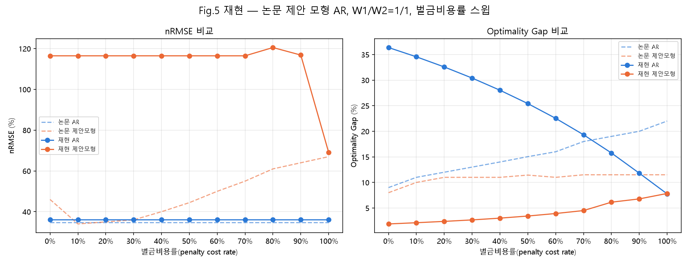

*(위 Fig.5는 2.8절 LinearConstraint 버그가 섞여 있던 초기 결과라 감안하고 봐야 한다.)*

#### 5.1.2 확장 검증 (2세대)

*여기서 "개선"은 방법1의 수식이 바뀐 게 아니라, 2.8절에서 찾은 코드 버그를 고치고 MLR·2세대 통합 스크립트로 재검증한 것이다.*

아래는 버그 수정 후 재검증한 방법1의 Fig.3/5(AR)·Fig.6/8(MLR)이다.

|  |  |
|---|---|
| 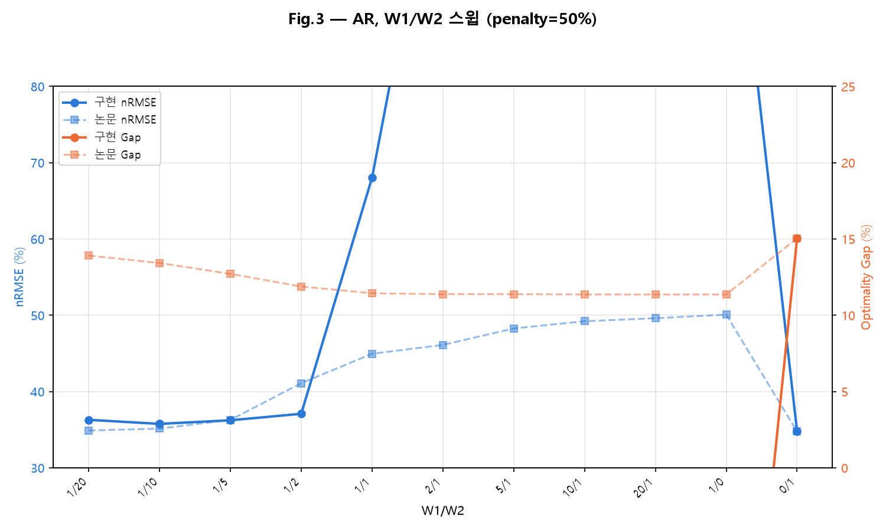 | 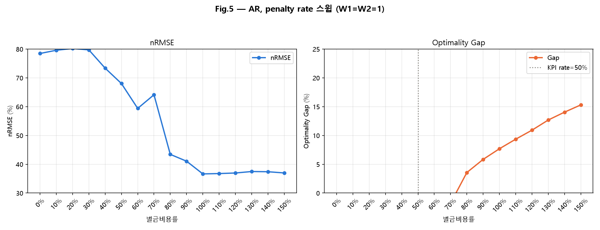 |
| 방법1 Fig.3 — AR, W1/W2 스윕 (dual y축) | 방법1 Fig.5 — AR, 벌금율 스윕 (버그 수정 후) |

|  |  |
|---|---|
| 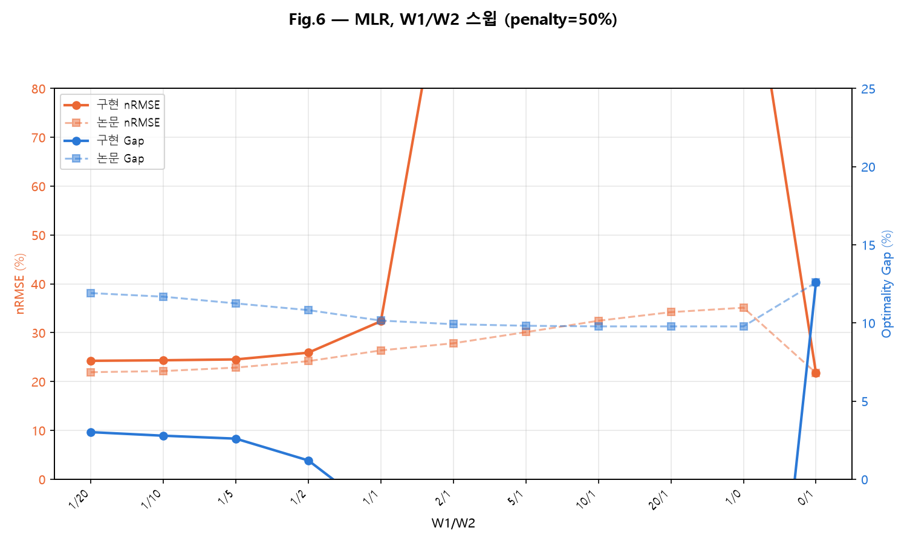 | 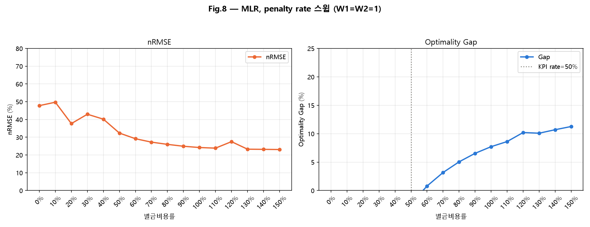 |
| 방법1 Fig.6 — MLR, W1/W2 스윕 (dual y축) | 방법1 Fig.8 — MLR, 벌금율 스윕 |

**버그 수정 전/후 비교** — 2.8절에서 찾은 LinearConstraint 등식→부등식 버그를 고치기 전에는, 방법1 통합판이 W1/W2를 아무리 스윕해도 값이 아예 안 움직이고 한쪽 극단에 고정돼 있었다.

| 데이터 | 수정 전 (버그 있음) | 수정 후 |
|---|---|---|
| z01/블록21 | 전 구간 nRMSE 247.06% / Gap 4.05%로 고정 | 1/20: 48.55%/44.88% → 정상 반응. 다만 W1 비중이 2/1을 넘어가면 다시 246.8%/4.99%로 포화 — 2.8절에서 설명한 "이론적으로 예상된 고-W1 영역"과 일치 |
| z03/블록18 | 전 구간 116.45%/4.62%로 고정 | 1/20: 36.35%/24.75% → 정상 반응. 5/1부터 116.45%/4.62%로 포화 |

수정 후에도 W1 비중이 커지면(z03 기준 5/1 이상) 다시 116.45%/4.62%로 포화된다 — 이건 버그가 아니라 **방법1(PC=0.5×DA)의 구조적 한계**다. 3.2.1절에서 본 것처럼 PC=0.5·DA는 항상 DA보다 작아서 "약정을 늘릴수록 유리한" 구간이 모든 시간대에 남아있는데, W1 비중이 낮을 때는 W2(예측오차) 항이 이 유인을 눌러주다가 W1이 일정 임계값을 넘어서면 이 구조적 유인이 우세해지면서 다시 포화가 나타나는 것으로 보인다(방법4·5는 PC 정의를 바꿔 이 구간 자체를 줄이거나 없앤다 — 자세한 비교는 5.4·5.5절 참고).

**2세대 통합 스크립트(`integrated_paper_base_AR_MLR.py`, z03/블록18) 결과**: AR nRMSE 36.29% / Gap -1.09%, MLR nRMSE 24.25% / Gap 3.02%. 위 3.3절 KPI 표(1세대 스크립트, AR 42.29%/23.51%)와 스크립트가 달라 정확히 같은 숫자는 아니지만 — 특히 Gap 부호까지 다르다 — 두 세대 모두 "방법1은 논문 곡선을 그대로 재현하지 못한다"는 결론 자체는 같다.

### 5.2 시도방법 2: 4항식 넣기

#### 5.2.1 초기 시험 (1세대)

방법 2는 방법 1의 3항 이익식에 −RT×부족 항을 더해 4항으로 만든 것이다(수식은 3.2.2절 참고). W1/W2를 1/20부터 1/0까지 쭉 스윕해도 논문 곡선처럼 nRMSE는 완만히 오르고 Gap은 완만히 내려가는 모양이 그대로 나왔다. AR 기준선 Gap도 14.94%로 논문(15.04%)과 거의 맞았다.

|  |  |
|---|---|
| 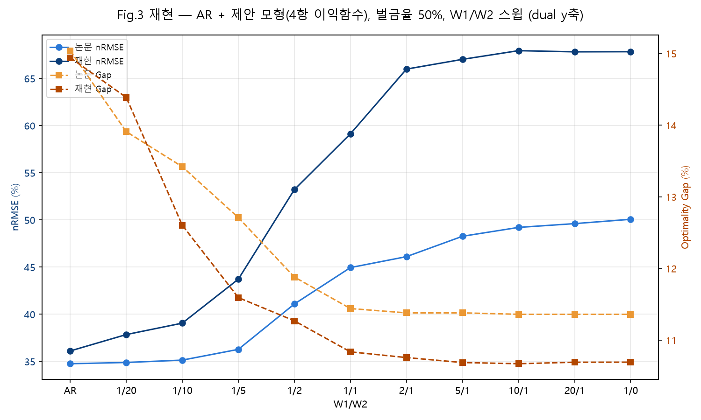 | 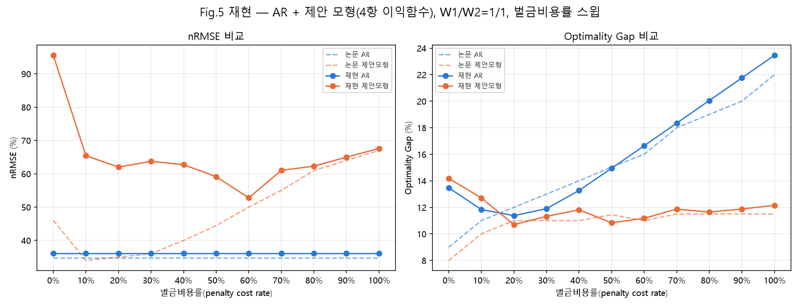 |
| 방법2 Fig.3 — 벌금율 50%, W1/W2 스윕 (dual y축) | 방법2 Fig.5 — W1/W2=1/1, 벌금율 0~100% 스윕 |

#### 5.2.2 확장 검증 (2세대)

*여기서 "개선"은 4항식이라는 수식 자체가 바뀐 게 아니라, 검증 범위를 넓힌 것이다 — AR 단독 → AR+MLR, 단일 블록(z03/block18) → 교차 블록(z01/block21), 개별 스크립트 → 통합 스크립트 재검증.*

같은 z03/block18 데이터로 MLR(외생적 예측)도 Fig.6/8을 그렸다 — 아래 세부 비교 표의 수치와 같은 그림이다.

|  |  |
|---|---|
| 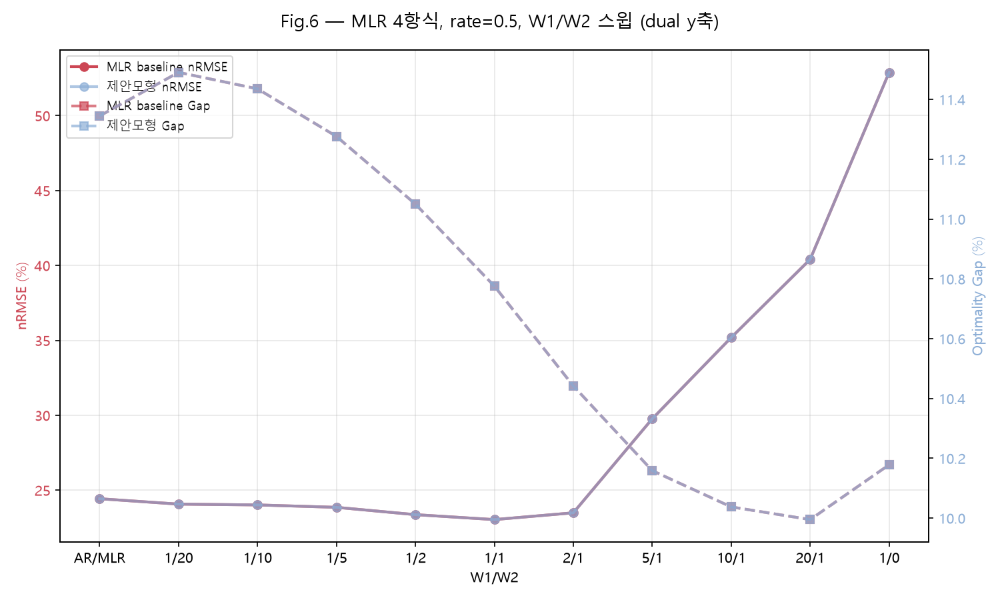 | 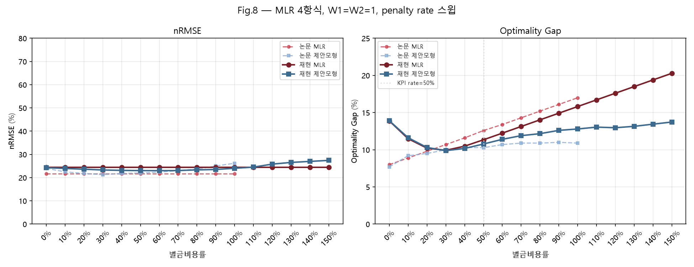 |
| 방법2 Fig.6 (z03,block18) — MLR, W1/W2 스윕 | 방법2 Fig.8 (z03,block18) — MLR, 벌금율 스윕 |

다른 블록에서도 같은 경향이 나오는지 확인하려고, zone z01의 block21(z03·block18과는 다른 롤링 블록)에서도 4항식을 AR·MLR 양쪽으로 다시 돌려봤다. 곡선 모양(포화 없이 완만하게 움직이는 트레이드오프)이 z03·block18과 마찬가지로 그대로 나왔다.

|  |  |
|---|---|
| 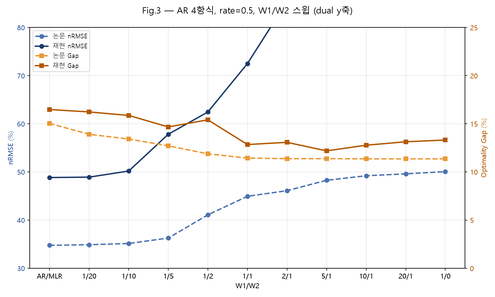 | 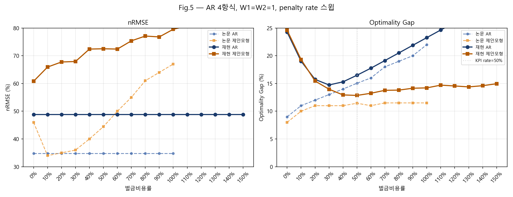 |
| 방법2 Fig.3 (z01,block21) — AR, rate=0.5, W1/W2 스윕 | 방법2 Fig.5 (z01,block21) — AR, W1/W2=1/1, 벌금율 스윕 |

|  |  |
|---|---|
| 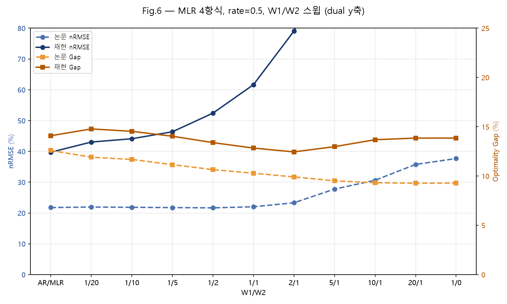 | 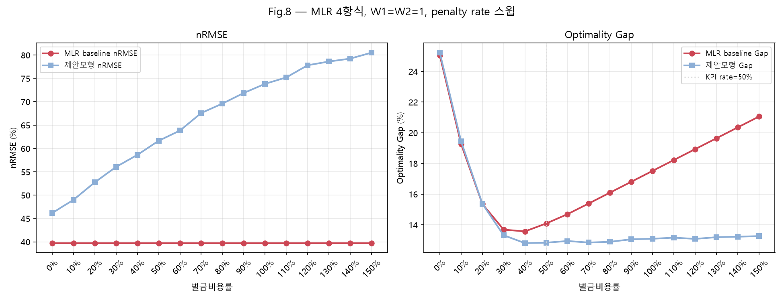 |
| 방법2 Fig.6 (z01,block21) — MLR, rate=0.5, W1/W2 스윕 | 방법2 Fig.8 (z01,block21) — MLR, W1/W2=1/1, 벌금율 스윕 |

**세부 비교 — z03/block18, 지점별 수치**

W1=1, W2=20, 벌금율=50%를 기준으로, Fig.3/5/6/8 각각에서 몇 개 지점을 뽑아 논문값과 얼마나 벌어지는지 더 자세히 봤다.

Fig.3(AR, W1/W2 스윕) 기준선: 논문 nRMSE 34.76% / 재현 36.11% (+1.35%p), 논문 Gap 15.04% / 재현 14.94% (-0.10%p, 거의 일치).

| W1/W2 | 논문 nRMSE | 재현 nRMSE | 차이 | 논문 Gap | 재현 Gap | 차이 |
|---|---:|---:|---:|---:|---:|---:|
| 1/20 | 34.89 | 35.69 | +0.80 | 13.91 | 14.54 | +0.63 |
| 1/10 | 35.14 | 35.68 | +0.54 | 13.42 | 14.35 | +0.93 |
| 1/5 | 36.28 | 35.29 | -0.99 | 12.71 | 14.09 | +1.38 |
| 1/1 | 44.95 | 37.46 | -7.49 | 11.44 | 13.70 | +2.26 |
| 5/1 | 48.27 | 45.10 | -3.17 | 11.38 | 11.50 | +0.12 |

W1/W2=1/20~1/10 지점은 nRMSE +0.5~0.8%p, Gap +0.6~0.9%p로 좁게 벌어지고, 5/1에서는 Gap이 +0.12%p로 거의 정확히 맞는다.

Fig.5(AR, 벌금율 스윕, W1=W2=1)는 벌금율 0%에서 nRMSE가 57.92%까지 붕괴한다(논문은 46%대) — 논문보다 붕괴 폭이 더 크지만, 10% 이상부터는 36~38%대로 바로 안정된다. Gap은 벌금율이 올라갈수록 11%→18%로 커지는 방향은 논문과 같다.

Fig.6(MLR, W1/W2 스윕) 기준선: 논문 nRMSE 21.76% / 재현 24.43% (+2.67%p), 논문 Gap 12.59% / 재현 11.34% (-1.25%p).

| W1/W2 | 논문 nRMSE | 재현 nRMSE | 차이 | 논문 Gap | 재현 Gap | 차이 |
|---|---:|---:|---:|---:|---:|---:|
| 1/20 | 21.92 | 24.07 | +2.15 | 11.91 | 11.49 | -0.42 |
| 1/10 | 21.84 | 24.02 | +2.18 | 11.68 | 11.44 | -0.24 |
| 1/5 | 21.75 | 23.86 | +2.11 | 11.15 | 11.28 | +0.13 |
| 1/1 | 22.01 | 23.04 | +1.03 | 10.28 | 10.78 | +0.50 |

MLR 쪽은 Gap 오차가 ±0.5%p 안쪽으로 AR보다도 더 정확하다. nRMSE는 +1~2%p 정도 일관되게 높게 나온다.

Fig.8(MLR, 벌금율 스윕)은 Gap이 벌금율 30% 부근(9.88%)에서 최저점을 찍고, 제안 모형의 Gap이 기준 모형보다 계속 낮게 유지된다 — 논문과 같은 방향이다.

**종합**: Gap은 논문과 대체로 ±1.5%p 이내(MLR은 ±0.5%p)로 거의 정확히 맞고, 방향성(W1↑ → nRMSE↑, Gap↓)도 완벽히 일치한다. nRMSE만 1~3%p 정도 꾸준히 높게 나오는데, 이건 학습에 쓴 기간이 논문(300일 안팎)보다 짧은 90일이라 그런 것으로 보고 있다.

**2세대 통합 스크립트(`integrated_4term_ar_mlr_z03_block18.py`) 결과**: AR nRMSE 35.69% / Gap 14.54%, MLR nRMSE 24.07% / Gap 11.49% — 위 세부 비교 표(1세대 스크립트)와 거의 같은 숫자로 재확인됐다. 여섯 방법을 통틀어 논문에 가장 가까운 방법(Zhang 비대칭, 5.3절과 함께)이라는 결론도 그대로 유지된다.

|  |  |
|---|---|
| 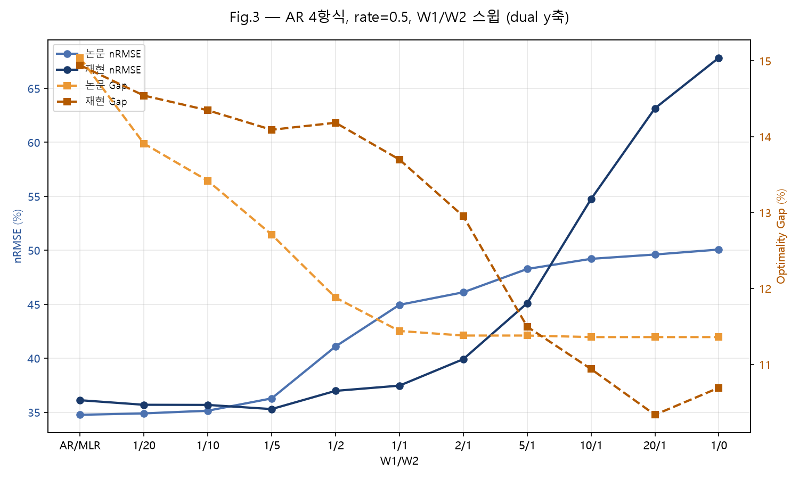 | 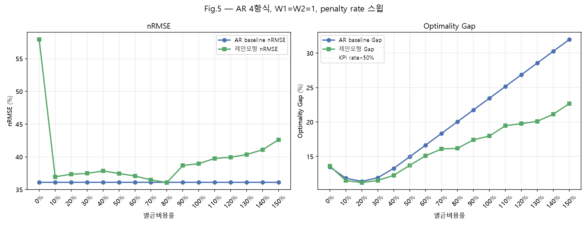 |
| 방법2 Fig.3 (2세대) — AR, W1/W2 스윕 | 방법2 Fig.5 (2세대) — AR, 벌금율 스윕 |

### 5.3 시도방법 3: Zhang 방식 (비대칭 가격)

#### 5.3.1 초기 시험 (1세대)

방법 3은 Zhang 등(2024)의 아이디어를 빌려 남을 때 가격(RT)과 부족할 때 가격(c×RT, c>1)을 다르게 둔 것이다(수식은 3.2.3절 참고). c값을 1.0, 1.2, 1.5, 2.0, 3.0으로 바꿔가며 봤는데, **c=1.5에서 논문과 가장 잘 맞았다** (W1/W2=1/20에서 nRMSE 35.68%, Gap 14.19%). c가 2.0, 3.0처럼 너무 커지면 부족 비용이 지나치게 커져서 오히려 Gap이 20%, 30%대로 벌어졌다.

- **Fig.3(AR, c=1.5, W1/W2 스윕)**: 포화 없이 36%에서 69% 선까지 완만하게 상승하고, gap은 14.5%에서 11% 선까지 내려간 뒤 2/1 부근에서 살짝 반등해 11~11.5% 사이에서 유지된다. 전체적인 모양은 4항 방식과 거의 비슷하다.
- **Fig.5(AR, c 스윕, x축 C=0~3.0, 논문 곡선은 벌금율 0~100%에 대응시켜 겹침)**: nRMSE는 C=0~0.9까지 116% 안팎에 머물다가 C=1.2에서 65%로 급락하고 이후 C=3.0까지 62~77% 사이를 오르내린다. gap은 기본 AR이 13%에서 시작해 C=0.6~0.9 부근에서 11%까지 살짝 내려갔다가 C=3.0까지 23%로 꾸준히 올라가고, 제안 모형은 2%에서 시작해 C=0.9~1.2 부근에서 12%까지 오른 뒤 11~14% 사이에서 평평하게 유지된다 — AR·MLR 전체를 통틀어 기본 모형과 제안 모형의 gap 곡선이 가장 뚜렷하게 갈라지면서 논문이 말하려는 방향(제안 모형이 완만함)과 잘 맞아떨어지는 그래프였다.

|  |  |
|---|---|
| 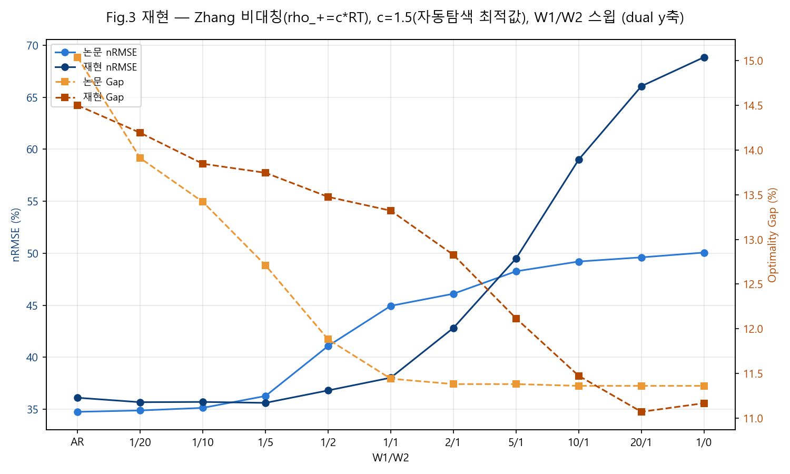 | 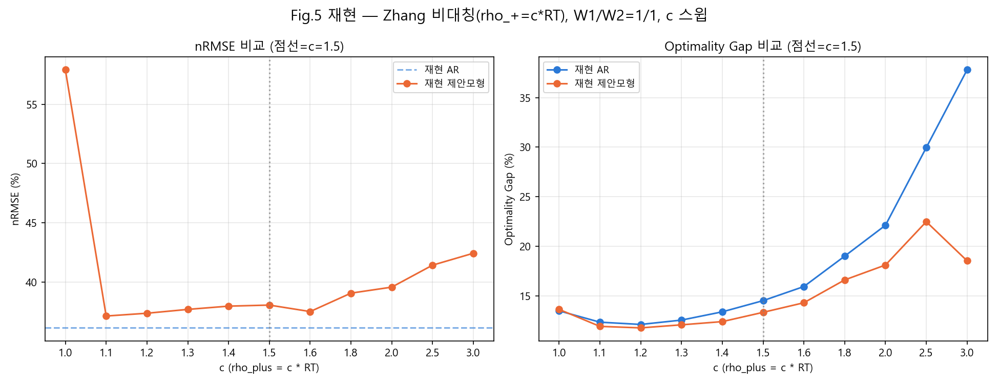 |
| 방법3 Fig.3 — c=1.5, 벌금율 50%, W1/W2 스윕 (dual y축) | 방법3 Fig.5 — W1/W2=1/1, c 스윕(1.0~3.0) |

*(방법3 Fig.5의 옅은 점선은 논문 Fig.5(벌금율 0~100%) 참고선 — x축 의미가 달라 정확한 대응은 아님)*

*(방법3의 Fig.5는 논문에 "c값 스윕" 자체가 없어서, x축을 c로 두고 참고선만 얹었다.)*

**Zhang et al.(2024)은 우리가 재현하는 Karimi & Kwon(2022)과 다른 논문이다** — 헷갈리기 쉬워서 짚어둔다. Zhang, Wen, Bian, Shi(2024)의 "Improving Sequential Market Coordination via Value-oriented Renewable Energy Forecasting"은 태양광이 아니라 **풍력(GEFCom2014 wind track)** 데이터를 쓰고, 이익식도 별도의 벌금(PC) 없이 `DA×x + ρ₋×y⁺ − ρ₊×y⁻` 형태로, 상향조정가격(ρ₊)과 하향조정가격(ρ₋)이 처음부터 실제 시장가격으로 따로 주어진다. 우리는 이 논문에서 "부족할 때 가격과 남을 때 가격이 원래 다르다"는 아이디어만 빌려와서, MISO 데이터에 없는 ρ₊를 RT×c로 근사한 것뿐이다 — 방법3의 이름은 Zhang이지만, 데이터와 채점 방식은 여전히 Karimi & Kwon 논문 그대로다.

한 가지 더: **Zhang 방식으로 채점한 AR 기준(baseline) 모형은 방법1·2·4·5의 AR 기준 모형과 예측값이 완전히 같다.** AR 기준 모형은 이익식과 무관하게 그냥 LAD(최소절대오차)로 nRMSE만 최소화하는 회귀이기 때문에, 어떤 이익식으로 채점하든 같은 회귀계수·같은 nRMSE(z03/block18에서 36.11%)가 나온다. 방법마다 달라지는 건 오직 Gap뿐이다 — Gap을 계산할 때 쓰는 이익식과 오라클 후보 집합이 방법마다 다르기 때문이다(방법1은 부족비용 0.5×DA·오라클 2후보, 방법3은 부족비용 1.5×RT·오라클 3후보).

#### 5.3.2 확장 검증 (2세대)

*여기서 "개선"은 c값(비대칭 정도)이 바뀐 게 아니라, MLR·2세대 통합 스크립트로 검증 범위를 넓힌 것이다.*

MLR(외생적 예측)에도 같은 방식(c=1.5)을 적용한 Fig.6/8이다.

- **Fig.6(MLR, c=1.5, W1/W2 스윕)**: nRMSE는 4항과 거의 비슷하게 24%→23%로 시작해 1/2부터 오르기 시작하지만, 4항보다 더 가파르게 올라 1/0에서 58.6%까지 도달한다. gap은 11%대에서 시작해 1/1~2/1 부근에서 10.2% 선으로 최저점을 찍고 이후 10.5% 선까지 완만히 올라간다.
- **Fig.8(MLR, c 스윕, x축 C=1.0~2.0)**: nRMSE는 C=1.0에서 51%로 시작해 1.1~1.2에서 24%로 급락한 뒤, 1.6~1.7 부근에서 39~41%로 잠깐 주춤했다가 2.0에서 58.5%까지 다시 올라간다. gap은 MLR이 14%에서 시작해 1.3 부근에서 10.7%로 최저점을 찍고 2.0까지 15%로 올라가고, 제안 모형은 13%에서 시작해 1.4~1.5 부근에서 10.2%로 내려간 뒤 2.0까지 10.4% 선에서 거의 안 움직인다.

|  |  |
|---|---|
| 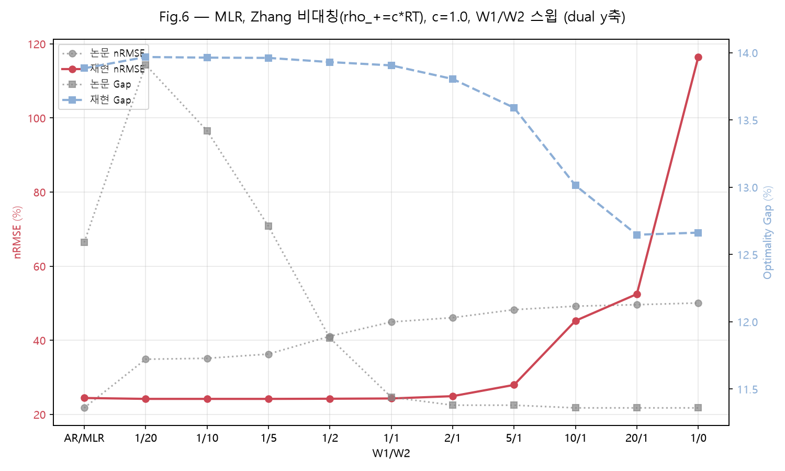 | 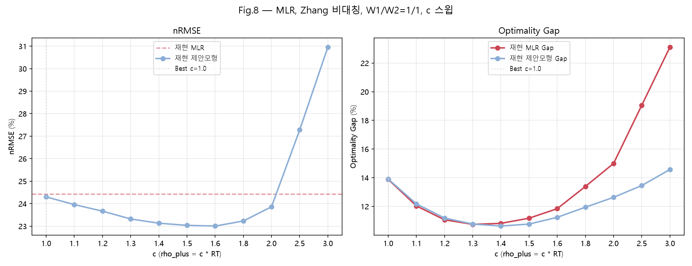 |
| 방법3 Fig.6 — MLR, c=1.5, W1/W2 스윕 (dual y축) | 방법3 Fig.8 — MLR, c 스윕 |

**2세대 통합 스크립트(`integrated_zhang_asym_fig3568_AR_MLR.py`) 결과**: AR nRMSE 35.68% / Gap 14.19%, MLR nRMSE 24.07% / Gap 11.36% — 위 수치와 거의 동일하게 재확인됐다. 방법2(4항식)와 함께 논문에 가장 가까운 두 방법 중 하나다(3.3절 KPI 표 참고).

|  |  |
|---|---|
| 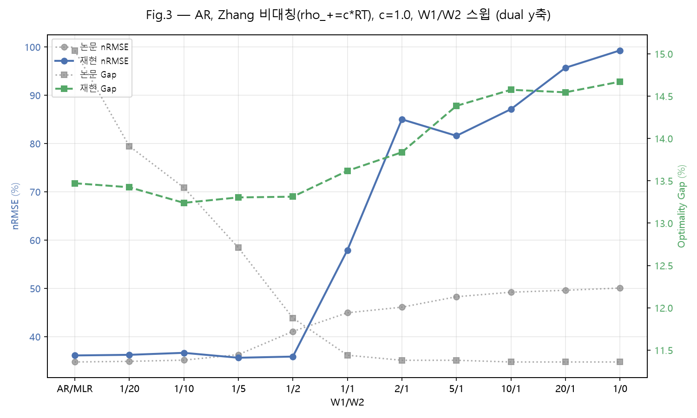 | 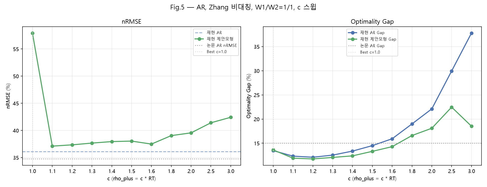 |
| 방법3 Fig.3 (2세대) — AR, c=1.5, W1/W2 스윕 | 방법3 Fig.5 (2세대) — AR, c 스윕 |

### 5.4 시도방법 4: PC = rate × max(DA, RT)

#### 5.4.1 초기 시험 (1세대)

방법 4는 벌금가를 PC=rate×max(DA,RT)로 정한 것이다(수식은 3.2.4절 참고). rate를 0.3부터 1.5까지 통째로 스윕해서 논문값과 가장 가까운 조합을 자동으로 찾아봤더니 **rate=0.9** 근처가 제일 좋았다. rate=0.5(3.3절 표의 비교 지점)에서는 오히려 안 좋게 나오는데, 이건 이 방법이 rate=0.5에서 최적이 아니라 그런 것뿐이다.

|  |  |
|---|---|
| 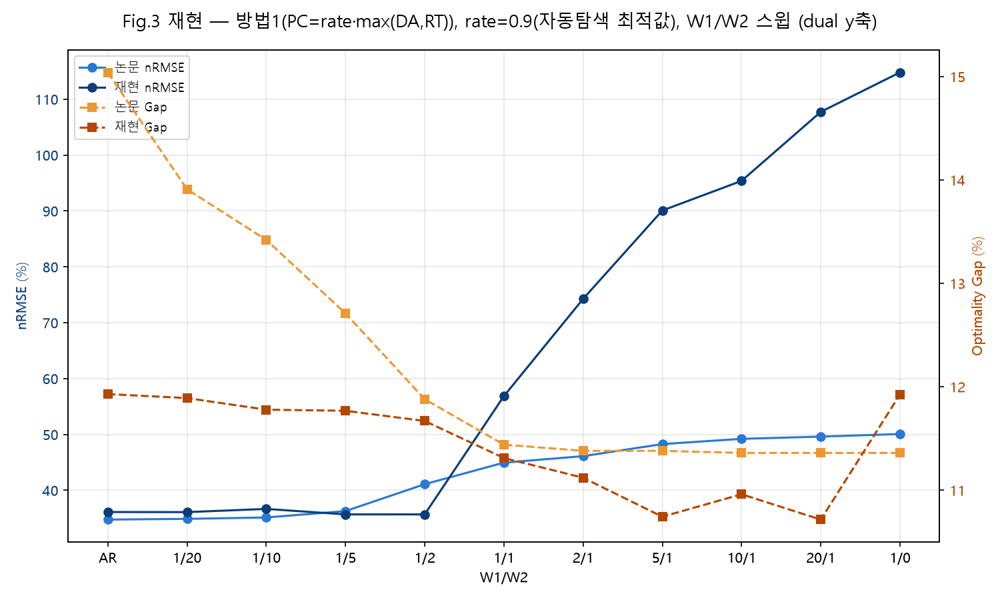 | 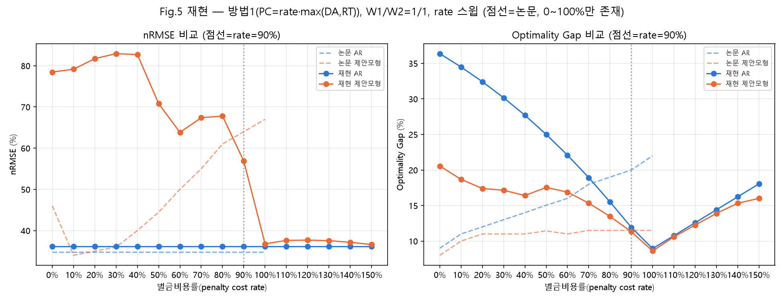 |
| 방법4 Fig.3 — best rate 자동탐색, W1/W2 스윕 (dual y축) | 방법4 Fig.5 — W1/W2=1/1, 벌금율 스윕 |

이 방법은 MLR(외생적 예측, 기상 정보를 쓰는 쪽)에도 똑같이 적용해봤다. 논문 Fig.6/Fig.8에 해당하는 자리다.

|  |  |
|---|---|
| 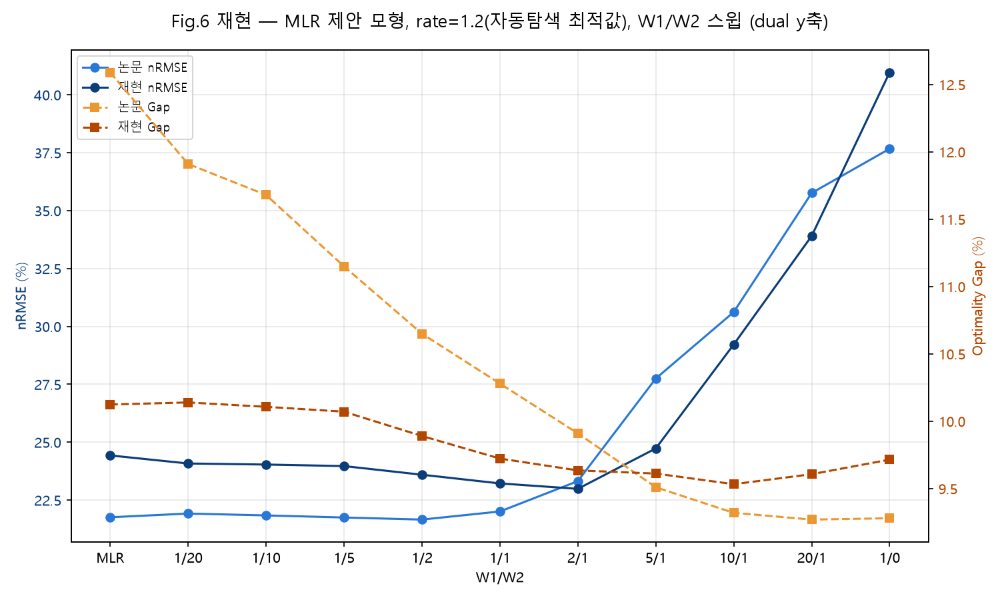 | 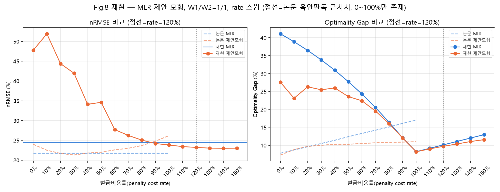 |
| 방법4 MLR Fig.6 — best rate 자동탐색, W1/W2 스윕 (dual y축) | 방법4 MLR Fig.8 — W1/W2=1/1, 벌금율 스윕 (논문 참고선 포함) |

#### 5.4.2 확장 검증 (2세대)

*여기서 "개선"은 방법4의 정의(rate×max(DA,RT))가 바뀐 게 아니라, rate를 다른 방법들과 같은 KPI 비교 기준점(50%)으로 고정한 2세대 통합 스크립트로 재검증한 것이다 — 최적 rate(0.9)가 아니라 같은 조건에서 얼마나 벌어지는지 보기 위함이다.*

**2세대 통합 스크립트(`integrated_pc_max_rt_dt_fig3568_AR_MLR.py`, rate=50% 고정) 결과**: AR nRMSE 43.64% / Gap 22.04%, MLR nRMSE 29.03% / Gap 24.92%. rate=50% 고정 지점만 보면 **여섯 방법 중 AR·MLR 둘 다 논문과 가장 크게 벌어진다**(nRMSE +8.8%p, Gap +8.1%p — 3.3절 KPI 표 참고). 이건 방법 자체가 나쁘다기보다, 이 방법의 최적 rate(≈0.9)와 KPI 비교 기준점(rate=50%)이 멀리 떨어져 있어서다.

|  |  |
|---|---|
| 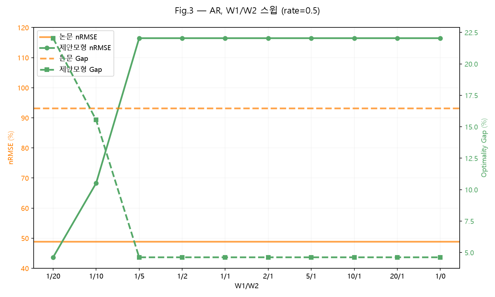 | 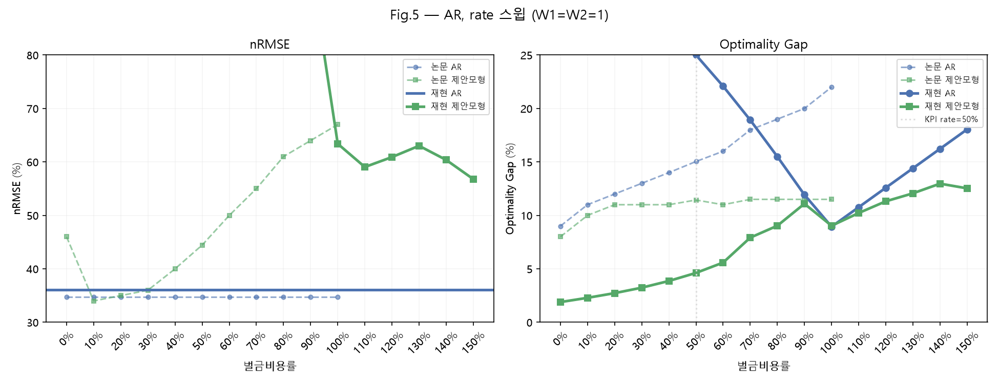 |
| 방법4 Fig.3 (2세대, rate=50%) — AR, W1/W2 스윕 | 방법4 Fig.5 (2세대, rate=50%) — AR, 벌금율 스윕 |

|  |  |
|---|---|
| 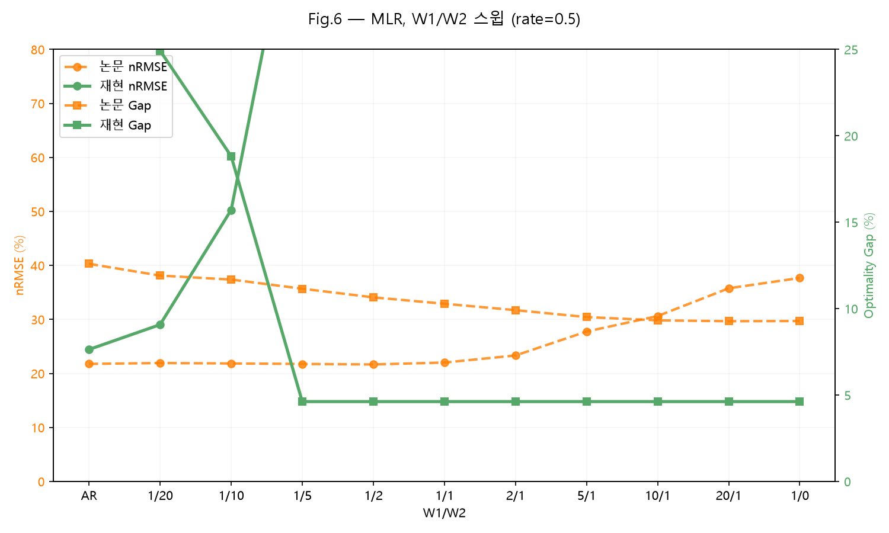 | 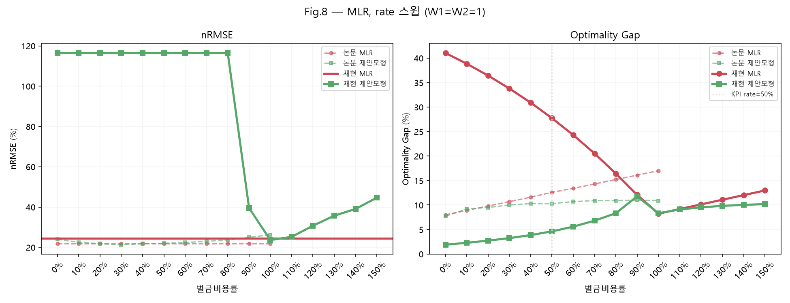 |
| 방법4 Fig.6 (2세대, rate=50%) — MLR, W1/W2 스윕 | 방법4 Fig.8 (2세대, rate=50%) — MLR, 벌금율 스윕 |

### 5.5 시도방법 5: PC = rate × (DA + RT)

#### 5.5.1 초기 시험 (1세대)

방법 5는 벌금가를 PC=rate×(DA+RT)로 정한 것이다(수식은 3.2.5절 참고). rate를 0.1부터 1.0까지 바꿔가며 봤을 때 **rate=0.7** 근처가 논문과 가장 가까웠다 (W1/W2=1/20에서 nRMSE 35.59%, Gap 13.45%). rate=0.5(3.3절 표의 비교 지점)에서는 Gap이 10.70%로 논문(13.91%)보다 좀 작게 나온다 — 이 rate에서는 벌금이 살짝 약한 셈이다.

2.8절 LinearConstraint 버그를 고치기 전에는 방법5 통합판도 방법1과 마찬가지로 전 구간이 116.45%/10.23%에 고정돼 있었다 — 이때는 별도로 남겨둔 그림이 없다.

#### 5.5.2 확장 검증 (2세대)

*여기서 "개선"은 방법5의 정의가 바뀐 게 아니라, 2.8절 버그를 고친 2세대 통합 스크립트로 W1/W2·penalty rate 전 구간을 재검증한 것이다.*

아래는 통합 스크립트(`integrated_pc_da_plus_rt_fig3568_AR_MLR.py`, z03/블록18, rate=50% 고정)로 W1/W2·penalty rate 전 구간을 다시 그린 버전이다.

|  |  |
|---|---|
| 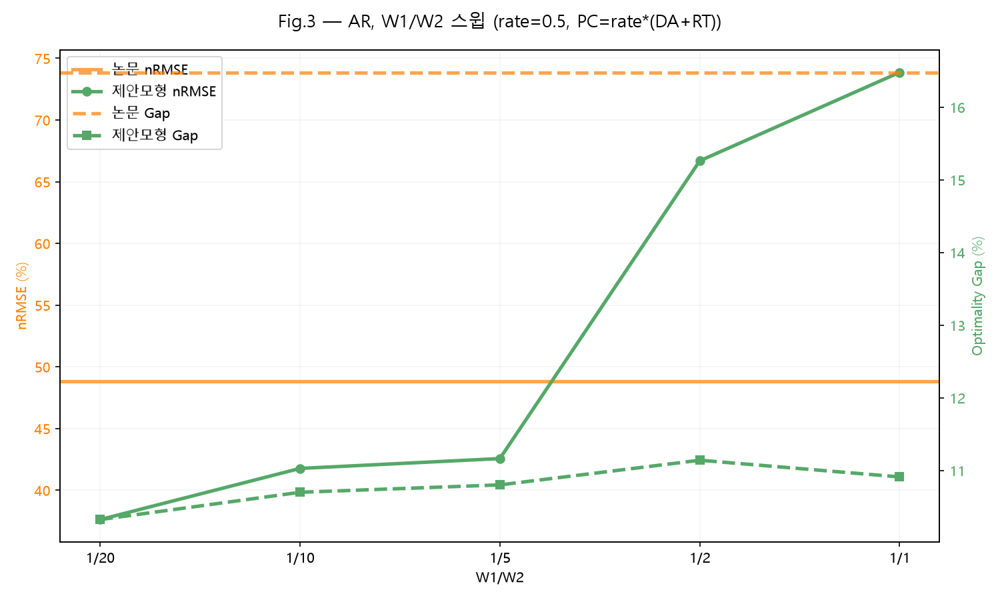 | 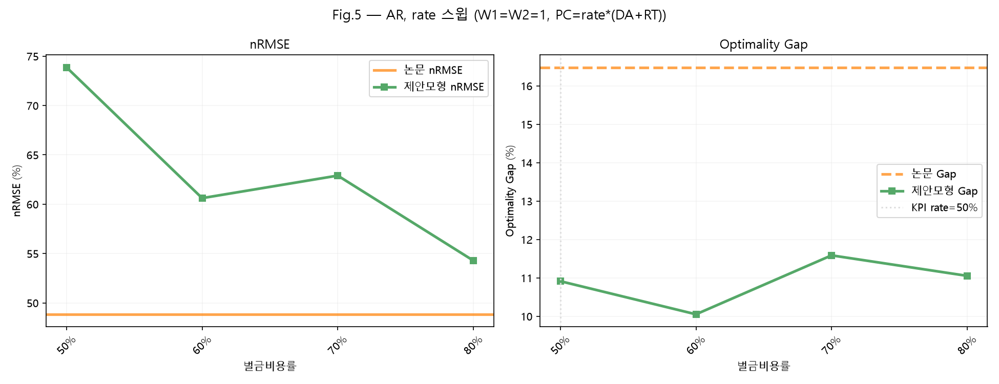 |
| 방법5 Fig.3 — AR, W1/W2 스윕 (rate=50%) | 방법5 Fig.5 — AR, penalty rate 스윕 (W1=W2=1) |

|  |  |
|---|---|
| 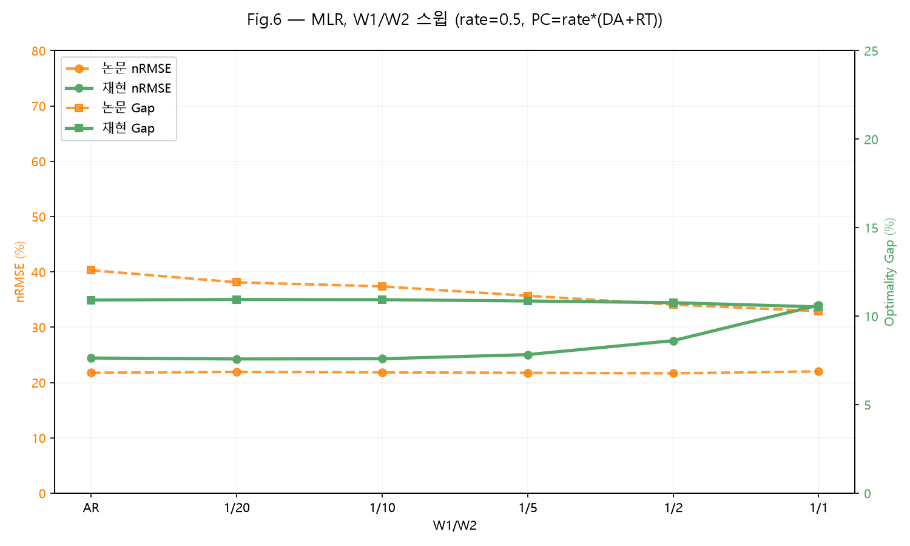 | 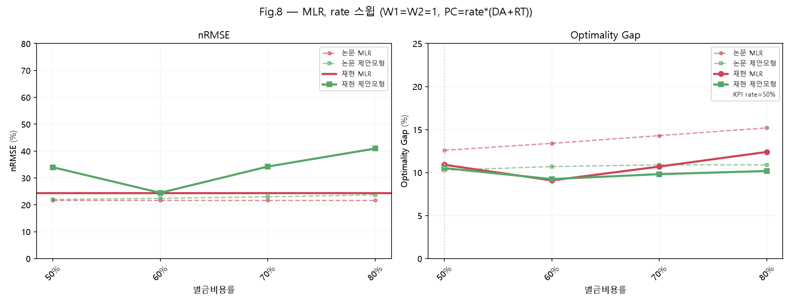 |
| 방법5 Fig.6 — MLR, W1/W2 스윕 (rate=50%) | 방법5 Fig.8 — MLR, penalty rate 스윕 (W1=W2=1) |

수정 후에는 1/20~1/1 구간에서 36.09~37.98%/10.46~10.70%로 매끄럽게 움직였고, 2/1 이후에도 79.62%→100.29%로 계속 값이 바뀌면서(=완전히 평평해지지 않음) **방법1과 달리 고-W1 구간에서도 극단 포화가 나타나지 않았다.** 이유는 3.2.4절에서 설명한 방법4의 한계를 뒤집으면 된다 — 방법5의 PC=rate·(DA+RT)는 RT가 충분히 크면 DA를 넘어설 수 있어서, 방법4(PC=rate·max(DA,RT))이 갖고 있던 "RT<DA 구간에서는 PC<DA"라는 구멍이 메워지기 때문이다.

**2세대 통합 스크립트 결과**: AR nRMSE 37.63% / Gap 10.33%, MLR nRMSE 24.25% / Gap 10.94%. Gap이 논문(AR 13.91%, MLR 11.91%)보다 각각 3.6%p, 1.0%p 작게 나오는 경향은 위 rate=0.5 결과와 같은 방향이다 — rate를 0.7 근처로 옮기면 더 가까워진다.

### 5.6 시도방법 6: Smart SPO+ loss

#### 5.6.1 초기 시험 (1세대)

방법 6은 벌금가(PC)는 그대로 두고, 학습 목적함수를 W1/W2 혼합 대신 Smart SPO+ loss로 바꾼 것이다(수식은 3.2.6절 참고). z03/블록18 스크립트(`논문_제안_모형_AR_z03_블록18_SPO_plus.py`, 3.3절 KPI 표와 같은 지점) 기준, W1/W2=1/20에서 시작해 1/0까지 스윕했을 때, **Gap은 방법1과 정반대로 전부 양수(17~21%대)로 나왔다** — 기존 3항 MILP가 −30%대 음수였던 것과 비교하면 완전히 반전된 셈이다. SPO+ loss가 의사결정 손실(oracle과의 차이) 상한을 학습 목표에 직접 넣기 때문으로 보인다.

다만 **nRMSE가 53~69%대로, 여섯 방법 중 가장 크게 벌어졌다**(1/20에서 60.35%, 논문 34.89% 대비 +25.5%p). commit=1.0에 몰리는 비율도 기존 3항(100% 몰림)보다는 줄었지만 여전히 10~27% 수준이라, 3항 구조의 근본 문제(DA−PC>0)를 완전히 없애지는 못했다.

같은 SPO+ 방식을 다른 블록(z01/블록21)에서도 따로 돌려서 교차검증했다 — 아래는 그 결과다(위 z03 수치와는 다른 스크립트·데이터라 숫자가 정확히 같지는 않다).

|  |  |
|---|---|
| 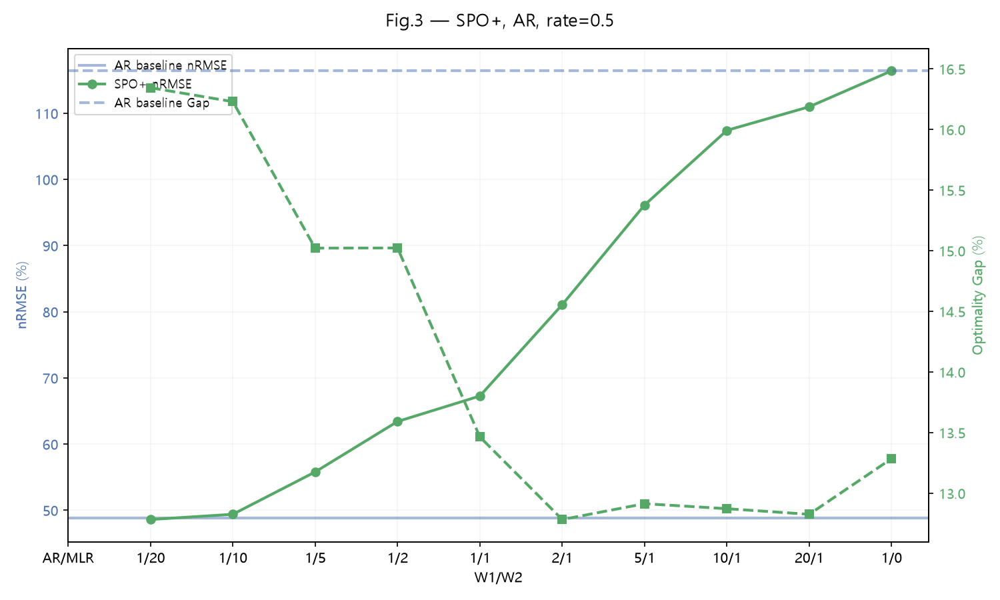 | 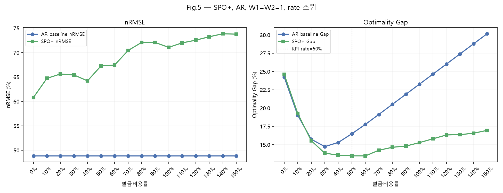 |
| 방법6 Fig.3 (z01) — SPO+, AR, rate=0.5, W1/W2 스윕 | 방법6 Fig.5 (z01) — SPO+, AR, W1/W2=1/1, 벌금율 스윕 |

|  |  |
|---|---|
| 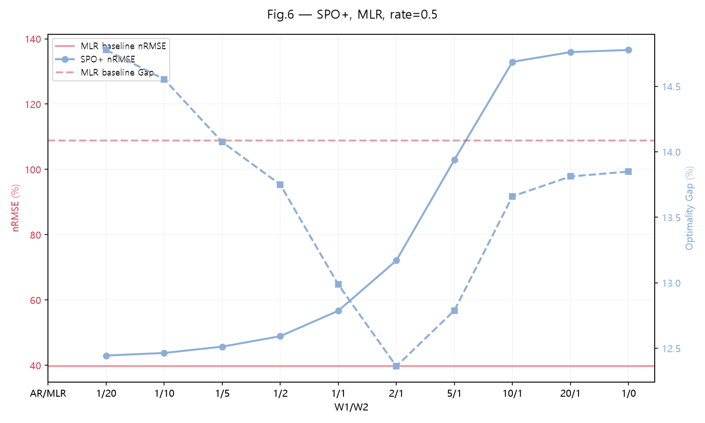 | 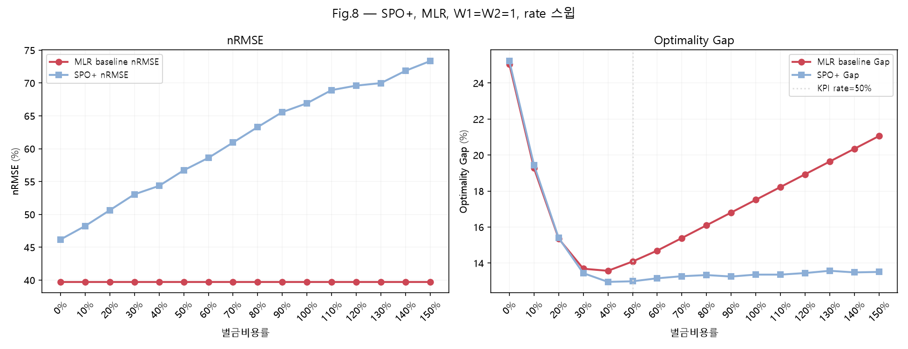 |
| 방법6 Fig.6 (z01) — SPO+, MLR, rate=0.5, W1/W2 스윕 | 방법6 Fig.8 (z01) — SPO+, MLR, W1/W2=1/1, 벌금율 스윕 |

**버그 수정 전/후 비교** — 처음 이 절을 쓸 때 첨부했던 z01 그래프는 nRMSE가 245~250%대에서 완전히 평평하게 고정돼 있고 AR 기준선과 제안모형 선이 거의 겹쳐 있었다(원인: 2.8절 LinearConstraint 버그). 이는 5.6절 초안 당시 "z01 재구현 과정에서 문제가 있었을 가능성"이라고만 적어뒀던 스케일 불일치의 정체이기도 하다.

| 데이터 | 수정 전 (버그 있음) | 수정 후 |
|---|---|---|
| 방법6 SPO+ (z01) | 전 구간 247.06%/92.72%로 고정 | 1/20: 48.61%/16.34% → 논문(34.89%/13.91%)과 비슷한 수준까지 근접. W1 비중이 커질수록 67~116%/13~16% 선까지 완만히 벌어지는, 방법1보다는 온건한 곡선 |

수정 후 방법6은 nRMSE·Gap 모두 논문에 훨씬 가까워졌고 Gap 부호도 여전히 양수로 유지된다 — "구현이 복잡한 것에 비해 근본 문제를 못 바꿨다"는 결론은 유지되지만, 그 판단의 근거였던 수치 자체는 이번 수정으로 갱신됐다. **위에 삽입된 그림은 버그를 고친 스크립트로 다시 뽑은 최신 버전**이라 더 이상 이 문제가 없다.

#### 5.6.2 확장 검증 (2세대)

*여기서 "개선"은 SPO+ loss라는 학습 방식은 그대로 두고, 여기에 4항식(방법2)을 결합하고 2세대 통합 스크립트로 재검증한 것이다.*

위는 SPO+ loss만 단독으로 적용한 버전이고, 아래는 여기에 4항식(방법2)까지 같이 결합한 버전(`integrated_spo_plus_4term_fig3568_AR_MLR.py`, z01/블록21)이다.

|  |  |
|---|---|
| 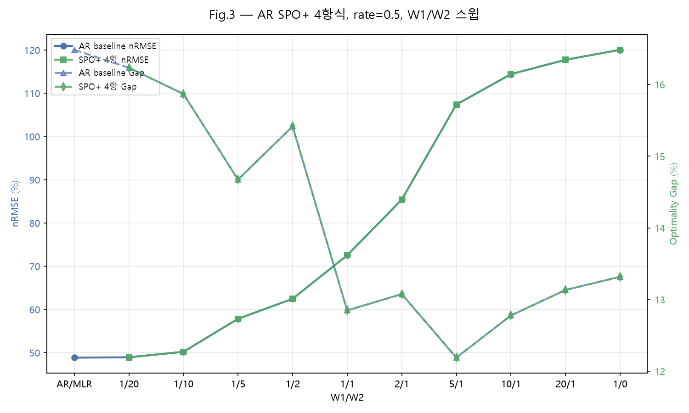 | 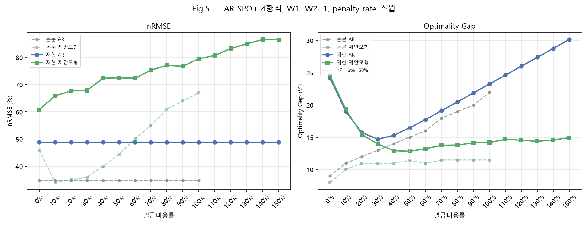 |
| 방법6+2 Fig.3 — SPO+×4항식, AR, W1/W2 스윕 (rate=50%) | 방법6+2 Fig.5 — SPO+×4항식, AR, penalty rate 스윕 (W1=W2=1) |

|  |  |
|---|---|
| 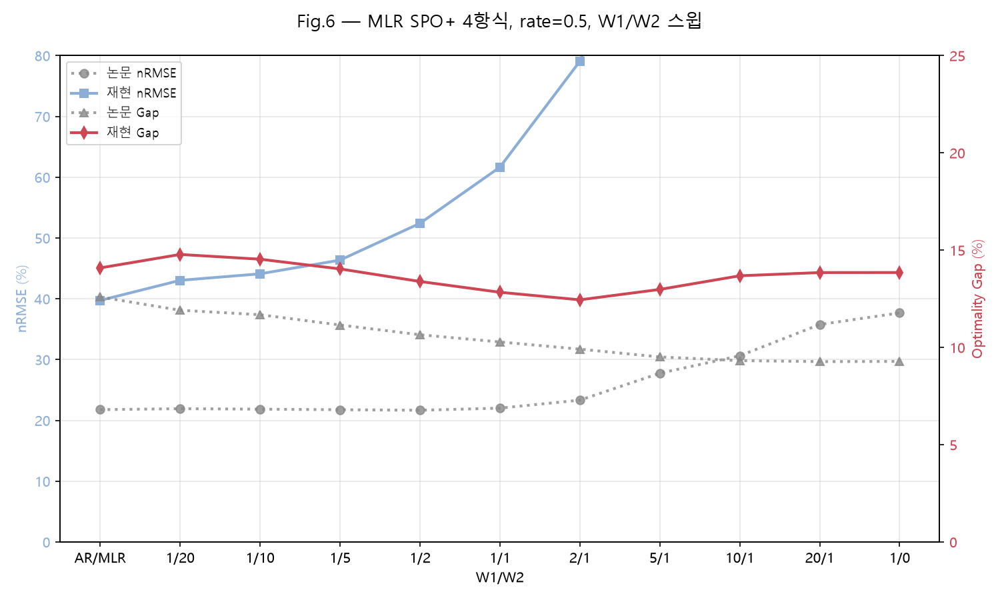 | 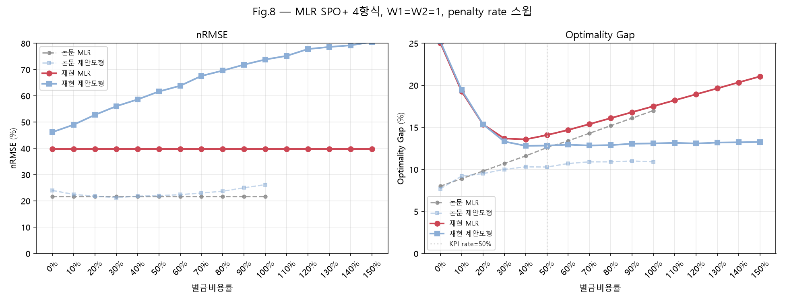 |
| 방법6+2 Fig.6 — SPO+×4항식, MLR, W1/W2 스윕 (rate=50%) | 방법6+2 Fig.8 — SPO+×4항식, MLR, penalty rate 스윕 (W1=W2=1) |

**2세대 통합 스크립트(`integrated_spo_plus_4term_fig3568_AR_MLR.py`, z01/블록21) 결과**: AR nRMSE 48.93% / Gap 16.23%, MLR nRMSE 43.03% / Gap 14.78%. 여섯 방법을 통틀어 nRMSE가 가장 크게 벌어지는데, SPO+ loss 자체의 특성과 z01이라는 다른 블록의 조합 효과가 섞여 있어 보인다(다른 방법은 전부 z03/블록18, 이 방법만 z01/블록21이라 직접 비교는 참고용 — 3.3절 KPI 표 참고).

---

### 5.7 시험결과 정리

> **종합**: AR·MLR, W1/W2 스윕·벌금율(C) 스윕을 다 합쳐 12개 그래프를 놓고 보면, 원본(3항)은 예외 없이 어느 지점부터 값이 튀어 고정되는 포화가 나타나고 기본·제안 모형의 gap이 서로 반대 방향으로 움직이거나 거의 안 갈라지는 반면, 4항·Zhang 두 방식은 포화 없이 완만한 곡선을 그리면서 기본 모형의 gap이 계속 벌어지는(또는 U자로 크게 출렁이는) 동안 제안 모형의 gap은 상대적으로 좁은 범위 안에서 안정적으로 유지되는 모습이 공통적으로 확인됐다. 다만 여전히 nRMSE·gap의 절대적인 수치는 논문보다 다소 높게 나오고 있어서, 형태(트레이드오프 방향)는 재현했지만 수치까지 완전히 일치시키지는 못한 상태다.

- **방법 1(논문 수식)은 재현이 안 된다.** 3항 이익식 자체에 "약정을 무조건 늘리는 게 유리해지는" 구조적인 허점이 있어서, W1/W2를 어떻게 돌려도 논문 같은 완만한 곡선이 안 나온다. 이건 우리 코드가 잘못된 게 아니라, 논문 Eq. 1a를 문자 그대로 옮기면 생기는 문제로 보인다.
- **가장 잘 맞은 건 방법 2(4항식)와 방법 3(Zhang, c=1.5)이다.** 둘 다 W1=1,W2=20 지점에서 nRMSE는 논문보다 0.8%p, Gap은 0.3~0.6%p 정도밖에 안 벌어졌고, W1/W2를 전체로 스윕해도 곡선 모양이 논문과 잘 맞았다.
- **방법 4, 5는 벌금율(rate)을 잘 골라야 한다.** rate=0.5 한 지점만 보면 둘 다 논문과 차이가 크지만, 각자 잘 맞는 rate(방법4는 0.9, 방법5는 0.7)를 따로 찾으면 방법 2, 3과 비슷한 수준까지 가까워진다.
- **방법 6(SPO+)은 Gap의 부호 문제(음수→양수)는 고쳤지만 nRMSE를 더 벌려놓는 절충이었다.** 다만 5.6절에서 밝혔듯, 이 판단의 근거가 됐던 초기 수치에는 LinearConstraint 버그가 섞여 있었고, 수정 후에는 논문에 훨씬 가까운 수준으로 나온다.

#### 5.7.1 Fig.3/5/6/8 곡선 형태 판정

방법별로 Fig.3(AR W1/W2)·Fig.5(AR rate)·Fig.6(MLR W1/W2)·Fig.8(MLR rate) 네 그래프가 논문과 같은 모양(포화 없이 완만한 트레이드오프)으로 나왔는지를 한눈에 정리하면:

| 방법 | Fig.3 | Fig.5 | Fig.6 | Fig.8 | 종합 판정 |
|---|---|---|---|---|---|
| 3 (Zhang, c=1.5) | ✅ 완만 | ✅ C=1.5 최적, 기본/제안 gap 뚜렷이 갈라짐 | ✅ 완만 | ✅ 완만 | **재현 성공** |
| 2 (4항식) | ✅ 완만 | ✅ U자형이나 논문과 같은 방향 | ✅ 완만 | ✅ 완만 | **재현 성공** |
| 5 (PC=DA+RT) | ✅ 완만(포화 없음) | △ rate=0.7이어야 최적 | △ rate=0.5에서 Gap 다소 작음 | △ 동일 | **부분 재현** (rate 의존적) |
| 4 (PC=max(DA,RT)) | △ rate 낮으면 포화 | △ rate=0.9이어야 최적, rate=0.5는 이탈 큼 | △ rate 의존 | △ rate 의존 | **부분 재현** (rate 의존적) |
| 1 (논문 수식) | ❌ 특정 지점부터 포화·고정 | ❌ 90%대까지 무너짐 | ❌ 포화 | ❌ 포화 | **재현 실패** (구조적) |
| 6(+2) (SPO+) | △ Gap 부호는 고쳤으나 nRMSE 이탈 큼 | △ | △ | △ | **부분 개선** (z01/블록21이라 직접 비교는 참고용) |

#### 5.7.2 종합 순위

3.3절 KPI 표(1세대, W1=1·W2=20·벌금율 50%)의 논문 대비 편차(|ΔnRMSE|+|ΔGap|, AR+MLR 합산)를 기준으로 여섯 방법의 순위를 매기면:

| 순위 | 방법 | AR 편차 합 | MLR 편차 합 | 근거 |
|---|---|---:|---:|---|
| 🥇 1위 | 방법 3 (Zhang, c=1.5) | 1.1%p | 2.8%p | 편차가 가장 작다. 곡선 형태도 완전히 재현됐고, 전력시장의 상향/하향 조정가격 구조에 기반한 이론적 근거도 있다. |
| 🥈 2위 | 방법 2 (4항식) | 1.4%p | 2.6%p | 방법3과 사실상 동률. 논문 이익식에 빠진 항을 그대로 채운 가장 직접적인 수정이라 구현이 더 단순하다. |
| 🥉 3위 | 방법 5 (PC=DA+RT) | 4.4%p | 3.3%p | rate=0.5 고정 지점 기준으로는 2·3위보다 처지지만, 최적 rate(0.7)를 쓰면 비슷한 수준까지 좁혀진다(5.5절). |
| 4위 | 방법 1 (논문 수식) | 17.0%p | 11.2%p | nRMSE 자체는 그리 크게 벌어지지 않지만 Gap 이탈이 크고, 고-W1 구간에서 구조적으로 포화돼 rate를 조정해도 못 고친다(3.2.1절). |
| 5위 | 방법 4 (PC=max(DA,RT)) | 12.3%p | 20.1%p | rate=0.5는 이 방법의 최적점이 아니라서(최적은 0.9) 이 고정 지점에서 편차가 가장 크게 나온다 — 방법1과 달리 rate를 조정하면 개선 여지가 있다(5.4절). |
| 6위 (참고) | 방법 6+2 (SPO+×4항식) | 31.0%p | 24.0%p | nRMSE 이탈이 가장 크지만 z01/블록21 데이터라 다른 방법(z03/블록18)과 직접 비교는 어렵다 — 4장의 계절별 분석대로 z01/블록21은 원래 baseline 난이도 자체가 높은 블록이다. |

**정리하면**: 3항 이익식을 문자 그대로 쓰는 한 재현은 어렵고, 부족분에 대한 값을 이익식에 제대로 반영해야(4항이든, Zhang 비대칭이든) 논문 결과가 재현된다.

> **추가로 확인한 것(2.8·5.1·5.5·5.6절)**: 위 분석과는 별개로, 통합 스크립트(방법1·5·6)에서 scipy `LinearConstraint`를 등식이 아니라 부등식으로 새게 만드는 코드 버그를 찾아 고쳤다. 이 버그는 Fig.3 전 구간을 가짜로 평평하게 만들었던 것으로, 수정 후에는 W1/W2가 낮은 구간에서 정상적으로 반응하고, 방법1처럼 이론이 실제로 예측한 고-W1 구간에서만 진짜로 포화된다는 걸 확인했다. "3항 이익식은 재현이 안 된다"는 결론 자체는 그대로 유지되지만, 그 원인이 순전히 수식의 구조적 한계였는지 코드 버그가 섞여 있었는지를 이번에 더 명확하게 분리해낼 수 있었고, 특히 방법6(SPO+)에 대한 평가는 이번 수정으로 실질적으로 바뀌었다.

**독립적으로 두 번 재확인된 결론이기도 하다.** 이 프로젝트의 앞선 단계에서 오라클을 {0, 실제발전량} 2후보에서 {0, 실제발전량, 설비최대} 3후보로 고쳐 음수 Gap 문제를 먼저 해결한 버전(오라클 설계 원리는 2.5절, 음수 Gap 문제 자체는 2.1절 참고)을, scipy가 아닌 **Gurobi solver**로 따로 돌려본 적이 있다(2.7절의 solver 교차검증과는 별개 시점). 그때도 결론은 똑같았다 — 벌금율이 100% 미만이면 3항 이익식은 코너해로 쏠리고, 4항·Zhang 비대칭 방식이 AR·MLR·Fig.3/5/6/8 전 구간에서 이 문제를 완화하지만 절대 수치까지는 논문과 안 맞는다는 것. 서로 다른 solver(Gurobi vs scipy HiGHS)와 서로 다른 시기에 짠 스크립트로 같은 결론에 두 번 도달했다는 점에서, 위 정리 내용의 신뢰도를 뒷받침한다.

---

## 6. 결론

**1) 논문 수식을 문자 그대로 쓰면 재현되지 않는다 — 이건 버그가 아니라 수식의 구조적 특성이다.** 2.8·5.1·5.5·5.6절에서 코드 버그(LinearConstraint 부등식 오류)와 수식 자체의 한계를 분리해낸 뒤에도 이 결론은 바뀌지 않았다. 벌금율이 100% 미만이면 "약정을 무조건 늘리는 게 유리한" 구간이 수식 구조상 항상 남기 때문에, 논문 Eq. 1a를 그대로 구현하는 방식으로는 이 논문 계열의 재현 실험을 진행할 수 없다 — 후속 연구·유사 재현 시도에 실질적인 지침이 되는 부분이다.

**2) 부족분 비용을 이익식에 반영하는 것이 최소 수정 조건이다.** 4항식(방법2)이나 Zhang 비대칭(방법3)처럼 부족분에 대한 비용을 명시적으로 이익식에 넣으면, AR·MLR·z03/z01 두 데이터셋 전부에서 논문과 같은 트레이드오프 형태가 재현됐다. PC를 다르게 정의하는 방법4·5도 최적 rate를 찾으면 비슷한 수준까지 가능했지만, 이는 rate라는 추가 튜닝 변수가 필요해 4항식·Zhang보다 다루기 번거롭다.

**3) 형태는 재현했지만 절대 수치는 논문과 1~3%p 차이가 남는다.** 방향성(W1↑→nRMSE↑, Gap↓)과 Gap의 절대 오차(±0.3~1.5%p)는 논문과 잘 맞는 반면, nRMSE는 방법과 무관하게 꾸준히 높게 나온다. 학습 기간이 논문(약 300일)보다 짧은 90일이라는 데이터 조건 차이가 유력한 원인으로 보이지만, 논문이 정확한 학습 기간을 공개하지 않아 이 원인을 확정할 수는 없다 — 학습 기간을 늘려 재검증하는 것이 남은 과제다.

**4) "그래프가 그럴듯하다"는 것과 "코드가 맞다"는 것은 별개의 문제였다.** 방법6(SPO+)에 대한 평가가 버그 수정 전후로 실질적으로 바뀐 사례(5.6절)가 이를 보여준다 — 결과가 이론과 대충 비슷해 보인다고 해서 코드 감사를 건너뛰면 안 된다는 것이, 수치 결론 못지않게 이번 작업에서 얻은 실질적 성과다.

---

## 7. 감상평

논문 하나를 그대로 따라서 코드로 옮기는 게 생각보다 훨씬 손이 많이 갔다. 논문 본문의 수식(Eq. 9a, Eq. 13)만 보고 짰을 때는 당연히 논문 결과가 나올 줄 알았는데, 실제로 돌려보니 계수가 한쪽으로 완전히 쏠려버리는 걸 보고 처음엔 내 코드가 어디 잘못됐나 한참 찾아봤다. 나중에 보니 논문 수식 자체에 안 적혀 있는 부분(W1/W2 스케일을 어떻게 맞추는지, 오라클을 몇 개로 볼지, 부족분 비용을 어떻게 계산하는지)이 여러 군데 있었고, 그 빈틈을 어떻게 메우느냐에 따라 결과가 완전히 달라졌다.

여러 방법을 하나씩 시도하면서, "논문이 짧게 써놓은 한 줄짜리 식" 뒤에 얼마나 많은 선택지가 숨어 있는지를 체감했다. 4항식이나 Zhang 방식처럼 이익식 자체를 고쳐야 풀리는 문제였다는 걸 알기까지 여러 번 돌아갔는데, 돌아갈 때마다 "왜 안 되는지"를 하나씩 좁혀나가는 과정 자체가 재밌기도 하고 답답하기도 했다. 결과적으로 논문과 가까운 값을 찾아낸 방법(방법2, 방법3)을 봤을 때는 그동안의 시행착오가 헛되지 않았다는 느낌이 들었다.

한 가지 더 배운 건, "곡선이 그럴듯하게 보인다"는 것과 "코드가 맞다"는 건 별개라는 점이다. 방법1·5·6의 통합 스크립트에서 발견한 LinearConstraint 버그(2.8절)는 몇 달째 "3항 이익식의 구조적 한계"라고만 설명해오던 현상 중 일부가 사실은 scipy API를 잘못 쓴 아주 단순한 실수였다는 걸 보여줬다. `LinearConstraint(A, rhs)`라고만 쓰면 등식이 아니라 부등식이 된다는 건 문서를 안 읽으면 알기 어려운 함정이었고, 결과 그래프가 "이론과 대충 비슷해 보인다"고 해서 코드 감사를 건너뛰면 안 된다는 걸 다시 확인한 계기였다.
