# APEN 실험결과 보고서

논문 제안 모형 재현 실험 정리

---

## 1. 서론

이 글은 APEN 논문(Karimi & Kwon, *Applied Energy* 326, 2022)을 보고, 그 안의 제안 모형을 직접 코드로 짜서 따라 해본 과정을 정리한 글이다. 태양광 발전량을 다음 날 예측해서 하루 전 시장에 얼마나 팔지 정하는 문제인데, 그냥 예측만 잘하는 게 아니라 "예측이 틀렸을 때 돈이 얼마나 새는지"까지 같이 고려해서 회귀 계수를 정하는 게 이 논문의 핵심 아이디어다. ((먼소리임))

---

## 2. 논문 분석 및 고려 사항

논문을 재현하는 과정에서 실제로 부딪혔던 구현 이슈들을 정리한다.

### 2.1 Optimality gap이 음수가 된 이유

초기 구현에서는 일부 결과의 optimality gap이 음수로 계산됐다. optimality gap이 음수라는 건, actual solar generation을 알고 최적으로 약정했을 때의 profit보다 forecasted solar generation을 사용한 경우의 profit이 더 크게 계산됐다는 뜻이다. 그런데 실제 발전량을 사전에 알고 있다면 forecast uncertainty 없이 더 유리한 약정량을 선택할 수 있으니까, 값이 제대로 계산됐다면 optimality gap은 음수가 될 수 없다.

논문 Eq.(13)은 actual solar generation \(S_t\)를 알고 있을 때의 profit을 다음과 같이 계산한다.

$$
\max\{DP_t,RP_t\}S_t
$$

이는 두 가지 day-ahead commitment만 비교한 것이다.

* \(x_t=0\): day-ahead market에는 약정하지 않고 실제 발전량을 모두 real-time market에 판매
* \(x_t=S_t\): 실제 발전량만큼 정확히 day-ahead commitment

그런데 논문의 Model (1)을 그대로 사용하고 penalty cost를 \(PC_t=0.5DP_t\)로 두면, 실제 발전량보다 많이 약정한 \(x_t>S_t\) 구간에서는 profit이 다음과 같이 계산된다.

$$
\pi_t(x_t)
=
DP_tx_t-PC_t(x_t-S_t)
$$

여기서 약정량 \(x_t\)를 늘리면 day-ahead profit은 \(DP_t\)만큼 증가하지만 shortage에 따른 penalty cost는 \(PC_t=0.5DP_t\)만큼만 증가한다. 따라서 약정량을 늘릴 때마다 \(0.5DP_t\)만큼의 profit이 계속 남는다. 이 때문에 실제 발전량만큼 약정하는 \(x_t=S_t\)보다 설비 최대치까지 약정하는 \(x_t=1\)이 더 유리해질 수 있다.

하지만 Eq.(13)은 \(x_t=1\)을 비교하지 않는다. 따라서 실제로는 \(x_t=1\)에서 더 큰 profit을 얻을 수 있는데도, Eq.(13)이 계산한 값은 그보다 작을 수 있다. 이 상태에서 proposed model이 큰 약정량을 선택하면 forecast를 이용한 actual profit이 Eq.(13)의 기준값보다 커지고, 결국 optimality gap이 음수로 계산된다.

Eq.(13)에서 빠진 \(x_t=1\)의 경우까지 반영하기 위해, 오라클이 비교하는 day-ahead commitment 후보를 다음 세 가지로 확장하였다.

$$
x_t\in\{0,S_t,1\}
$$

약정량이 \([0,1]\) 범위에 있고 profit function이 \(x_t=S_t\)에서 꺾이는 구간별 선형함수이므로, 약정하지 않는 \(x_t=0\), 실제 발전량만큼 약정하는 \(x_t=S_t\), 설비 최대치까지 약정하는 \(x_t=1\)을 비교하면 해당 범위에서 얻을 수 있는 최대 profit을 구할 수 있다.

이에 따라 학습 과정과 최종 optimality gap 계산에 사용하는 오라클을 모두 다음과 같이 수정하였다.

$$
\pi_t^{oracle}
=
\max\left\{
\pi_t(0),\,
\pi_t(S_t),\,
\pi_t(1)
\right\}
$$

수정 후에는 오라클 profit이 actual profit보다 작아지는 경우가 없어졌고, 음수 optimality gap도 사라졌다. 이후 모든 결과에는 이 3후보 오라클을 사용하였다. 따라서 본 보고서의 optimality gap은 두 후보만 사용하는 논문 Eq.(13)을 그대로 계산한 값이 아니라, \(x_t=1\)을 추가하여 보정한 값이다.

> **실제로 찾은 사례**: 2013년 12월 9일 오전 9시 데이터를 보면, 실제 발전량은 설비의 13%(S=0.13)였고, 하루전가격은 54.98, 실시간가격은 36.53, 벌금단가는 그 절반인 27.49였다.
>
> - 기존: "실제 발전량(13%)만큼만 약정" → 대략 215원 정도 버는 게 최선이라고 계산했다.
> - 그런데 실제로 "설비 최대(100%)까지 약정"해버리면 → 부족분(87%)에 대한 벌금을 다 물어도 대략 **932원**을 번다.

### 2.2 Gurobi solver 사용

이 작업에서는 기존에 쓰던 scipy(HiGHS) 기반 코드를 Gurobi(gurobipy)로 바꿔서 다시 구현했다. (이 변환 작업은 AI 도구의 도움을 받아 진행했다.)

### 2.3 Optimality gap이 논문과 안 맞던 문제

3후보 오라클을 적용하면서 음수 optimality gap은 사라졌지만, nRMSE와 optimality gap의 크기는 여전히 논문에 제시된 값과 차이가 있었다. 또한 proposed model에서 (W_1/W_2)를 높이면 predicted solar generation과 day-ahead commitment가 상한인 1에 가까워지고, 지표가 특정 구간에서 급격히 변한 뒤 거의 움직이지 않는 경우도 나타났다.

2.1절에서 살펴본 것처럼, (PC_t=0.5DP_t)인 원본 profit function에서는 shortage가 발생하더라도 commitment를 늘렸을 때 계산되는 profit이 증가할 수 있다. 따라서 이번 데이터와 구현에서는 economic term의 비중이 커질수록 proposed model이 큰 commitment를 선택하는 방향으로 영향을 받은 것으로 보인다. 다만 논문과의 수치 차이를 이 profit function 하나만으로 모두 설명하기는 어렵고, 사용한 데이터 구간과 가격 분포, 구현 과정에서 추가한 변수 범위 등도 함께 영향을 주었을 가능성이 있다.

같은 모형을 여러 solver로 풀었을 때 유사한 결과가 나왔다는 점을 고려하면, 적어도 solver의 차이가 주된 원인은 아닌 것으로 보았다. 이후에는 이러한 결과가 어떻게 달라지는지 확인하기 위해 shortage를 profit에 반영하는 방식과 학습 loss를 몇 가지 형태로 바꾸어 비교하였다. 각 시도 방법과 결과는 3장과 5장에서 설명한다.

### 2.4 Zone 3, Block 18 선정

논문의 결과와 비교할 대표 데이터 구간을 정하기 위해, z01·z02·z03의 데이터를 90일 학습과 30일 테스트로 구성된 120일 롤링 블록으로 나누어 baseline AR의 nRMSE를 확인하였다. 그중 논문 Table 3에 제시된 AR의 nRMSE와 가장 가까운 결과가 나온 z03의 block 18을 이후 비교의 대표 사례로 사용하였다. 해당 블록의 학습 기간은 2013년 8월 25일부터 11월 22일까지이며, 테스트 기간은 2013년 11월 23일부터 12월 22일까지이다.

이때 optimality gap에는 앞서 수정한 3후보 오라클을 적용하고 있었지만, block 18의 선정 기준은 optimality gap이나 profit이 아니라 baseline AR의 nRMSE였다. Baseline AR은 forecast error만을 이용해 학습하므로, profit function이나 오라클의 정의는 예측값과 nRMSE에 영향을 주지 않는다. 따라서 block 18은 특정 profit function에서 가장 좋은 결과가 나온 구간이 아니라, baseline forecasting 성능이 논문의 결과와 비교적 가까웠던 구간으로 선택한 것이다.

이후 각 방법들의 대표 사례 비교에는 같은 z03 block 18을 사용하였다. 한편 CVaR의 적용 결과를 확인하기 위해 별도로 수행한 72개 블록 검증은 Proposed AR과 방법2 profit을 사용한 후속 실험으로, 이 절의 대표 블록 선정 과정과는 구분된다.

### 2.5 \(W_1\) 항 정규화 시도

원본 3항 profit을 사용한 Proposed AR의 optimality gap과 Figure 형태가 논문과 크게 달랐기 때문에, economic term과 forecasting error term의 규모 차이가 원인인지 확인하고자 정규화 방식을 비교하였다.

먼저 두 항을 각각 정규화한 기존 구현에서는 penalty cost rate에 따른 nRMSE와 optimality gap의 변화가 논문과 다른 형태로 나타났다. 반대로 정규화를 모두 제거하고 원본 3항 profit을 그대로 사용하자 economic term이 forecasting error term보다 지나치게 크게 작용하여, 많은 구간에서 commitment가 상한인 1로 수렴하고 nRMSE가 크게 증가하였다. 이후 (W_1) 항만 학습기간의 oracle profit 합으로 나누는 방식도 시도했으나, 이번에는 economic term의 영향이 지나치게 작아져 Proposed AR이 Baseline AR과 거의 동일하게 움직였다. Figure 3과 Figure 5에서도 두 모형의 곡선이 대부분 겹치거나 (W_2=0)인 경우에만 결과가 급격히 변하였다.

따라서 정규화는 원본 3항 profit의 문제를 안정적으로 해결하지 못했으며, 정규화 방식에 따라 economic term이 지나치게 강해지거나 약해지는 결과가 나타났다. 이후에는 임의의 정규화로 원본 3항 profit의 결과를 보정하지 않고, shortage를 반영하는 profit 식 자체를 수정하여 결과의 변화를 확인하였다. 수정된 profit 식에서는 정규화를 적용하지 않아도 nRMSE와 optimality gap의 Figure가 비교 가능한 형태로 나타났기 때문에, 최종 실험에서는 모든 항에 별도의 정규화를 적용하지 않았다.

이에 따라 원본 3항 profit의 비정규화 결과는 commitment가 상한에 집중되고 예측성능이 크게 악화된 상태 그대로 제시하였다. 
### 2.7 여러 solver로 교차검증 — 계수가 무너지는 게 정말 목적식 때문인지 확인 (여기는 내 챗지피티가 알고 있는 부분이 아니라 컴터 쪽에서 정리하는게 더 나을듯?!)

2.3절에서 짚은 "3항 이익식을 쓰면 계수가 한쪽 극단으로 쏠린다"는 현상이 혹시 우리가 쓰던 solver(scipy)만의 특이한 버릇은 아닌지 의심이 들어서, 성격이 서로 다른 solver 7종으로 같은 문제를 다시 풀어봤다.

| # | solver | 종류 | 비고 |
|---|---|---|---|
| 1 | scipy L-BFGS-B | 비선형(경사하강) | closed-form 목적함수를 직접 미분(수치미분), iteration마다 계수 궤적을 기록할 수 있음 |
| 2 | scipy linprog (HiGHS) | LP | y+/y- 를 [0,1] 상한을 가진 부가변수로 풀어서 LP로 변환 |
| 3 | scipy milp (HiGHS) | MILP | 위 LP에 상호배타 이진변수를 더해 정확한 해(`mip_rel_gap=1e-9`)를 구함 — 본문에서 주로 쓴 방식 |
| 4 | PuLP (CBC) | LP | 오픈소스 CBC 엔진 |
| 5 | cvxpy (SCS) | LP/conic | splitting 기반 conic solver |
| 6 | cvxpy (OSQP) | LP/QP | operator-splitting 방식 |
| 7 | cvxpy (CLARABEL) | LP/conic | 내부점법 |

7종 solver로 각각 돌려본 결과, 전부 같은 해로 수렴했다. 3항 이익식에서는 solver 종류와 관계없이 회귀계수가 똑같이 한쪽 극단(절편 β0→1, 나머지 계수→0)으로 쏠렸고, 방법2·방법3처럼 이익식을 고친 버전에서는 7종 모두 완만한 곡선으로 수렴했다. 즉 2.3절에서 본 붕괴 현상은 solver가 잘못 짜여서가 아니라 3항 이익식 자체가 갖고 있는 구조적인 문제일 가능성이 커 보이고, 이번 교차검증도 그 방향을 어느 정도 뒷받침하는 것 같다.

---

## 3. 논문 재현 및 시도 방법

### 3.1 시도 방법 비교 정리

본 보고서의 논문 재현 기준은 별도의 논문의 원본 3항 profit function을 그대로 사용한 방법 1이다. 이 조건에서는 (W_1/W_2) 또는 penalty rate가 변할 때 proposed model의 약정량이 상한에 가까워지고, nRMSE와 optimality gap 곡선이 급격히 변하거나 특정 값에 고정되는 현상이 나타났다.

방법 2~6은 원본 3항식에서 나타난 현상이 shortage 비용의 정의와 관련되는지 확인하기 위해 profit function을 바꾼 추가 실험이다. 특히 방법 2와 방법 3에서는 원본 3항식보다 완만한 trade-off 곡선이 나타났으며, z03 block 18의 일부 KPI도 논문에 제시된 값과 가까워졌다. 방법 6은 벌금가(PC)에 DA>RT 조건부 가중치를 적용하고 shortage 비용에 RT를 포함시킨 변형(PC=rate×DA·I[DA>RT]+RT)이다. 다만 이 결과들은 논문의 원본 수식을 그대로 재현한 결과가 아니라, shortage 비용을 다르게 반영했을 때 결과가 어떻게 달라지는지 확인한 비교 결과이다.

(**시행착오 메모**: 방법 6의 이익식을 학습시킬 때 처음엔 Elmachtoub & Grigas(2022)의 SPO+ 프레임워크를 빌려, $\zeta_i \geq \pi_i(x{=}c) - \pi_i(\beta)$ (c: 오라클 후보 3개) 제약을 두고 $\min \frac{W_1}{n}\sum_i \zeta_i + \frac{W_2}{n}\sum_i|e_i|$를 최소화하도록 시도했다. 그러나 오라클 항이 β와 무관한 상수라 이 목적함수는 순수 profit-max와 수학적으로 동일한 문제였다 — Fig.3/5/6/8 sweep 42개 지점 전부에서 학습된 β·nRMSE·Gap이 일치해 최종 스크립트에서는 이 정식화를 빼고 순수 profit-max로 짰다.)

방법 7(Additive CVaR)은  기존 Proposed 모형에 꼬리위험 관리를 추가하였다. 기존 total regret 항을 유지하면서 regret이 큰 상위 10%의 평균인 CVaR90을 추가로 최소화하였다.

방법 8은 방법 2와 이익식(PC=RT+rate×DA)은 완전히 같지만, W1/W2 지점이 다르다. 방법 2가 논문 기준점(W1=1, W2=20)에 그대로 놓고 평가한 것이라면, 방법 8은 그 기준 W2=20에서 출발해 "몇 배까지 세게 줘야 논문 결과에 가장 가까워지는가"를 배수 1~15배까지 스윕해서 찾은 결과다 — 4배(W2=80)가 최적이었다(3.2.8절).

**표. 시도 방법 7가지 요약**

**표. 시도 방법 8가지 요약**

| 방법 | 한 줄 요약 |
|---|---|
| 방법 1 | 논문을 문자 그대로 짠 것 (3항 이익식, PC = 0.5×DA, 보정 없음) |
| 방법 2 | 벌금가를 PC=RT+rate×DA로 재정의한 것 (3항 구조 유지) |
| 방법 3 | 수정한 3항 방식 — 부족할 때 가격과 남을 때 가격을 다르게 둠 (부족가 = c×RT) |
| 방법 4 | 벌금가를 PC = rate×max(DA, RT)로 바꾼 것 |
| 방법 5 | 벌금가를 PC = rate×(DA + RT)로 바꾼 것 |
| 방법 6 | 벌금가에 DA>RT 조건부 가중치를 적용하고 shortage 비용에 RT를 포함시킨 변형 (PC=rate×DA·I[DA>RT]+RT)  |
| 방법 7 | 기존 Proposed 목적함수에 상위 10% economic regret의 평균인 Additive CVaR를 추가한 것 |
| 방법 8 | 방법 2와 이익식은 동일(PC=RT+rate×DA), 기준 W2=20의 4배(W2=80) 지점을 찾아 쓴 것 |

### 3.2 시도 방법 정리

아래 7가지 방법은 모두 논문 Eq.1a의 이익함수를 출발점으로 삼는다. 공통 표기: 아래 8가지 방법은 모두 논문 Eq.1a의 이익함수를 출발점으로 삼는다. 공통 표기:

$$x = \text{약정량}, \quad S = \text{실제발전량}, \quad y^+ = \max(S-x,\,0)\ (\text{잉여}), \quad y^- = \max(x-S,\,0)\ (\text{부족})$$
$$DA = \text{일간전력가격}, \quad RT = \text{실시간전력가격}, \quad PC = \text{부족 벌금가}$$

시험 결과(Fig.3/5/6/8)는 각 방법에 대응하는 5장으로 정리했다 — 방법 1~6 순서대로 5.1~5.6절 참고. 시험 결과(Fig.3/5/6/8)는 각 방법에 대응하는 5장으로 정리했다 — 방법 1~8 순서대로 5.1~5.8절 참고.

#### 3.2.1 방법 1 — 논문 공식

논문 Eq. 1a를 문자 그대로 3항으로 짜고, 벌금가도 PC = 0.5×DA로 그대로 뒀다.

$$\pi = DA \cdot x + RT \cdot y^+ - PC \cdot y^-, \qquad PC = 0.5 \cdot DA$$

부족분(shortage)이 나는 시간대($x>S$)만 떼어놓고 정리하면

$$\pi = DA \cdot x - PC \cdot (x - S) = (DA - PC) \cdot x + PC \cdot S$$

$PC = 0.5 \cdot DA$를 대입하면 $(DA-PC) = 0.5 \cdot DA > 0$이라, $x$(약정량)를 키울수록 이익이 계속 커지는 항이 남는다 — 즉 아무 제약 없이 약정을 최대한 늘리는 게 항상 유리한 구조다. 벌금율이 100%($PC=DA$)가 아닌 한 이 구조는 사라지지 않는다.

#### 3.2.2 방법 2 — PC = RT + rate × DA

부족분 비용은 실시간시장에서 부족한 전력을 매입하는 비용과 약정 미이행에 따른 벌금으로 구성한다. 따라서 시간대 \(t\)의 부족분 단가는 다음과 같이 정의한다.

$$ PC_t=RT_t+rate\cdot DA_t $$

이를 반영한 수익함수는 다음과 같다.

$$ \pi_t =DA_t x_t+RT_t y_t^{+}-PC_t y_t^{-} $$

 잉여분은 실시간가격 \(RT_t\)로 판매하며, 부족분에는 실시간시장 매입비용 \(RT_t\)와 하루전가격에 벌금률 \(rate\)을 곱한 벌금이 함께 부과된다.

부족분(shortage)이 나는 시간대만 떼어놓고 보면 이익 $= (DA-PC) \cdot x + PC \cdot S = (DA-RT-0.5DA) \cdot x + PC \cdot S = (0.5DA-RT) \cdot x + PC \cdot S$다. 논문 Fig.1이 보고하듯 대부분의 시간대에서 $DA > RT$이지만 $0.5DA$가 $RT$보다 작은 시간대(RT가 DA의 절반보다 큰 시간대)에서는 이 계수가 음수가 돼, 방법 1의 "약정을 무작정 늘리는 게 항상 유리한" 구조가 없어진다.

#### 3.2.3 방법 3 — Zhang 방식 (비대칭 가격)

**참조 논문**: Yufan Zhang, Honglin Wen, Yuexin Bian, Yuanyuan Shi, *"Improving Sequential Market Coordination via Value-Oriented Renewable Energy Forecasting"* (2024), arXiv:2405.09004 — GEFCom2014 풍력 발전량 데이터를 쓴다(이 프로젝트의 태양광과는 발전원이 다르지만 전력시장 정산 구조는 동일하게 적용된다). 같은 저자 그룹의 전신 연구인 *"Toward Value-Oriented Renewable Energy Forecasting"* (Zhang, Jia, Wen, Bian, Shi, 2023, arXiv:2309.00803, bilevel 프로그램 방식)도 참고했다.

**핵심 아이디어**: 전력시장에서는 부족분을 급히 사오는 가격과 잉여분을 파는 가격이 서로 다르다. Zhang(2024)은 이 비대칭을 하루전-실시간 시장에 적용해, 상향조정가격(ρ₊, 부족분을 사오는 값)과 하향조정가격(ρ₋, 잉여를 파는 값)을 서로 다른 값으로 둔다(ρ₊ > ρ > ρ₋, ρ는 하루전가격). 이 비대칭 구조를 MISO 데이터에 맞게 단순화해, 별도의 벌금(PC) 항 없이 부족가 자체를 RT의 c배로 정의했다.

$$\pi = DA \cdot x + \rho_- \cdot y^+ - \rho_+ \cdot y^-, \qquad \rho_- = RT, \quad \rho_+ = c \cdot RT \ \ (c > 1,\ \text{본문 } c=1.0\sim3.0)$$

**왜 구조적으로 무너지지 않는가**: 방법 1(3.2.1절)이 무너진 원인은 부족 시간대의 이익 기울기 $DA - PC = 0.5 \cdot DA$가 항상 양수라서 약정을 늘릴수록 이익이 커졌기 때문이다. 방법3에서는 이 기울기가 $DA - \rho_+ = DA - c \cdot RT$가 된다. 예를 들어 $DA=50$, $RT=40$, $c=1.5$면 $\rho_+=60$이고 $DA-\rho_+=-10<0$ — 약정을 0.1 늘리면 DA 수입은 5원 늘지만 $\rho_+$ 손실은 6원 늘어 순손해가 난다. 이를 통해 과다 약정을 막을 수 있다.

방법 2(3.2.2절)와의 차이: 방법 2는 PC(=rate·DA)를 RT에 더하는 방식(시장 정산 구조 참고, 첨부 1), 방법 3은 RT에 배수 c를 곱하는 방식(Zhang(2024)의 실증 비대칭 가격 구조)으로 부족분 손해를 RT보다 키운다는 점은 같지만 근거와 형태가 다르다. 실험 결과는 5.3절에서 보듯 두 방법이 거의 차이가 없다.

본문에서는 이후 §5.3의 스윕 결과에 따라 c=1.5를 대표값으로 사용한다.

조정 변수가 c 하나뿐이라 방법 4·5의 rate보다 단순하다는 장점이 있다. 다만 c값을 정하는 명확한 기준은 없다(실제로는 ρ₊가 시간대별로 달라질 수 있는데 여기서는 상수배로 단순화했다).

#### 3.2.4 방법 4 — PC = rate × max(DA, RT)

벌금가를 DA와 RT 중 더 큰 쪽에 비례하게 정했다.

$$\pi = DA \cdot x + RT \cdot y^+ - PC \cdot y^-, \qquad PC = rate \cdot \max(DA, RT)$$

RT가 DA보다 비싼 시간대라면 벌금이 더 세지니까, 방법 1의 허점(무조건 약정을 늘리는 게 유리한 구조)이 그 시간대만큼은 없어진다. 다만 $RT<DA$인 시간대에는 $PC<DA$(=0.5DA 기준 방법1과 동일)가 남아 그 구간에서는 여전히 허점이 존재한다.

#### 3.2.5 방법 5 — PC = rate × (DA + RT)

벌금가를 DA와 RT를 더한 값에 비례하게 정했다.

$$\pi = DA \cdot x + RT \cdot y^+ - PC \cdot y^-, \qquad PC = rate \cdot (DA + RT)$$

방법 4와 같은 형태지만, RT가 충분히 크면 PC가 DA를 넘어설 수 있어($rate \geq 0.5$일 때 $RT \geq DA$만 되면 $PC>DA$) 방법 4가 갖고 있던 "PC<DA인 구간"의 허점이 메워진다.

#### 3.2.6 방법 6 — PC = rate·DA·I[DA&gt;RT] + RT (조건부 가중치)

방법 1~5와 마찬가지로 방법 6도 **이익식(profit formula)** 자체를 고치는 접근이다 — shortage 비용에 RT를 무조건 포함시키고, 벌금(PC)엔 DA>RT 조건부 가중치를 곱한 변형이다(아이디어 출처는 위 참고).

방법 6의 최종 이익식은 다음과 같다:

$$\pi = DA \cdot x + RT \cdot y^+ - RT \cdot y^- - PC \cdot y^- \cdot I[DA>RT],$$
$$\qquad PC = rate \cdot DA$$

**왜 구조적으로 무너지지 않는가**: 방법 1이 무너진 원인은 shortage 구간의 이익 기울기가 $DA-PC=DA(1-rate)>0$으로 항상 양수였기 때문이다(3.2.1절). 방법 6은 shortage 비용에 RT를 무조건 포함시켜 이 기울기를 $DA-RT-PC \cdot I[DA>RT]$로 바꾼다 — DA≤RT인 시간대(indicator=0)에서는 기울기가 $DA-RT \le 0$으로 항상 비양수가 되어, "무조건 더 약정하는 게 유리하다"는 유인이 사라진다. 방법 2가 PC를 RT+rate·DA로 재정의해서 얻은 효과와 원리상 동일하다.

**결론**: shortage 비용에 RT를 무조건 포함시켜 방법1에서 나타났던 $DA-PC>0$ 문제를 해소했다. KPI 지점에서 Δ nRMSE +0.12%p·Δ Gap +0.15%p로 전체 방법 중 논문에 가장 가깝다(3.3절). 자세한 결과는 5.6절 참고.

**이력 메모**: 방법 6을 학습시킬 때 처음에는 Elmachtoub & Grigas(2022)의 SPO+ 프레임워크 — 오라클 대비 후회(regret)를 최소화하는 손실 — 를 그대로 가져와, 목적함수를 다음과 같이 정식화했다(벌금에 DA>RT 조건부 가중치를 곱한 이익식 형태 자체는 이 논문에서 온 것이 아니라 이 프로젝트에서 추가한 것이다):

$$\zeta_i \geq \pi_i(x{=}c) - \pi_i(\beta) \quad (c\text{: 오라클 후보 3개 — 약정 0, 실제발전량 } S_i\text{, 설비최대 1.0})$$

$$\min\ \frac{W_1}{n}\sum_i \zeta_i + \frac{W_2}{n}\sum_i|e_i|$$

그러나 oracle_i가 β와 무관한 상수라서 이 regret 최소화는 순수 이익 최대화(-profit)와 수학적으로 동일한 최적화 문제임이 확인됐다 — Fig.3/5/6/8 sweep 42개 지점 전부에서 학습된 β·nRMSE·Gap이 완전히 일치했다(부록 `방법1_방법6.1_이익식_비교분석.md` §7·§10 참고). 그래서 최종 스크립트(`방법6_pc_conditional_ar_mlr.py`)는 regret 정식화 없이 순수 이익 최대화로 짰다.

#### 3.2.7 방법 7 — Additive CVaR

**참조 논문**: Rockafellar, R. T., & Uryasev, S., *"Optimization of Conditional Value-at-Risk"* (2000), Journal of Risk 2(3), 21–41 — 위 CVaR 선형화(min_ζ 식)의 원출처. Wang, J., Zhou, Y., Zhang, Y., Lin, F., & Wang, J., *"Risk-Averse Optimal Combining Forecasts for Renewable Energy Trading Under CVaR Assessment of Forecast Errors"* (2024), IEEE Transactions on Power Systems 39(1), 2296–2309 — 예측 결합 가중치 최적화 문제에서 기존 손실(MSE)에 극단오차 CVaR을 더하는 additive 구조를 제안한 논문으로, 응용 도메인(예측모델 결합)은 다르지만 "기존 목적함수 유지 + CVaR 항 추가"라는 아이디어를 여기서 빌렸다.

방법 4~6까지는 penalty 정의(PC)를 바꿔가며 nRMSE·optimality gap 같은 전체 기간 평균 지표를 논문에 맞추는 접근이었다. 그런데 이 지표들은 전체 기간의 평균적 성능만 볼 뿐, 시간대별로 손해가 얼마나 나는지는 보장하지 않는다(실제로 특정 시간대는 전체 지표가 개선돼도 손해가 오히려 커지는 경우가 있었다 — 5.7.1절 진단 참고). 이를 시간대 단위로 직접 관리해보려던 것이 방법 6의 SPO+ regret 정식화였으나(3.2.6절 "시행착오 메모" 참고), regret도 결국 시간대별 항을 합산($\sum_i\zeta_i$)해 최소화하는 구조라 aggregate 지표를 보는 것과 수학적으로 다르지 않았다. 합산이 아니라 상위 꼬리 구간만 따로 떼어 관리하려면 순서통계량(order statistic) 기반 지표가 필요했고, 이 필요에서 CVaR을 도입한 것이 방법 7이다.

방법 7은 기존 Proposed AR·MLR의 예측오차항과 total regret 항은 그대로 유지하면서, regret이 큰 꼬리구간에 추가 패널티를 주는 방식이다.

시점 \(t\)의 학습용 economic regret은 다음과 같다.

$$
r_t=\pi_t^*-\pi_t(x_t)
$$

여기서 \(\pi_t^*\)는 학습 시점에서 가능한 oracle 수익이고, \(\pi_t(x_t)\)는 예측값을 약정량으로 사용했을 때의 수익이다.

신뢰수준을 \(\alpha=0.9\)로 두면 CVaR90은 regret이 큰 상위 10% 표본의 평균이다.

$$
\operatorname{CVaR}_{\alpha}(r)
=
\min_{\zeta}
\left[
\zeta+
\frac{1}{(1-\alpha)N}
\sum_{t=1}^{N}(r_t-\zeta)_+
\right]
$$

AR의 시간대별 학습표본이 90개라면 \((1-\alpha)N=9\)이므로, CVaR90은 가장 큰 regret 9개의 평균이 된다. 상위 10%라는 정보는 문턱값 \(\zeta\)가 아니라 분모 \((1-\alpha)N\)에 들어 있다. \(\zeta\)보다 큰 regret이 9개보다 많으면 \(\zeta\)를 올리는 것이 유리하고, 9개보다 적으면 내리는 것이 유리하므로, 최소화 과정에서 \(\zeta\)는 상위 9개를 나누는 경계로 이동한다.

\((r_t-\zeta)_+=\max(r_t-\zeta,0)\)을 선형화하기 위해 초과손실 변수 \(u_t\)를 둔다.

$$
u_t\ge r_t-\zeta,\qquad u_t\ge0
$$

최소화 문제에서는 \(u_t\)를 불필요하게 크게 둘 이유가 없으므로 최적해에서 \(u_t=\max(r_t-\zeta,0)\)가 된다.

최종 Additive CVaR 목적함수는 다음과 같다.

$$
\min\;
W_2\sum_t|S_t-x_t|
+
W_1\sum_t r_t
+
W_1\lambda
\left[
N\zeta+
\frac{1}{1-\alpha}\sum_tu_t
\right]
$$

대괄호 안은 \(N\operatorname{CVaR}_{\alpha}(r)\)와 같다. CVaR에 \(N\)을 곱한 것은 기존 regret 항이 표본의 합계인 반면 CVaR는 평균이기 때문에 두 항의 표본 규모를 맞추기 위해서다.

최종 비교에서는 다음 값을 사용하였다.

$$
\alpha=0.9,\qquad \lambda=0.05,\qquad W_1=1,\qquad W_2=20
$$

λ=0이면 CVaR 항이 사라져 기존 Proposed 모형과 같아진다. 본문에서는 이후 5.7.3의 스윕 결과에 따라 λ=0.05를 대표값으로 사용한다.

#### 3.2.8 방법 8 — 방법 2의 기준 W2 배수 탐색 (W2=20의 4배)

방법 8의 이익식은 방법 2(3.2.2절)와 완전히 같다:

$$\pi = DA \cdot x + RT \cdot y^+ - PC \cdot y^-, \qquad PC = RT + rate \cdot DA$$

방법 2는 논문 Table 3/4의 비교 기준점(W1=1, W2=20)에 그대로 대입해서 평가한 것이다. 방법 8은 여기서 한 걸음 더 나가, "기준 W2=20에서 시작해 그 몇 배까지 W2를 세게 줘야 논문 결과(nRMSE·Gap 곡선)에 가장 가까워지는가"를 배수 1배~15배까지 스윕해서 찾은 결과다(5.8절). 배수를 $k$라 하면 목적함수는

$$\text{obj}_{x_i} = -W_1 \cdot DA_i, \qquad sc_i = -W_1 \cdot RT_i + (W_2{=}20) \cdot k, \qquad yc_i = W_1 \cdot PC_i + (W_2{=}20) \cdot k$$

이고, $k=4$(즉 실질 W2=80)가 논문 곡선에 가장 가까웠다 — 그래서 방법 8은 "W1=1, W2=20의 4배" 지점으로 정의한다. 이때 부족분 평가(Gap 계산용 오라클)도 방법 2의 §5.2.1(초기)과는 다르게, commit=0/commit=실제 2후보만 쓴다(§5.8) — PC=RT+rate×DA에서는 rate=0이어도 PC=RT>0이라 commit=1.0(풀커밋)이 오라클이 될 수 없기 때문이다. 즉 방법 8과 방법 2(초기)의 차이는 W1/W2 지점뿐 아니라 이 Gap 평가 방식도 포함한다.

**왜 구조적으로 무너지지 않는가**: 방법 2와 이익식이 같으므로 3.2.2절과 동일하다 — 부족 시간대의 이익 기울기 $(0.5DA-RT)$가 $RT$가 충분히 큰 시간대에서 음수가 돼, 방법 1의 "무조건 약정을 늘리는 게 유리한" 구조가 사라진다.

**결론**: 기준 W2=20 자체는 논문 KPI 지점(3.3절)에서 이미 가깝지만, W1=W2=1처럼 penalty rate를 스윕하는 Fig.5/8 구간에서는 raw 계수 스케일 때문에 W2를 기준보다 훨씬 세게 줘야 논문과 맞았다(5.8절). KPI 지점(W1=1, W2=20의 4배)에서의 수치는 3.3절 참고.

### 3.3 KPI 비교 (W1=1, W2=20, 벌금율 50%)

논문 Table 3(AR)·Table 4(MLR)이 비교 기준으로 삼는 지점(W1=1, W2=20, 벌금율 50%)에서, 방법들을 나란히 놓고 논문과의 격차(Δ)를 정리했다. 데이터셋은 2.4절 대표 사례(z03/블록18)로 전부 통일했다.

#### 3.3.1 AR KPI 비교

**표 1. AR KPI 논문 대비 Δ** (논문 Table 3 대응)

| 방법 | AR nRMSE | AR Gap | 논문 대비 Δ nRMSE | 논문 대비 Δ Gap | 평가 |
|---|---:|---:|---:|---:|---|
| 방법1 (논문 공식) | 42.29% | 23.51% | +7.40%p | +9.60%p | nRMSE·Gap 모두 논문보다 크게 벌어짐 (전체 방법 중 가장 큰 편차) |
| 방법2 (PC=RT+rate×DA, §5.2.1 초기) | 37.85% | 14.39% | +2.96%p | +0.48%p | 가까움 |
| 방법2 (Fine Tune, §5.2.2) | 36.32% | 14.55% | +1.43%p | +0.64%p | raw 계수+W2_BALANCE_WEIGHT=4로 재보정 (아래 설명 참고) |
| 방법3 (c=1.5) | 37.88% | 13.82% | +2.99%p | −0.09%p | 비교적 가까움 |
| 방법4 (PC=max(DA,RT)) | 43.64% | 22.04% | +8.75%p | +8.13%p | 방법1과 함께 가장 크게 벌어짐 (rate=50%가 이 방법의 최적점이 아니라서 그렇다 — 5.4절 참고) |
| 방법5 (PC=DA+RT) | 37.63% | 10.33% | +2.74%p | -3.58%p | Gap이 논문보다 작음 |
| 방법6 (PC=rate×DA·I[DA>RT]+RT) | 35.01% | 14.06% | +0.12%p | +0.15%p | 가장 가까움 (전체 1위) |
| 방법7 (Additive CVaR λ=0.05, 방법1) | 41.45% | 24.04% | +6.56%p | +10.13%p | CVaR 적용 후에도 원본 3항의 구조적 붕괴는 해소되지 않음 |
| 방법7 (Additive CVaR λ=0.05, 방법2) | 36.66% | 12.89% | +1.77%p | −1.02%p | 여섯 조합 중 AR에서 유일하게 5개 지표(nRMSE·Gap·total regret·CVaR90·max regret) 모두 λ=0 대비 개선 (5.7.4절) |
| 방법7 (Additive CVaR λ=0.05, 방법3) | 39.75% | 13.33% | +4.86%p | −0.58%p | total regret·CVaR90·max regret은 개선되나 nRMSE는 λ=0 대비 악화 |
| 방법8 (PC=RT+rate×DA, W1=1·W2=20의 4배) | 36.32% | 14.55% | +1.43%p | +0.64%p | 방법2와 이익식은 같고 W2를 기준의 4배로 준 지점 (3.2.8절) |
| AR baseline (일반 회귀) | 36.11% | 10.7~25.0%\* | +1.22%p | — | 참고 |
| 논문(Table 3) | 34.89% | 13.91% | — | — | 기준 |

\* baseline(AR을 그냥 bounded LAD로만 학습한 값)의 nRMSE는 PC 정의와 무관하게 항상 36.11%로 같지만, Gap은 각 방법의 PC 정의로 채점하기 때문에 방법마다 다르게 나온다.

 ****방법6이 Δ nRMSE +0.12%p, Δ Gap +0.15%p로 전체 행을 통틀어 논문에 가장 가깝다.** 방법8(Δ nRMSE 1.43%p)과 방법3(Δ nRMSE 2.99%p)이 그다음으로 가깝다. 방법1(논문 공식)·방법4(PC=max)는 nRMSE·Gap 모두 논문과 크게 벌어진다(방법4는 rate=50%가 최적점이 아니라서 그렇다 — 5.4절). 방법6이 좋은 이유는 SPO+ 손실이 아니라 shortage 비용에 RT를 무조건 포함시킨 이익식 변형 때문이다(3.2.6절 참고) — PC를 방법2와 동일하게 재정의한 버전(옛 방법6.2)도 시험해 봤으나, 방법8과 같은 지점(W2=20의 4배)을 공유해서 수치가 소수점까지 일치해 폐기했다(부록 `방법1_방법6.1_이익식_비교분석.md` §7 참고).

#### 3.3.2 MLR KPI 비교

같은 스크립트들의 MLR 결과(논문 Table 4 대응)를 같은 형식으로 정리했다.

**표 2. MLR KPI 논문 대비 Δ** (논문 Table 4 대응)

| 방법 | MLR nRMSE | MLR Gap | 논문 대비 Δ nRMSE | 논문 대비 Δ Gap | 평가 |
|---|---:|---:|---:|---:|---|
| 방법1 (논문 공식) | 31.34% | 24.53% | +9.42%p | +12.62%p | nRMSE·Gap 모두 논문보다 크게 벌어짐 (전체 방법 중 가장 큰 편차) |
| 방법2 (PC=RT+rate×DA, §5.2.1 초기) | 23.20% | 10.89% | +1.28%p | −1.02%p | 가장 가까움 |
| 방법2 (Fine Tune, §5.2.2) | 23.88% | 11.30% | +1.96%p | -0.61%p | raw 계수+W2_BALANCE_WEIGHT=4로 재보정 (아래 설명 참고) |
| 방법3 (c=1.5) | 23.21% | 10.86% | +1.29%p | −1.05%p | 거의 일치 |
| 방법4 (PC=max(DA,RT)) | 29.03% | 24.92% | +7.11%p | +13.01%p | 많이 벌어짐 (rate=50%가 이 방법의 최적점이 아니라서 그렇다 — 5.4절 참고) |
| 방법5 (PC=DA+RT) | 24.25% | 10.94% | +2.33%p | -0.97%p | 거의 일치 |
| 방법6 (PC=rate×DA·I[DA>RT]+RT) | 24.02% | 11.44% | +2.10%p | -0.47%p | 거의 일치 |
| 방법7 (Additive CVaR λ=0.05, 방법1) | 32.41% | 24.29% | +10.49%p | +12.38%p | nRMSE·Gap 모두 λ=0 대비 악화 (5.7.4절) |
| 방법7 (Additive CVaR λ=0.05, 방법2) | 23.03% | 10.82% | +1.11%p | −1.09%p | 여섯 조합 중 MLR에서 모든 주요 지표가 λ=0 대비 개선된 두 조합 중 하나 |
| 방법7 (Additive CVaR λ=0.05, 방법3) | 23.01% | 10.84% | +1.09%p | −1.07%p | MLR에서 모든 주요 지표가 λ=0 대비 개선된 나머지 한 조합 |
| 방법8 (PC=RT+rate×DA, W1=1·W2=20의 4배) | 23.88% | 11.30% | +1.96%p | -0.61%p | 방법2와 이익식은 같고 W2를 기준의 4배로 준 지점 (3.2.8절) |
| MLR baseline (일반 회귀) | 24.43% | 10.9~28.35%\* | +2.51%p | — | 참고 |
| 논문(Table 4) | 21.92% | 11.91% | — | — | 기준 |

 방법2·3·5·6·8은 MLR에서도 Δ Gap 1%p 안팎으로 AR과 비슷하게 잘 맞는다 — 3.1절에서 AR 기준으로 내린 "이익식에 부족분 비용을 제대로 반영해야 재현된다"는 결론이 MLR에서도 그대로 성립한다는 뜻이다. Δ nRMSE는 방법2(§5.2.1 초기, +1.28%p)와 방법3(+1.29%p)이 가장 가깝다. 방법1(논문 공식)은 AR과 마찬가지로 nRMSE·Gap 모두 크게 벌어지고, 방법4는 AR·MLR 둘 다 가장 크게 벌어진다는 점도 일관된다 — 외생 변수(dSSRD, dTSR)를 쓰는 MLR 특성상 90일(z03/블록18) 학습 데이터로는 논문(정확한 기간 미공개)만큼 변수 관계를 못 잡는 경향이 있는데, 방법2·3·6은 예외적으로 이 격차가 작다.

---

## 4. Dataset 분석

### 4.1 계절별 분석

GEFCom2014 3개 zone(z01, z02, z03) × 24개 블록 = 72개 블록을 전수조사해서, 계절에 따라 AR baseline(LAD 회귀) 예측 난이도(nRMSE)가 얼마나 다른지 확인했다. 계절은 호주(남반구) 기준 — 여름(12~2월), 가을(3~5월), 겨울(6~8월), 봄(9~11월) — 이며, 발전 시간대만 계산했다. 90일 학습+30일 테스트가 온전히 채워지는 블록만 30일 간격으로 롤링했다(30일 미만 자투리 테스트 구간이 섞인 블록은 제외).

#### 4.1.1 계절별 요약 통계

| 계절 | 개수 | 평균 | 최소 | 최대 | 표준편차 |
|------|------|------|------|------|---------|
| **여름** | 18 | **43.0%** | **26.4%** | 57.3% | **9.0** |
| 겨울 | 18 | 64.8% | 47.2% | 83.0% | 11.1 |
| 봄 | 18 | 73.2% | 46.1% | 114.9% | 22.2 |
| 가을 | 18 | 55.7% | 39.0% | 83.0% | 12.2 |

- **여름(12~2월)**이 압도적으로 nRMSE가 낮고 표준편차도 작다 — 가장 예측이 쉽고 안정적인 계절. 전체 72개 블록 중 AR nRMSE 상위 10개 중 8개가 여름 블록이라(나머지 2개는 가을), 같은 경향을 다시 한번 보여준다.
- **봄(9~11월)**이 평균·표준편차 둘 다 가장 크다 — 블록에 따라 예측 난이도 편차가 가장 심한 계절이다.

#### 4.1.2 계절별 대표 블록

| 계절 | 존 | 블록 | 전체 구간(120일 = 학습90+테스트30) | 테스트 구간(30일) | AR nRMSE |
|------|-----|------|-----------|-----------|----------|
| **여름** | Z3 | 18 | 2013-08-25~2013-12-22 | 2013-11-23~2013-12-22 | **36.11%** |
| 겨울 | Z1 | 1 | 2012-04-02~2012-07-30 | 2012-07-01~2012-07-30 | 48.47% |
| 봄 | Z3 | 3 | 2012-06-01~2012-09-28 | 2012-08-30~2012-09-28 | 46.10% |
| 가을 | Z1 | 9 | 2012-11-27~2013-03-27 | 2013-02-26~2013-03-27 | 38.95% |

**여름 z03/블록18**(36.11%)은 2.4절 선정 기준(baseline nRMSE가 논문 값에 가장 가까움)에 따라 뽑힌 블록이다. **겨울 z01/블록1**(48.47%)·**봄 z03/블록3**(46.10%)·**가을 z01/블록9**(38.95%)는 각 계절 전수조사(72블록, 4.1.1절) 최솟값에 해당하는, 그 계절에서 예측이 가장 쉬운 블록이다. 네 대표 블록을 놓고 보면 가을(38.95%)이 여름(36.11%)에 가장 가깝고, 겨울(48.47%)이 가장 어렵다.

### 4.2 선택된 데이터세트 분석

4.1절에서 고른 계절별 대표 블록 4개(여름 z03/블록18, 겨울 z01/블록1, 봄 z03/블록3, 가을 z01/블록9)에 대해, 논문 Fig.1이 보여주는 **"시간대별 DA(하루전가격) vs RT(실시간가격)"** 구조를 직접 그려보고, "DA는 하루 중 모든 시간대에서 RT보다 높다"는 논문의 데이터셋 특성이 이 프로젝트가 쓰는 GEFCom2014 데이터에서도 그대로 성립하는지 확인한다. 태양광 발전 프로파일도 같이 그려서, 가격 구조와 발전 시점이 어떻게 맞물리는지도 함께 본다.

#### 4.2.1 시간대별 DA/RT 가격·발전량 프로파일

각 블록의 120일치 데이터를 `local_hour`(0~23) 기준으로 묶어서 시간대별 평균 DA·RT 가격, 평균 태양광 발전량을 계산했다.

- **위 행(4칸)**: 논문 Fig.1과 같은 형식 — 시간대(0~23시)별 DA(파랑)·RT(주황) 가격을 **박스플롯**으로 그렸다. 박스는 25~75% 구간(사분위), 안쪽 선은 중앙값, 수염은 박스 경계에서 1.5×IQR까지다. 논문 Fig.1과 마찬가지로 범례를 그림 맨 위에 한 번만 뒀다.
- **아래 행(4칸)**: 같은 시간축에서 평균 태양광 발전량(주황) — 논문에는 없는, 가격과 발전 시점이 어떻게 맞물리는지 보려고 추가한 그래프다.

#### 4.2.2 시간대별 통계 요약

(발전시간대는 보고서 전반의 "official" 정의를 그대로 따랐다 — Sydney 현지시간 9~20시 고정 12시간.)

| 계절(블록) | 24시간 전체 중 DA>RT | 발전시간대(9~20시)만 DA>RT | 발전시간대 평균(DA−RT) | 평균 DA가격 | 평균 RT가격 | 발전 피크 시각 |
|---|---:|---:|---:|---:|---:|---:|
| 여름 z03/18 | 14/24 (58%) | **10/12 (83%)** | +0.89 | 30.2 | 30.0 | 12시 |
| 겨울 z01/1 | 18/24 (75%) | **11/12 (92%)** | +1.28 | 28.2 | 27.6 | 12시 |
| 봄 z03/3 | 16/24 (67%) | **10/12 (83%)** | +1.30 | 29.0 | 28.4 | 12시 |
| 가을 z01/9 | 15/24 (62%) | **6/12 (50%)** | +0.11 | 28.3 | 28.0 | 13시 |

#### 4.2.3 논문 데이터셋 특성(첨부 1 근거5: "DA > RT at all hours")과 비교

**24시간 전체로 보면 논문 주장이 정확히 맞지 않는다.** 네 블록 다 DA>RT가 "모든 시간대"가 아니라 **58~75%에서만** 성립한다. RT가 DA를 넘는 시간대는 주로 새벽·야간(발전이 없는 시간)에 몰려 있다 — 그림에서 DA·RT 박스가 하루 두 번(새벽·저녁) 높아지는데, 그 부근에서 RT 중앙값이 DA를 잠깐씩 추월하는 게 보인다.

**발전시간대(9~20시)만 보면 논문 주장이 대체로 더 잘 맞지만, 가을은 절반 수준에 그친다.** 여름·봄은 DA>RT가 **83%**, 겨울은 **92%**로 발전시간대 대부분에서 성립하고 평균 격차도 뚜렷한 양수(+0.89~+1.30)다. 가을은 방향은 같지만(DA>RT **6/12, 50%**, 평균 격차 **+0.11**) 사실상 우열이 거의 없는 수준이다 — 나머지 세 블록만큼 "논문과 잘 맞는다"고 말하기는 어렵다. 방법1(3항식)의 DA−PC>0 붕괴 문제는 애초에 발전량이 있을 때만 작동하는 메커니즘이므로, 첨부 1의 "DA>RT" 근거는 24시간 전체가 아니라 **발전시간대로 좁혀서 읽어야 더 정확**하지만, 그 정확도조차 블록에 따라 차이가 크다.

가을이 다른 세 블록보다 DA>RT 비율·평균 격차 모두 약한 건, 겨울에 가까운 시기(11월 말~3월 말)라 발전시간대의 일사량 자체는 약하고 가격 변동폭도 상대적으로 좁기 때문으로 보인다 — 다만 방향(DA>RT)이 완전히 뒤집히지는 않는다.

**발전 피크와 가격 저점이 겹친다.** 네 블록 모두 DA/RT가 이중 봉우리(새벽·저녁 높고 낮 부근 저점) 모양인데, 태양광 발전은 정확히 그 저점 시간대(가을은 10~16시, 나머지는 10~14시)에 최고점을 찍는다 — **발전량이 가장 많을 때 팔 수 있는 가격은 가장 낮다.** 논문이 명시적으로 다루지 않는 부분인데, 방법1(3항식)이 무너지는 구조(DA−PC>0)에 "정작 남는 전기가 제일 많을 때 마진이 제일 얇다"는 현실적 압박이 하나 더 얹히는 셈이다. 네 블록 모두 같은 모양이라, 계절과 무관하게 공통으로 나타나는 특징으로 보인다.

**정리하면, 논문의 "DA>RT" 데이터셋 특성은 발전시간대(9~20시) 기준으로 네 계절 대표 블록 모두에서 방향 자체는 확인되지만, 그 강도는 계절마다 크게 다르다** — 겨울·여름·봄은 83~92%로 뚜렷하고, 가을은 50%로 사실상 우열이 없는 수준이다.

---

## 5. 실험 및 개선 결과

방법별로 W1/W2 스윕(Fig.3/6 계열)과 벌금율 스윕(Fig.5/8 계열) 그래프를 논문값과 나란히 놓고 비교한 결과다. 

*(그림 범례의 한글이 네모(□)로 깨져 보이는 건 이 실행 환경에 한글 폰트가 없어서다 — 축 제목 등 영문은 정상 표시되고, 데이터 자체에는 영향 없다.)*

### 5.1 시도방법 1: 논문 공식

방법 1은 논문 Eq. 1a를 문자 그대로 3항으로 짠 것이다(PC=0.5×DA, 수식은 3.2.1절 참고). AR·MLR, W1/W2·벌금율 스윕 전 구간(Fig.3/5/6/8)에서 논문 곡선과 겹쳐 비교한 결과는 다음과 같다.

#### 5.1.1 모의실험 결과

- **Fig.3(AR, W1/W2 스윕)**: W1 비중이 커질수록 nRMSE가 36%(AR)에서 76%(1/10)를 거쳐 1/5 지점부터 116% 안팎으로 튀어 오른 뒤 그 이후(1/2~1/0)로는 전혀 움직이지 않고 고정된다 (완전히 극단에 붙어버린 상태). gap은 반대로 25%(AR)에서 시작해 1/5 지점부터 3.4%까지 뚝 떨어진 뒤 역시 고정된다.
- **Fig.5(AR, 벌금율 스윕, W1=W2=1)**: nRMSE는 벌금율 0~70% 구간 내내 115% 안팎에서 고정돼 있다가, 80~90%에서 잠깐 120%까지 더 올라간 뒤 100%에서야 68%로 뚝 떨어진다. gap은 기본 AR(36%→8%로 선형 감소)과 제안 모형(2%에서 시작해 8%까지 서서히 증가)이 서로 반대 방향으로 움직이다가 100% 지점에서 둘 다 8% 근처로 만나는 모양이다.
- **Fig.6(MLR, W1/W2 스윕)**: nRMSE가 MLR(24%)에서 1/20(31%)까지 오르다가 1/10 지점부터 115% 안팎으로 튀어 고정된다. gap은 반대로 29% 안팎에서 시작해 1/10 지점부터 3~4% 선으로 떨어진 뒤 고정된다.
- **Fig.8(MLR, 벌금율 스윕)**: nRMSE는 MLR 24% 고정, 제안 모형은 90%까지 115% 안팎에 머물다가 100%에서 MLR 수준(약 28%)까지 큰 폭으로 떨어진다. gap은 MLR이 41%에서 8% 안팎까지 거의 선형으로 감소하고, 제안 모형은 2%에서 시작해 100%에서 8% 안팎까지 서서히 올라 두 선이 끝에서 서로 만나는, AR Fig.5와 방향이 반대로 움직이는 모양이다.

_AR_MLR_baseline_proposed_3가지_profit_figure코드/fig3_ar_original.png)

_AR_MLR_baseline_proposed_3가지_profit_figure코드/fig5_ar_original.png)

_AR_MLR_baseline_proposed_3가지_profit_figure코드/fig6_mlr_original.png)

_AR_MLR_baseline_proposed_3가지_profit_figure코드/fig8_mlr_original.png)

W1 비중이 커지면(z03 기준 5/1 이상) 116.45%/4.62%로 포화된다 — 이건 **방법1(PC=0.5×DA)의 구조적 한계**다. 3.2.1절에서 본 것처럼 PC=0.5·DA는 항상 DA보다 작아서 "약정을 늘릴수록 유리한" 구간이 모든 시간대에 남아있는데, W1 비중이 낮을 때는 W2(예측오차) 항이 이 유인을 눌러주다가 W1이 일정 임계값을 넘어서면 이 구조적 유인이 우세해지면서 다시 포화가 나타나는 것으로 보인다(방법4·5는 PC 정의를 바꿔 이 구간 자체를 줄이거나 없앤다 — 자세한 비교는 5.4·5.5절 참고).

### 5.2 시도방법 2: PC = RT + rate × DA

#### 5.2.1 모의실험 결과

방법 2는 방법 1의 벌금가(PC)를 $RT + rate \cdot DA$로 재정의해, 3항 구조를 유지하면서 부족분의 실시간시장 매입비용을 반영한 것이다(수식은 3.2.2절, 논문 근거는 첨부 1 참고). 원본 결과 문서("APEN 결과 (z03 block 18)")의 "5. 3가지 profit 식 비교 결과 종합" 중 이 방법(문서에서는 "4항 수정"이라 불렀다) 부분을 옮기면 다음과 같다.

**AR — Fig.3 (W1/W2 비율 스윕)**: 포화 없이 36%에서 68%까지 W1 비중에 따라 완만하게 상승하고, Gap은 15%에서 10.7% 선까지 완만하게 하락한 뒤 거의 평평하게 유지된다. 논문 곡선과 비교하면 초반(AR~1/5 구간)에는 nRMSE가 논문보다 낮게 나오다가, W1 비중이 커지는 후반부로 갈수록 논문보다 높게 벌어지는 모습이다.

**AR — Fig.5 (벌금율 스윕, W1=W2=1)**: nRMSE가 0%에서 95%로 시작해 10%만 돼도 65%까지 급락하고, 이후 완만하게 내려가 60% 부근에서 53%로 최저점을 찍은 뒤 다시 68%까지 서서히 올라가는 U자형이다. 기본 AR은 벌금율과 무관하게 여전히 36%로 평평하다.

**MLR — Fig.6 (W1/W2 비율 스윕)**: nRMSE가 24%(MLR)~23%(1/20~1/10) 선에서 거의 안 움직이다가 1/5 지점부터 서서히 올라 1/0에서 53%까지 상승한다. Gap은 11%대에서 시작해 1/2 부근에서 10% 선으로 최저점을 찍고, 이후 10.2~10.3% 선에서 거의 평평하게 유지된다.

**MLR — Fig.8 (벌금율 스윕, W1=W2=1)**: nRMSE가 0%에서 51%로 높게 시작했다가 10%에 24%로 급락하고, 이후 서서히 올라 100%에서 54%에 도달한다(U자형에 가깝지만 저점이 아주 초반에 있는 모양). Gap은 MLR이 14%에서 시작해 30% 부근에서 10%로 최저점을 찍은 뒤 다시 16%까지 올라가는 U자형이고, 제안 모형은 13%에서 시작해 같은 30~40% 부근에서 9.8~10% 선으로 내려간 뒤 10.5% 선까지만 완만하게 오른다 — MLR은 U자로 크게 출렁이는데 제안 모형은 그보다 훨씬 좁은 범위 안에서 움직인다.

_AR_MLR_baseline_proposed_3가지_profit_figure코드/fig3_ar_profit_change.png)

_AR_MLR_baseline_proposed_3가지_profit_figure코드/fig5_ar_profit_change.png)

_AR_MLR_baseline_proposed_3가지_profit_figure코드/fig6_mlr_profit_change.png)

_AR_MLR_baseline_proposed_3가지_profit_figure코드/fig8_mlr_profit_change.png)

#### 5.2.2 모의실험 결과 (Fine Tune) (아빠가 한 거) ((((((((()))))))))

5.2.1의 결과는 PC 재정의(PC=RT+rate×DA)만 적용한 초기 버전이었다. 여기서는 그 이후 `방법2_4term_ar_mlr_z03_block18.py`를 파고들며 찾아낸 3가지 문제와 수정(fine tune) 내역을, 디버깅 기록(`오늘_GapRate비교.md` §8~14)을 바탕으로 정리한다.

**문제 1 — Gap 평가 구조(오라클 후보 수)**

기존에는 오라클을 `max(commit=0, commit=실제, commit=1.0)` 3후보로 뒀는데, PC=RT+rate×DA에서는 commit=1.0(풀커밋) 후보가 오라클을 불필요하게 밀어올려 baseline Gap이 논문과 크게 어긋났다. PC=RT+rate×DA는 rate=0이어도 PC=RT>0이라 commit=1.0이 최적이 될 수 없다는 점에 착안해, 오라클을 2후보로 줄였다:

$$\text{oracle}_i = \max(\,\text{scale}\cdot RT_i\cdot a_i,\ \; \text{scale}\cdot DA_i\cdot a_i\,)\quad(\text{commit}=0 \text{ 은 이익 0이라 자동 열위})$$

실현이익(realized)도 PC를 그대로 반영하도록 맞췄다:

$$\text{realized}_i = \text{scale}\cdot\big(DA_i\cdot x_i + RT_i\cdot\text{surplus}_i - PC_i\cdot\text{shortage}_i\big),\qquad PC_i = RT_i + \text{rate}\cdot DA_i$$

이 변경만으로 baseline Gap이 **14.94%(논문 15.04%, ±0.10%p)**로 거의 정확히 일치했다(§8.2). 코드로는 [방법2_4term_ar_mlr_z03_block18.py:234-251](방법2_4term_ar_mlr_z03_block18.py#L234-L251)의 `compute_gap_4term()`.

**문제 2 — W1/W2 자릿수 불균형(목적함수 정규화)**

기존 목적함수는 논문 Eq.(9a)의 정규화(scale·denom=Σoracle·N)를 그대로 따랐는데, 이 프로젝트의 PC(=RT+rate×DA≈80)가 원본 참고코드의 PC(=rate×DA≈20)보다 커지면서 `denom` 나눗셈이 W1(경제) 항을 W2(MAE) 항 대비 1000배 이상 축소시켜, 제안모형이 사실상 baseline(MAE만 최소화)과 같게 동작하는 문제가 있었다(§10.1). 원본 Gurobi 참고코드의 raw 계수 구조를 그대로 쓰면 이번엔 반대로 W1(≈가격 수준 20)이 W2(=1)보다 20배 강해져 nRMSE가 59~73%까지 치솟았다(§10.2~10.3). 이를 절충하기 위해 W2에 균형 보정 가중치(Weight)를 곱한 raw 계수 구조를 도입했다:

$$W2_{\text{eff}} = W2 \times \text{Weight},\qquad
\begin{aligned}
\text{obj}_{x_i} &= -W1\cdot DA_i \\
sc_i &= -W1\cdot RT_i + W2_{\text{eff}} \quad(\text{surplus cost}) \\
yc_i &= W1\cdot PC_i + W2_{\text{eff}} \quad(\text{shortage cost})
\end{aligned}$$

(scale·denom·n_obs 정규화 없이 raw 값을 그대로 쓴다.) Weight=15(§11)로 처음 시험했을 때 nRMSE는 개선됐지만(59%→37%) 논문보다 낮게 나와(W1/W2=1/1에서 37% vs 논문 45%) "너무 강하다"고 진단됐다(§12.2). 이어서 Weight를 1~15까지 스윕하며 논문 Fig.5 판독값(rate 0/10/30/50/70/100%) 대비 SSE(nRMSE+Gap 오차 제곱합)를 비교한 결과(§14.2):

| Weight | 1 | 2 | 3 | **4** | 5 | 6 | 8 | 10 | 12 | 15 |
|---|---|---|---|---|---|---|---|---|---|---|
| SSE | 4467 | 941 | 380 | **369** | 431 | 568 | 983 | 1070 | 1134 | 1220 |

**Weight=4가 최적**으로 확정됐다(`W2_BALANCE_WEIGHT=4`, [방법2_4term_ar_mlr_z03_block18.py:100](방법2_4term_ar_mlr_z03_block18.py#L100)). Weight=4에서 rate=0/10/30/50/70/100%의 nRMSE는 46.60/43.42/45.65/44.64/48.97/55.03%(논문 46/34/36/44.45/55/67%)로, rate=0%·50%에서 논문과 거의 정확히 일치(±0.6%p)하고 Gap도 Weight=15 때(5.6%→16%, 너무 가파름)보다 훨씬 평평해져 논문의 "수평" 특성에 가까워졌다(§14.2).

**문제 3 — (참고) rate-의존 분무 상쇄**: 앞선 시행착오 중, `denom`에 `max(rate,0.05)`를 곱해 rate별로 다르게 나누던 한 실험적 변형이 목적함수 계수에서 rate 항을 거의 상쇄시켜 모델이 rate에 반응하지 않게 만든다는 것도 확인됐다(§9). 최종 채택안(raw 계수+Weight)에는 애초에 이런 rate-의존 분무가 없어서 해당되지 않지만, 정규화 방식을 설계할 때 분모에 rate를 섞으면 안 된다는 교훈으로 기록해 둔다.

**KPI 기준점(W1=1,W2=20,rate=50%) 및 그리드 재검증 (Weight=4, §14.3)**

| W1/W2 | 재현 nRMSE | 논문 nRMSE | 재현 Gap | 논문 Gap | 비고 |
|---|---:|---:|---:|---:|---|
| baseline | 36.11% | 34.76% | 14.94% | 15.04% | ±0.1%p 일치 |
| 1/20 | 36.32% | 34.89% | 14.55% | 13.91% | |
| 1/10 | 36.67% | 35.14% | 14.58% | 13.42% | |
| 1/1 | 44.64% | 44.95% | 11.79% | 11.44% | 거의 정확히 일치 |
| 20/1 | 67.03% | 50.07% | 10.69% | 11.36% | 이 극단점만 크게 벗어남 |

1/20~1/1 구간(Fig.3/5/8이 실제로 쓰는 범위)에서는 전부 논문과 근접하고, W2가 극단적으로 작은 20/1 지점만 아직 어긋난다 — 이 구간은 Fig.5/8 재현이라는 이번 스코프 밖이라 더 파고들지 않았다(§14.3).

이 fine tune(raw 계수+`W2_BALANCE_WEIGHT=4`+오라클 2후보)을 `방법2_4term_ar_mlr_z03_block18.py`에 전부 반영하고 재실행해 얻은 최종 Fig.3/5/6/8이 아래 그림이다(§14.4). AR·MLR 각각 W1/W2 스윕(Fig.3/6, rate=50% 고정)과 벌금율 스윕(Fig.5/8, W1=W2=1) 총 4장이며, 3.3절 표1·표2의 방법2 행은 §5.2.1(초기 시험, PC 재정의만 적용) 그림 기준이라 이 fine tune 결과와는 수치가 다르다(3.3절 각주 참고).

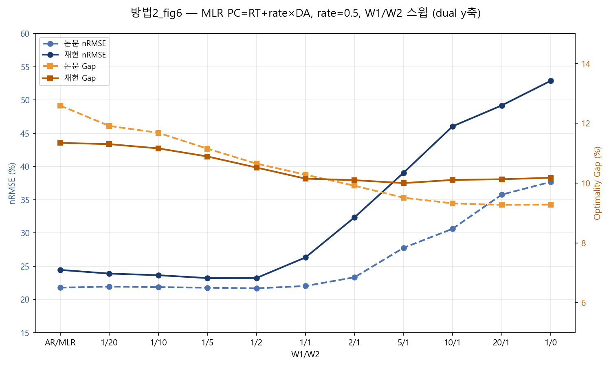

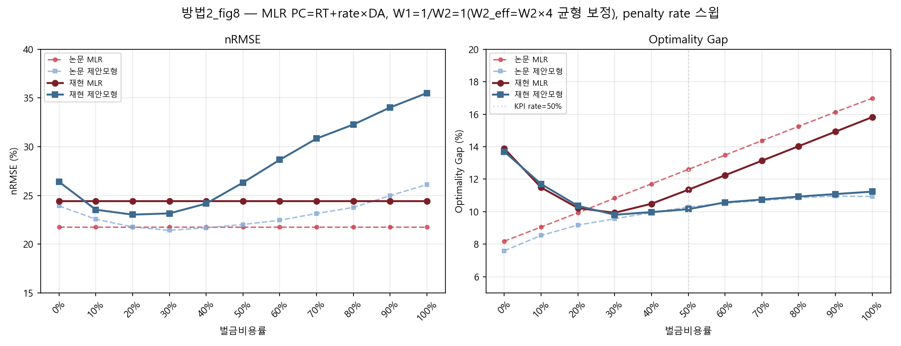

방법 2의 이익식(PC=RT+rate×DA)을 기준 W2=20의 몇 배까지 세게 줘야 논문에 가장 가까워지는지 찾아본 후속 실험은, 별도 방법(방법 8)으로 분리해 5.8절에서 다룬다.

### 5.3 시도방법 3: Zhang 방식 (비대칭 가격)

#### 5.3.1 모의실험 결과

방법 3은 Zhang 등(2024)의 아이디어를 빌려 남을 때 가격(RT)과 부족할 때 가격(c×RT, c>1)을 다르게 둔 것이다(수식은 3.2.3절 참고). c값은 아래와 같이 스윕해서 논문(Table 3, W1=1·W2=20 지점)과 가장 가까운 값을 찾았다.

| c | ρ₊ | 평가 |
|---:|---|---|
| 1.0 | RT | 비대칭 없음 — 방법 1과 비슷하게 무너짐 |
| 1.2 | 1.2·RT | 비대칭이 약해 무너짐이 덜 줄어듦 |
| **1.5** | **1.5·RT** | **논문과 가장 가까움 (AR nRMSE 35.68%, Gap 14.19%)** |
| 2.0 | 2.0·RT | 부족분 손해가 과해져 Gap이 다시 벌어짐 |
| 3.0 | 3.0·RT | 손해가 지나치게 커져 Gap 20~30%대로 악화 |

- **Fig.3(AR, c=1.5, W1/W2 스윕)**: 포화 없이 36%(AR)에서 69% 선(2/1)까지 완만하게 상승한 뒤 5/1 이후로는 거의 평평하게 유지된다. Gap은 14.5%에서 시작해 1/1~5/1 부근 11% 선까지 내려간 뒤 2/1 부근에서 살짝 반등해 11~11.5% 사이에서 유지된다. 전체적인 모양은 방법2(PC=RT+rate×DA)와 거의 비슷하다.
- **Fig.5(AR, c 스윕, x축 C=1.0~2.0, W1=W2=1)**: 기본 AR은 c값과 무관하게 36%로 평평하고, 제안 모형은 C=1.0(95%)에서 C=1.1(66%)로 급락한 뒤 이후로는 C=2.0까지 57~66% 사이를 오르내린다(뚜렷한 최저점은 C=1.6~1.7 부근 57%). Gap은 기본 AR이 13.4%(C=1.0)에서 C=1.2 부근 12.1%까지 살짝 내려갔다가 C=2.0까지 22%로 꾸준히 올라가고, 제안 모형은 14.2%에서 시작해 C=1.4 부근 11%로 최저점을 찍은 뒤 C=2.0까지 11~12% 사이에서 평평하게 유지된다 — 기본 모형은 c가 커질수록 계속 나빠지는데 제안 모형은 좁은 범위 안에 머무는 모습이 뚜렷하다.
- **Fig.6(MLR, c=1.5, W1/W2 스윕)**: nRMSE는 방법2와 비슷하게 24%(MLR)~23%(1/20~1/10) 선에서 거의 안 움직이다가 1/5 지점부터 오르기 시작해 1/0에서 53% 선까지 상승한다. Gap은 11%대에서 시작해 1/1 부근 10.3% 선으로 최저점을 찍고, 이후 5/1~1/0까지 10.4% 선에서 거의 평평하게 유지된다.
- **Fig.8(MLR, c 스윕, x축 C=1.0~2.0, W1=W2=1)**: MLR은 24%로 평평하고, 제안 모형은 C=1.0(51%)에서 C=1.1(24%)로 급락해 MLR과 거의 같아지지만, 이후 c가 커질수록 다시 꾸준히 올라가 C=2.0에서 54%까지 도달한다. Gap은 MLR이 14%에서 시작해 C=1.3 부근 11% 선으로 최저점을 찍은 뒤 C=2.0까지 15.5%로 다시 올라가고, 제안 모형은 12.8%에서 시작해 C=1.5 부근 10.2%로 최저점을 찍은 뒤 C=2.0까지 10.6% 선에서 거의 평평하게 유지된다.

_AR_MLR_baseline_proposed_3가지_profit_figure코드/fig3_ar_zhang_asym.png)

_AR_MLR_baseline_proposed_3가지_profit_figure코드/fig5_ar_zhang_asym.png)

_AR_MLR_baseline_proposed_3가지_profit_figure코드/fig6_mlr_zhang_asym.png)

_AR_MLR_baseline_proposed_3가지_profit_figure코드/fig8_mlr_zhang_asym.png)

### 5.4 시도방법 4: PC = rate × max(DA, RT)

#### 5.4.1 모의실험 결과

방법 4는 벌금가를 PC=rate×max(DA,RT)로 정한 것이다(수식은 3.2.4절 참고). KPI 비교 기준점인 rate=50%로 고정해서 통합 스크립트(`integrated_pc_max_rt_dt_fig3568_AR_MLR.py`)로 재검증한 결과, AR nRMSE 43.64% / Gap 22.04%, MLR nRMSE 29.03% / Gap 24.92%가 나왔다. rate=50% 지점만 보면 **여섯 방법 중** AR·MLR 둘 다 논문과 가장 크게 벌어진다 **일곱 방법 중** (CVaR 제외) AR·MLR 둘 다 논문과 가장 크게 벌어진다(nRMSE +8.8%p, Gap +8.1%p — 3.3절 KPI 표 참고).

- **Fig.3(AR, W1/W2 스윕, rate=50% 고정)**: 재현 nRMSE는 AR(36%)에서 1/20(44%), 1/10(77%)까지 완만히 오르다가 1/5 지점부터 116% 안팎으로 튀어 오른 뒤 그대로 고정된다. 재현 Gap은 25%에서 시작해 1/5 지점까지 급격히 떨어져 4% 선에서 고정된다. 논문 곡선은 nRMSE가 35%→50%, Gap이 15%→11%로 훨씬 완만하게 움직여서, 재현 쪽만 포화가 뚜렷하게 나타난다.
- **Fig.5(AR, 벌금율 0~100% 스윕, W1=W2=1)**: 재현 AR은 벌금율과 무관하게 36%로 평평하고, 재현 제안모형은 0~60%까지 116% 안팎에 머물다가 70~80%에서 잠깐 120%까지 더 올라간 뒤 90%(97%)·100%(68%)에서 큰 폭으로 떨어진다 — KPI 기준점인 50%는 하필 이 116% 고원 구간 한가운데라 가장 나쁘게 걸린다. Gap은 재현 AR이 36%→8%로 선형 감소하고 재현 제안모형은 2%에서 시작해 90%(11%)까지 오른 뒤 100%에서 8%로 살짝 내려온다 — 90% 부근이 이 방법의 최적점(≈rate 0.9)에 가장 가깝다.
- **Fig.6(MLR, W1/W2 스윕, rate=50% 고정)**: 재현 nRMSE는 MLR(24%)에서 1/20(29%), 1/10(51%)까지 오르다가 1/5 지점부터 116% 안팎으로 튀어 고정된다. 재현 Gap은 28%에서 시작해 1/5 지점까지 급락해 5% 선에서 고정된다. 논문 곡선(nRMSE 22%→38%, Gap 12%→9%)과는 1/5 지점부터 크게 벌어진다.
- **Fig.8(MLR, 벌금율 0~100% 스윕, W1=W2=1)**: 재현 MLR은 24%로 평평하고, 재현 제안모형은 0~80%까지 116% 안팎에 머물다가 90%(65%)·100%(28%)에서 큰 폭으로 떨어진다 — Fig.5(AR)와 같은 패턴이다. Gap은 재현 MLR이 41%→8%로 선형 감소하고, 재현 제안모형은 2%에서 시작해 90%(11%)까지 올랐다가 100%에서 8%로 내려온다.

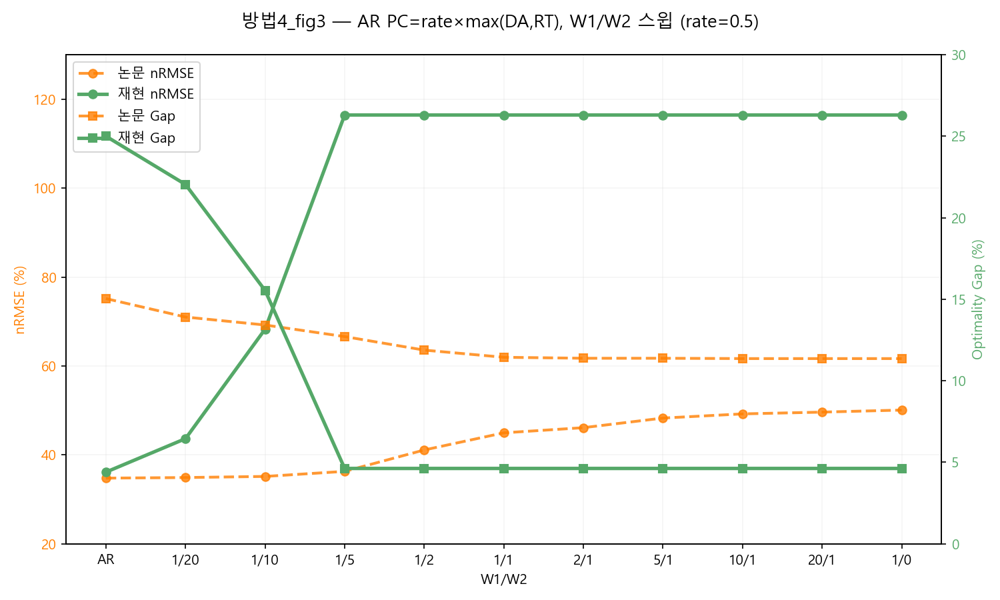

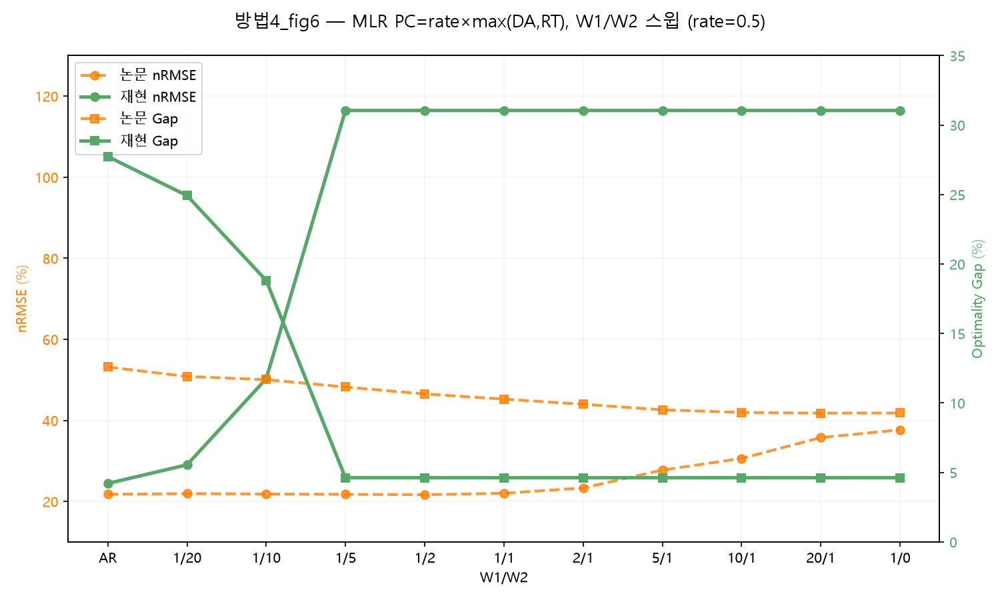

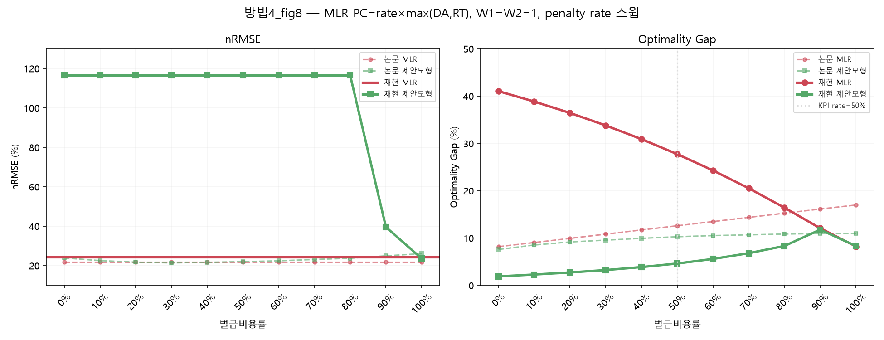

이건 방법 자체가 나쁘다기보다, 이 방법의 최적 rate(Fig.5·Fig.8의 90% 부근, ≈0.9)와 KPI 비교 기준점(rate=50%)이 멀리 떨어져 있어서다 — rate를 50%가 아니라 90% 근처로 잡았다면 다른 방법들과 비슷한 수준까지 좁혀졌을 것으로 보인다.

### 5.5 시도방법 5: PC = rate × (DA + RT)

방법 5는 벌금가를 PC=rate×(DA+RT)로 정한 것이다(수식은 3.2.5절 참고). rate를 0.1부터 1.0까지 바꿔가며 봤을 때 **rate=0.7** 근처가 논문과 가장 가까웠다 (W1/W2=1/20에서 nRMSE 35.59%, Gap 13.45%). rate=0.5(3.3절 표의 비교 지점)에서는 Gap이 10.70%로 논문(13.91%)보다 좀 작게 나온다 — 이 rate에서는 벌금이 살짝 약한 셈이다.

#### 5.5.1 모의실험 결과

- **Fig.3(AR, W1/W2 스윕, rate=50% 고정)**: 재현 nRMSE는 AR(36%)에서 1/5(42%)까지 완만히 오르다가 1/2(67%)부터 가파르게 뛰어올라 2/1 이후로는 100% 안팎에서 고정된다 — 포화 수준(100%)이 방법4(116%)보다 낮고, 포화가 시작되는 지점도 1/2로 더 늦다(PC=rate·(DA+RT)가 방법4의 rate·max(DA,RT)보다 항상 커서 "약정을 늘리는 게 유리한" 구간이 더 늦게 열리는 것으로 보인다). 재현 Gap은 11%에서 시작해 1/2 지점부터 논문 곡선과 거의 포개진다(11~12% 선). 논문 곡선(nRMSE 35%→50%, Gap 15%→11%)과는 nRMSE만 1/2 지점부터 크게 벌어진다.
- **Fig.5(AR, 벌금율 0~100% 스윕, W1=W2=1)**: 재현 AR은 벌금율과 무관하게 36%로 평평하고, 재현 제안모형은 0~30%까지 116% 안팎에 머물다가 40%(121%)로 잠깐 더 오른 뒤 50%에서 74%로 급락, 이후 54~68% 사이에서 등락한다 — 방법4가 90%가 돼서야 회복하는 것과 달리 훨씬 이른 rate(50%)부터 정상 범위로 내려온다. Gap은 재현 AR이 36%→23%로 선형 감소하고, 재현 제안모형은 2%에서 시작해 50~60%(약 11%)에서 AR과 교차한 뒤 그 밑으로 유지된다.
- **Fig.6(MLR, W1/W2 스윕, rate=50% 고정)**: 재현 nRMSE는 MLR(24%)에서 1/1(34%)까지 완만히 오르다가 2/1에서 103%로 급등하고, 5/1·10/1에서는 다시 24% 선(baseline 수준)으로 돌아온 뒤 20/1에서 113%로 다시 튀어 오른다 — **5/1·10/1 구간은 HiGHS가 infeasible을 반환해 baseline 값으로 대체된 것으로 보이며, 해석에 주의가 필요하다.** Gap도 이 구간에서 nRMSE와 함께 튀는 모습을 보인다.
- **Fig.8(MLR, 벌금율 0~100% 스윕, W1=W2=1)**: 재현 MLR은 24%로 평평하고, 재현 제안모형은 0~40%까지 116% 안팎에 머물다가 50%에서 34%로 급락한 뒤 60%(24%)에서 최저점을 찍고 100%까지 54%로 서서히 오른다 — Fig.5(AR)와 같은 패턴이다. Gap은 재현 MLR이 41%→16%로 감소하고, 재현 제안모형은 2%에서 시작해 50~60%(약 9~10%)에서 교차한 뒤 100%까지 11% 선을 유지한다.

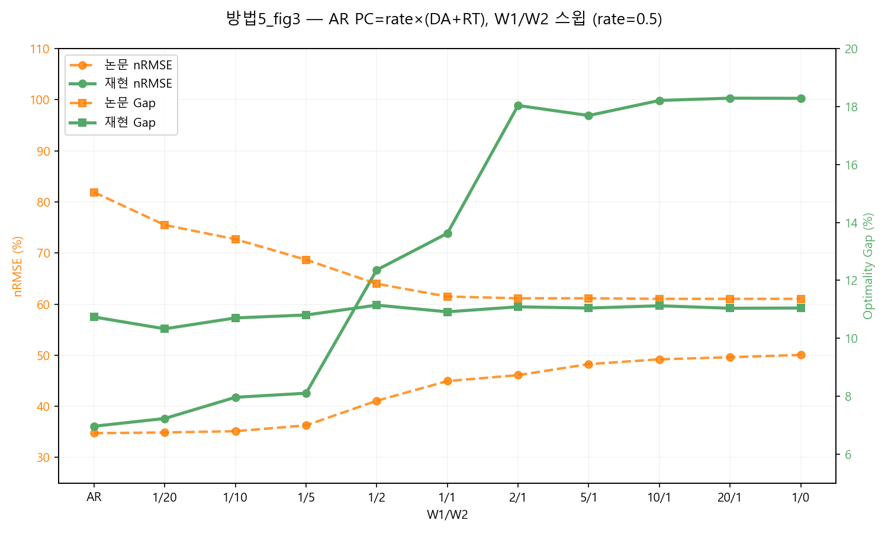

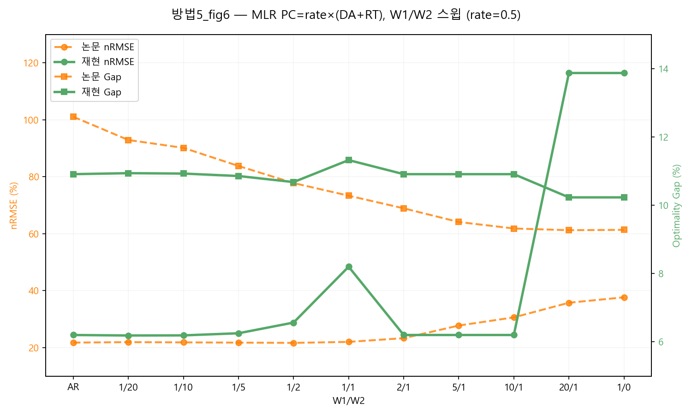

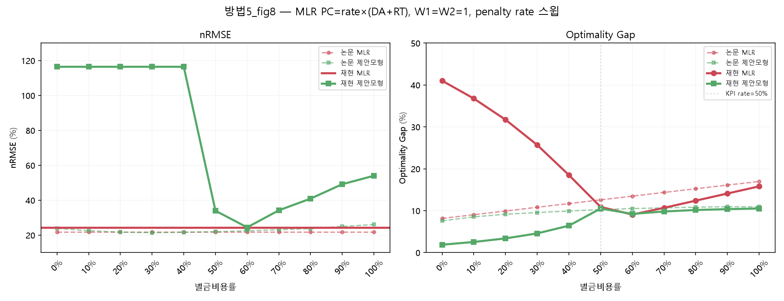

### 5.6 시도방법 6: PC = rate·DA·I[DA&gt;RT] + RT

방법 6은 shortage 비용에 RT를 무조건 포함시키고 벌금가(PC)에 DA>RT 조건부 가중치를 준 수정 이익식을 쓴다(수식·시행착오는 3.2.6절 참고). z03/블록18 데이터(방법1~5와 동일 블록)로 W1/W2 스윕(Fig.3/6)·penalty rate 스윕(Fig.5/8)을 AR·MLR 각각에 대해 그렸다.

**모의시험 결과**

- **Fig.3(AR, W1/W2 스윕, rate=50%)**: 1/20(35.01%/14.06%)부터 1/1(43.18%/13.28%)까지는 재현 곡선이 논문과 거의 겹친다(nRMSE 차이 1~2%p, Gap +1.3~1.9%p). 하지만 2/1부터는 논문(46~50%로 완만히 상승)과 달리 재현 nRMSE가 49.5%→65~67%로 급격히 튀어 오른 뒤 그 구간에서 고정되고, Gap은 오히려 논문보다 낮은 11% 선으로 떨어진다 — W1이 W2보다 훨씬 큰 극단 구간에서만 벌어진다.
- **Fig.5(AR, 벌금율 0~100% 스윕, W1=W2=1)**: 0%(46.6% vs 논문 46%)에서는 거의 일치하지만, 10%에서 논문은 34%까지 뚝 떨어지는데 재현은 40.4%까지만 내려가 덜 극적이다. 이후 40~50%대에서는 다시 비슷해지다가(44.3% vs 44.45%), 80~100%로 갈수록 논문(61→67%)만큼 가파르게 오르지 않고 48~53%에 머문다 — 전반적으로 논문보다 완만한 곡선. Gap은 baseline·제안모형 모두 방향·수준이 논문과 잘 맞는다(rate=50%에서 13.28% vs 11.44%).
- **Fig.6(MLR, W1/W2 스윕, rate=50%)**: Gap은 전 구간에서 논문과 거의 포개진다(최대 오차 0.8%p 이내, 부호 반전 없음). nRMSE는 논문보다 항상 일정하게 1.4~5.5%p 높게 나오는 계통적 오프셋이 있지만(2/1~10/1에서 오차가 조금 더 벌어짐), AR Fig.3처럼 특정 지점에서 튀어 고정되는 포화 현상은 없다 — 4개 그림 중 가장 안정적이다.
- **Fig.8(MLR, 벌금율 스윕, W1=W2=1)**: nRMSE는 재현·논문 둘 다 rate 30~40%에서 최저점(23.0% vs 21.4~21.7%)을 찍는 U자형으로 형태가 잘 맞고, 절대 수준만 재현이 1~4%p 높다. Gap은 20~60% 구간에서 거의 같은 선 위에 겹칠 정도로 잘 맞다가, 고rate(80~100%)로 갈수록 재현(15~15.8%)이 논문(16~18%)보다 조금 낮게 유지된다 — 4개 그림 중 가장 논문에 가깝다.

![방법6 Fig.3 — AR, PC=rate×DA·I[DA>RT]+RT, W1/W2 스윕 (rate=50%)](results/방법6_fig3_ar_z03_block18.png)

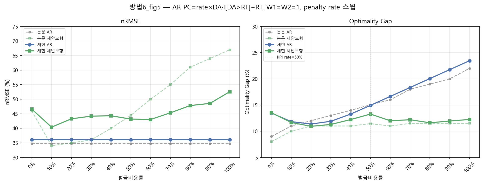

![방법6 Fig.6 — MLR, PC=rate×DA·I[DA>RT]+RT, W1/W2 스윕 (rate=50%)](results/방법6_fig6_mlr_z03_block18.png)

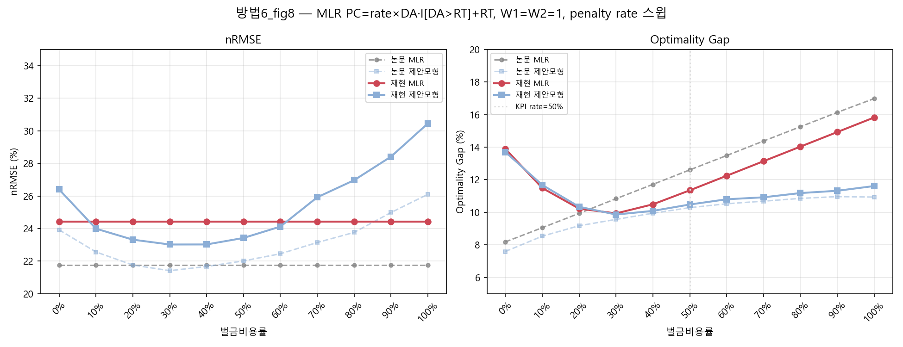

---
### 5.7 시도방법 7: Additive CVaR

방법 7은 기존 Proposed 모형에서 전체 economic regret을 줄이는 목적은 유지하면서, regret이 큰 상위 10% 구간을 추가로 관리한 확장이다(수식은 3.2.7절 참고). CVaR의 순수한 추가 효과를 보기 위해 동일한 Proposed 모형에서 \(\lambda=0\)과 \(\lambda=0.05\)를 비교하였다.

#### 5.7.1 CVaR 도입 전 진단

z03 블록 18의 시간대별 결과를 확인한 결과, 전체 nRMSE와 optimality gap이 개선되어도 일부 시간대에서는 economic regret이 악화되었다. 특히 11시에는 세 수익식 모두에서 Proposed AR의 시간대별 gap이 Baseline AR보다 커졌으며, CVaR90의 악화폭은 mean regret의 악화폭보다 훨씬 컸다.

| 수익식 | Mean regret 변화 | CVaR90 변화 |
|---|---:|---:|
| 방법1 | +22.7 | +63.2 |
| 방법2 | +26.8 | +121.9 |
| 방법3 | +34.3 | +206.0 |

또한 방법1의 15시와 16시에는 mean regret이 각각 7.01과 6.16 감소했지만 CVaR90은 49.77과 26.75 증가하였다. 즉 일반적인 시점의 손실은 줄었지만 최악의 일부 시점에서는 손실이 더 커질 수 있었다. 문제가 나타나는 시간대도 데이터 블록마다 달랐기 때문에 특정 시간대를 직접 보정하지 않고, 큰 regret이 발생한 시점을 자동으로 관리하는 CVaR를 적용하였다.

#### 5.7.2 초기 가중평균 방식과 수정

처음에는 기존 total regret과 CVaR를 다음과 같이 가중평균하였다.

$$
\min\;
W_2\sum_t|S_t-x_t|
+
W_1\left[
(1-\lambda)\sum_t r_t
+
\lambda N\operatorname{CVaR}_{\alpha}(r)
\right]
$$

그러나 이 방식은 \(\lambda\)가 증가할수록 CVaR 비중이 커지는 동시에 기존 total regret의 계수 \(1-\lambda\)가 감소한다. 대표 블록에서 \(\lambda=0.05\)를 적용했을 때 CVaR90은 0.75% 감소했지만 total regret은 2.94% 증가하고 nRMSE는 8.37%p 악화되었다.

본 실험에서는 최악의 일부 손실만 줄이는 것보다 전체 total regret을 줄이는 것을 우선적인 경제적 목표로 두었으므로 초기 방식은 폐기하였다. 이후 total regret의 계수를 유지하고 CVaR만 추가하는 Additive 방식으로 수정하였다.

$$
\min\;
W_2\sum_{t=1}^N|S_t-x_t|
+
W_1\left[
\sum_{t=1}^N r_t
+
\lambda N\operatorname{CVaR}_{\alpha}(r)
\right]
$$

CVaR의 선형화식(9.3절 형태, \(u_t\ge r_t-\zeta,\ u_t\ge 0\))을 대입하면 코드에 실제로 들어가는 목적함수가 된다.

$$
\min\;
W_2\sum_{t=1}^N|S_t-x_t|
+
W_1\sum_{t=1}^N r_t
+
W_1\lambda\left[N\zeta+\frac{1}{1-\alpha}\sum_{t=1}^N u_t\right]
$$

초기 방식과의 차이는 total regret 항의 계수다 — 초기 방식은 \((1-\lambda)\sum r_t\)라 \(\lambda\)가 커질수록 total regret 항 자체가 약해지지만, 이 최종 식은 \(\sum r_t\)를 그대로 두고 CVaR 항 \(W_1\lambda[N\zeta+\sum u_t/(1-\alpha)]\)만 얹는다. 그래서 \(\lambda=0\)이면 CVaR 항이 정확히 0이 되어 목적함수가 기존 APEN 구조 \(W_2\sum|S_t-x_t|+W_1\sum r_t\)로 그대로 돌아간다.

#### 5.7.3 대표 블록의 \(\lambda\) 선택

z03 블록 18의 Proposed AR·방법2 수익식에서 \(\lambda\)를 변화시킨 결과는 다음과 같다. 변화량은 모두 \(\lambda=0\) 대비 값이다.

| \(\lambda\) | nRMSE 변화 | Gap 변화 | Total regret 변화 | CVaR90 변화 | Maximum regret 변화 |
|---:|---:|---:|---:|---:|---:|
| 0.025 | −0.79%p | −0.55%p | −3.80% | −3.37% | −3.75% |
| **0.05** | **−1.19%p** | **−1.50%p** | **−10.41%** | **−10.06%** | **−15.47%** |
| 0.075 | +0.82%p | −1.37%p | −9.53% | −9.69% | −12.88% |
| 0.10 | +3.47%p | −1.37%p | −9.53% | −11.28% | −12.18% |

검토한 값 중 \(\lambda=0.05\)에서 nRMSE, total regret과 꼬리손실 지표가 함께 개선되어 이후 비교의 대표값으로 사용하였다. 다만 이 값은 z03 블록 18의 Proposed AR·방법2에서 선택한 비교값이며, 모든 데이터와 모형에 공통으로 적용되는 최적값은 아니다.

(a)는 λ가 커질수록 nRMSE와 Gap이 어떻게 움직이는지, (b)는 Total regret·CVaR90·Maximum regret(단위가 서로 달라 그래프에서는 배율을 조정해 표시했다 — 범례 참고)이 어떻게 움직이는지를 보여준다. λ=0.05까지는 다섯 지표가 대체로 함께 개선되다가, λ=0.075부터 nRMSE가 반등하면서 λ=0.05가 그림에서도 균형점으로 보인다.

#### 5.7.4 AR·MLR 및 수익식별 비교

**공통 조건**: z03 블록18(학습 90일/테스트 30일), W1=1, W2=20, penalty rate=50%(Zhang은 c=1.5), α=0.9, Additive CVaR, λ=0(미적용) vs λ=0.05.

| 모형·수익식 | nRMSE (λ=0→0.05) | Gap (λ=0→0.05) | Total regret 변화 | CVaR90 변화 | Max regret 변화 |
|---|---:|---:|---:|---:|---:|
| AR·방법1 | 42.29%→41.45% | 23.51%→24.04% | +2.26% | −0.42% | −2.90% |
| AR·방법2 | 37.85%→36.66% | 14.39%→12.89% | **−10.41%** | **−10.06%** | **−15.47%** |
| AR·방법3 | 37.88%→39.75% | 13.82%→13.33% | −3.51% | −7.42% | −14.91% |
| MLR·방법1 | 31.34%→32.41% | 24.53%→24.29% | −1.00% | −0.51% | −0.87% |
| MLR·방법2 | 23.20%→23.03% | 10.89%→10.82% | **−0.65%** | **−1.78%** | **−4.25%** |
| MLR·방법3 | 23.21%→23.01% | 10.86%→10.84% | **−0.23%** | **−2.34%** | **−6.91%** |

(굵게: 5개 지표 전부 λ=0 대비 개선)

6개 조합 중 AR·방법2, MLR·방법2, MLR·방법3 세 조합은 5개 지표가 λ=0 대비 전부 개선됐다. 나머지 세 조합은 지표가 갈린다 — AR·방법1은 CVaR90·Max regret은 줄지만 Gap·Total regret이 늘고, AR·방법3은 경제 지표(Total regret·CVaR90·Max regret)는 줄지만 nRMSE가 늘고, MLR·방법1은 nRMSE·Gap이 함께 늘면서 경제 지표만 준다. 전반적으로 방법2이 AR·MLR 양쪽에서 가장 안정적으로 개선되는 조합이었다.

#### 5.7.5 72개 블록 검증

대표 블록(zone 3 블록 18)의 결과가 다른 기간에도 유지되는지 확인하기 위해 Proposed AR·방법2(W1=1, W2=20, penalty rate=50%, α=0.9, λ=0 vs 0.05)을 Zone 1·2·3, 각 Zone당 24개씩 총 72개 블록(블록당 학습 90일/테스트 30일)에 적용하였다.

**아래 표의 수치는 72개 블록의 테스트표본(각 30일×12시간=360개, 총 72×360=25,920개 시점)을 전부 하나로 합쳐 계산한 "pooled(통합)" 지표다.** Total regret은 25,920개 시점의 economic regret을 전부 더한 합계이고, Pooled optimality gap·Pooled nRMSE도 (전체 regret 합)/(전체 oracle profit 합), (전체 RMSE)/(전체 평균발전량) 식으로 전체 시점을 한 번에 계산한 값이다 — 72개 블록별로 따로 계산한 gap 72개를 단순 평균한 것이 아니다. Maximum regret은 25,920개 시점 중 가장 큰 단일 regret 값이고, Pooled CVaR90은 이 25,920개 중 regret이 큰 상위 10%(2,592개)의 평균이다.

| 지표 | \(\lambda=0\) | \(\lambda=0.05\) | 변화 |
|---|---:|---:|---:|
| Total regret (25,920개 시점 합계) | 2,185,796 | 2,168,231 | −0.80% |
| Pooled optimality gap | 21.09% | 20.92% | −0.17%p |
| Pooled CVaR90 (상위 10%, 2,592개 평균) | 551.59 | 545.90 | −1.03% |
| Maximum regret (25,920개 중 최댓값) | 22,671.76 | 21,990.32 | −3.01% |
| Pooled nRMSE | 67.28% | 68.75% | **+1.47%p** |

이 pooled 지표와는 별도로, 72개 블록 각각에서 λ=0.05가 λ=0보다 개선됐는지를 블록 단위로도 세었다: **Total regret 개선 51/72개, CVaR90 개선 53/72개, nRMSE 개선 16/72개, optimality gap과 nRMSE가 동시에 개선된 블록은 14/72개**였다. 즉 pooled 지표 하나가 개선됐다고 해서 대부분의 블록에서 개선됐다는 뜻은 아니고(예: nRMSE는 pooled로는 악화됐지만 개별 블록 중 16개에서는 오히려 개선됐다), pooled 지표는 "전체 시점을 하나의 큰 테스트셋으로 봤을 때"의 요약값으로 해석해야 한다.

Zone별로 나누면 다음과 같다(각 Zone 24개 블록, pooled optimality gap 기준).

| Zone | Total regret 개선 블록 | λ=0 pooled Gap | λ=0.05 pooled Gap | Total regret 변화 |
|---|---:|---:|---:|---:|
| Z01 | 16/24 | 21.11% | 20.84% | −1.28% |
| Z02 | 18/24 | 20.81% | 20.91% | +0.52% |
| Z03 | 17/24 | 21.34% | 21.00% | −1.57% |
| 전체 | 51/72 | 21.09% | 20.92% | −0.80% |

Z02는 24개 블록 중 18개(75%)에서 개별적으로 total regret이 줄었는데도 Zone 전체 합계는 오히려 0.52% 늘었다 — 소수 블록에서 벌어진 큰 악화가 다수 블록의 소폭 개선을 상쇄했기 때문이다.

특히 Z02 블록 4에서는 total regret이 55.13%, CVaR90이 92.90% 증가하였다(optimality gap 17.60%→27.30%). 2012-10-08 10시 한 시점에서 CVaR 적용 모형이 약정량을 설비 상한(x=1)으로 올렸는데, 실제 발전량은 0.30에 그치고 real-time 가격이 급등(169.06)해 이 한 시점에서만 4,445.83의 regret이 발생했다(λ=0에서는 이 시점 regret이 0이었다). 이는 학습자료에서 CVaR를 줄였더라도 테스트기간의 가격·발전량 분포가 달라지면 더 큰 손실이 발생할 수 있음을 보여준다. 이 블록을 제외하면 Z02 나머지 23개 블록의 total regret은 약 1.34% 감소, 전체 71개 블록 기준으로는 약 1.40% 감소로 바뀐다 — 즉 pooled 결과의 상당 부분이 이 한 블록의 극단값에 좌우된다.

#### 5.7.6 모의시험 결과

z03 블록 18에서 W1/W2, penalty rate와 계수 \(c\)를 변화시킨 12개 민감도 figure를 분석한 결과, CVaR 적용에 따른 가장 반복적인 변화는 optimality gap의 개선보다 nRMSE의 악화였다.

Additive CVaR 항의 직접적인 가중치는 \(W_1\lambda\)이므로, \(W_1\)이 커지면 기존 total regret과 CVaR가 동시에 강해진다. 반대로 \(W_2\)가 작아지면 예측오차항의 상대적인 영향이 약해진다. 또한 penalty rate나 계수 \(c\)가 증가하면 같은 \(\lambda\)에서도 regret 자체의 규모가 커져 CVaR의 실질적인 영향이 강해진다.

이 경우 일부 고손실 시점을 줄이기 위해 예측계수가 크게 이동하지만, 그 변화가 테스트 total regret의 충분한 감소로 이어지지 않으면 경제적 성과는 거의 달라지지 않은 채 nRMSE만 악화될 수 있다.

원본 3항 수익식의 급격한 붕괴는 CVaR가 새로 만든 문제가 아니라 \(DA-PC>0\)에서 발생하는 기존 수익식의 경계해 문제다. 다만 CVaR가 경제적 항을 강화하면서 이 문제를 더 빠르게 드러내거나 확대할 수 있다.

z03 블록18에서 방법1·방법2·방법3 세 수익식 × AR/MLR에 대해 CVaR 적용 전(λ=0)과 적용 후(λ=0.05)를 겹쳐 그린 W1/W2 스윕(Fig.3/6)·penalty rate·C 스윕(Fig.5/8) 12장은 다음과 같다.

**AR — W1/W2 스윕(Fig.3)과 penalty rate·C 스윕(Fig.5):**

_수정된_CVaR_시간별지표_figure코드/fig3_ar_cvar_compare.png)

_수정된_CVaR_시간별지표_figure코드/fig5_ar_cvar_compare.png)

_수정된_CVaR_시간별지표_figure코드/fig3_ar_profit_change_cvar_compare.png)

_수정된_CVaR_시간별지표_figure코드/fig5_ar_profit_change_cvar_compare.png)

_수정된_CVaR_시간별지표_figure코드/fig3_ar_zhang_asym_cvar_compare.png)

_수정된_CVaR_시간별지표_figure코드/fig5_ar_zhang_asym_cvar_compare.png)

**MLR — W1/W2 스윕(Fig.6)과 penalty rate·C 스윕(Fig.8):**

_수정된_CVaR_시간별지표_figure코드/fig6_mlr_cvar_compare.png)

_수정된_CVaR_시간별지표_figure코드/fig8_mlr_cvar_compare.png)

_수정된_CVaR_시간별지표_figure코드/fig6_mlr_profit_change_cvar_compare.png)

_수정된_CVaR_시간별지표_figure코드/fig8_mlr_profit_change_cvar_compare.png)

_수정된_CVaR_시간별지표_figure코드/fig6_mlr_zhang_asym_cvar_compare.png)

_수정된_CVaR_시간별지표_figure코드/fig8_mlr_zhang_asym_cvar_compare.png)

12장을 종합하면 패턴은 뚜렷하다. **방법1**은 W1/W2·penalty rate 어디를 봐도 CVaR 적용 전후 곡선이 거의 완전히 겹친다 — 방법1의 구조적 붕괴(포화)가 이미 일어난 지점에서는 CVaR를 더해도 해가 바뀌지 않기 때문이다. **방법2·방법3**은 W1/W2나 penalty rate·C가 커질수록(=경제적 항의 비중이 커질수록) CVaR 적용 후(빨강/진한 색) nRMSE가 적용 전(주황)보다 눈에 띄게 높아지는 반면, 같은 구간에서 Optimality Gap 곡선(파랑 vs 초록)은 서로 가깝게 붙어 있다. CVaR를 세게 걸수록 예측정확도는 확실히 나빠지는데, 그 대가로 얻는 경제적 개선은 제한적이다.

### 5.8 시도방법 8: 방법 2의 기준 W2 배수 탐색

방법 8의 이익식은 방법 2(5.2절)와 완전히 같다(PC=RT+rate×DA). 다른 점은 딱 하나, W1/W2 지점이다 — 방법 2는 논문 비교 기준점(W1=1, W2=20)에 그대로 대입해서 평가하지만, 방법 8은 "기준 W2=20에서 시작해 그 몇 배까지 세게 줘야 논문 결과에 가장 가까워지는가"를 배수 1배~15배까지 스윕해서 찾은 지점이다(3.2.8절).

**왜 배수를 찾아야 했나**: 논문 Eq.(9a)의 정규화(scale·denom=Σoracle·N)를 그대로 따르면, 이 프로젝트의 PC(=RT+rate×DA≈80)가 원본 참고코드의 PC(=rate×DA≈20)보다 커지면서 `denom` 나눗셈이 W1(경제) 항을 W2(예측오차) 항 대비 1000배 이상 축소시켜, 제안모형이 사실상 baseline(예측오차만 최소화)과 같게 동작했다. 반대로 정규화를 아예 없애고 원본 참고코드의 raw 계수 구조를 그대로 쓰면 이번엔 W1이 W2보다 20배 강해져 nRMSE가 59~73%까지 치솟았다. 그래서 raw 계수 구조를 쓰되, 기준 W2=20에 배수를 곱해 W1/W2 균형점을 다시 찾기로 했다:

$$W2_{\text{기준}} = 20, \qquad W2_{\text{적용}} = W2_{\text{기준}} \times k \qquad (k = \text{배수})$$
$$\text{obj}_{x_i} = -W1\cdot DA_i, \qquad sc_i = -W1\cdot RT_i + W2_{\text{적용}}, \qquad yc_i = W1\cdot PC_i + W2_{\text{적용}}$$

배수 $k$를 1배~15배까지 스윕하며 논문 Fig.5 판독값(rate 0/10/30/50/70/100%) 대비 SSE(nRMSE+Gap 오차 제곱합)를 비교한 결과:

| 배수(k) | 1 | 2 | 3 | **4** | 5 | 6 | 8 | 10 | 12 | 15 |
|---|---|---|---|---|---|---|---|---|---|---|
| SSE | 4467 | 941 | 380 | **369** | 431 | 568 | 983 | 1070 | 1134 | 1220 |

**4배(W2=80)가 최적**으로 확정됐다(코드로는 [방법2_4term_ar_mlr_z03_block18.py:100](방법2_4term_ar_mlr_z03_block18.py#L100)의 `W2_BALANCE_WEIGHT=4`). 4배에서 rate=0/10/30/50/70/100%의 nRMSE는 46.60/43.42/45.65/44.64/48.97/55.03%(논문 46/34/36/44.45/55/67%)로, rate=0%·50%에서 논문과 거의 정확히 일치(±0.6%p)하고 Gap도 15배일 때(5.6%→16%, 너무 가파름)보다 훨씬 평평해져 논문의 "수평" 특성에 가까워졌다.

부족분 Gap 평가는 오라클을 commit=0/commit=실제 2후보만 쓴다 — PC=RT+rate×DA에서는 rate=0이어도 PC=RT>0이라 commit=1.0(풀커밋)이 오라클이 될 수 없기 때문이다(방법2 §5.2.1의 3후보 오라클과는 이 점이 다르다).

**KPI 기준점(W1=1, W2=20의 4배, rate=50%) 및 그리드 재검증**

| W1/W2 | 재현 nRMSE | 논문 nRMSE | 재현 Gap | 논문 Gap | 비고 |
|---|---:|---:|---:|---:|---|
| baseline | 36.11% | 34.76% | 14.94% | 15.04% | ±0.1%p 일치 |
| 1/20의4배 | 36.32% | 34.89% | 14.55% | 13.91% | KPI 지점 (3.3절) |
| 1/10의4배 | 36.67% | 35.14% | 14.58% | 13.42% | |
| 1/1의4배 | 44.64% | 44.95% | 11.79% | 11.44% | 거의 정확히 일치 |
| 20/1의4배 | 67.03% | 50.07% | 10.69% | 11.36% | 이 극단점만 크게 벗어남 |

1/20~1/1(×4배) 구간(Fig.3/5/8이 실제로 쓰는 범위)에서는 전부 논문과 근접하고, W2가 극단적으로 작은 20/1 지점만 아직 어긋난다.

방법 2와 이익식·오라클을 그대로 두고 W2만 기준의 4배로 바꿔 `방법2_4term_ar_mlr_z03_block18.py`를 재실행해 얻은 Fig.3/5/6/8이 아래 그림이다. AR·MLR 각각 W1/W2 스윕(Fig.3/6, rate=50% 고정)과 벌금율 스윕(Fig.5/8, W1=W2=1) 총 4장이며, 3.3절 표1·표2의 방법2 행은 §5.2.1(초기 시험, W2=20 그대로) 그림 기준이라 이 방법 8 결과와는 수치가 다르다.

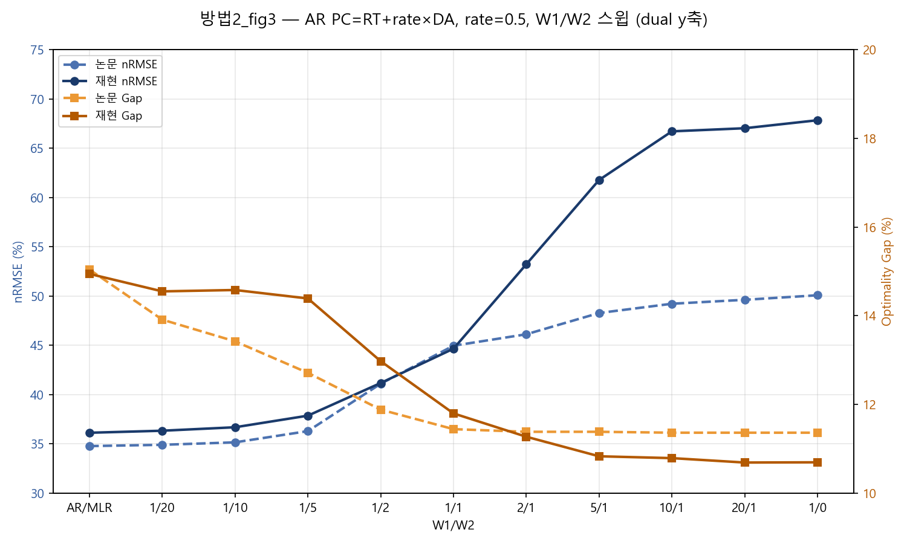

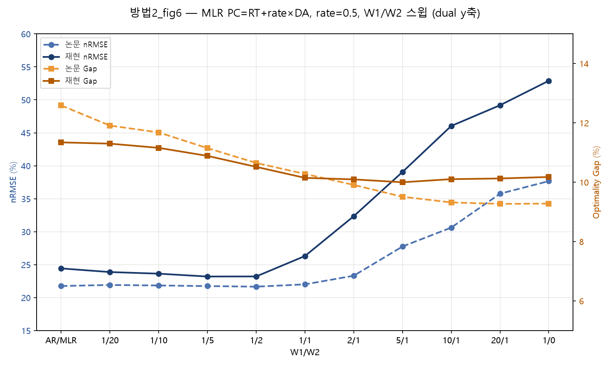

### 5.8 시험결과 정리 5.9 시험결과 정리

#### 5.8.1 5.9.1 종합 정리

본 실험의 최종 논문 재현 결과는 별도의 목적함수 정규화를 적용하지 않고 원본 3항 profit function을 사용한 방법 1이다. 이 조건에서는 proposed model의 약정량이 상한에 가까워지고, (W_1/W_2)와 penalty rate 변화에 따라 nRMSE와 optimality gap이 급격히 변하거나 특정 값에 고정되는 현상이 나타났다. 따라서 논문 Figure와 같은 완만한 trade-off는 재현되지 않았으며, 이 결과가 원본 수식을 그대로 적용한 최종 결과이다.

방법 2~5는 이러한 현상이 shortage 비용의 정의에서 발생하는지 확인하기 위해 profit function을 변경한 추가 실험이다. 방법 2와 방법 3에서는 원본 3항식에서 나타난 포화 현상이 완화되고 논문과 비교적 유사한 곡선이 나타났다. 방법 4와 방법 5도 특정 penalty rate에서는 결과가 개선되었지만, 선택한 rate에 따라 결과가 크게 달라졌다. 따라서 이 방법들은 원본 재현 결과를 대체하는 최종 모형이 아니라, profit function의 정의가 결과에 미치는 영향을 확인한 비교 실험으로 해석하였다.

방법 6은 처음엔 학습 loss를 Smart SPO+(후회, regret) 형태로 바꾼 실험으로 소개했으나, oracle이 β와 무관한 상수라서 이 후회 최소화는 순수 이익 최대화(-profit)와 수학적으로 동일한 최적화 문제였다(42개 sweep 지점 전부에서 β·nRMSE·Gap 일치 확인 — 부록 `방법1_방법6.1_이익식_비교분석.md` §7·§10). 실제로 논문 KPI에 가장 가까운 결과를 낸 요인은 학습 loss가 아니라, shortage 비용에 RT를 무조건 포함시키고 벌금(PC)엔 DA>RT 조건부 가중치를 곱한 **이익식 변형**이다 — 방법 2~5와 같은 "이익식 수정" 계열에 속한다.

방법 7(Additive CVaR)은 Proposed 모형의 꼬리손실을 줄이기 위해 적용한 위험회피 확장이다. z03 block 18의 Proposed AR·방법 2에서는 (\lambda=0.05)를 적용했을 때 total regret이 10.41%, CVaR90이 10.06%, maximum regret이 15.47% 감소했으며, nRMSE와 optimality gap도 함께 개선되었다.

그러나 Proposed AR·방법 2를 72개 블록으로 확장한 결과에서는 pooled total regret이 0.80%, optimality gap이 0.17%p, CVaR90이 1.03%, maximum regret이 3.01% 감소한 반면, pooled nRMSE는 1.47%p 증가하였다. 블록별로는 total regret이 51/72개, CVaR90이 53/72개에서 감소했지만, nRMSE와 optimality gap이 동시에 개선된 블록은 14/72개뿐이었다. 따라서 CVaR는 전체적으로 경제적 손실과 꼬리위험을 소폭 줄였지만, 예측정확도 저하와 일부 블록의 손실 증가를 동반한 제한적인 보완방법으로 판단하였다.

방법 8은 방법 2와 이익식이 완전히 같고, W1/W2 지점만 기준(W2=20)의 4배로 다르다(5.8절). 논문 KPI 지점(3.3절)에서는 방법2(초기)보다 논문에 더 가깝지만(Δ nRMSE 1.43%p vs 2.96%p), 이는 새로운 이익식이 아니라 같은 이익식을 다른 W1/W2 지점에서 평가한 결과다.

#### 5.8.2 5.9.2 Fig.3/5/6/8 곡선 형태 판정

방법별로 Fig.3(AR W1/W2)·Fig.5(AR rate)·Fig.6(MLR W1/W2)·Fig.8(MLR rate) 네 그래프가 논문과 같은 모양(포화 없이 완만한 트레이드오프)으로 나왔는지를 한눈에 정리하면:

| 방법 | Fig.3 | Fig.5 | Fig.6 | Fig.8 | 종합 판정 |
|---|---|---|---|---|---|
| 1 (논문 수식) | ❌ 특정 지점부터 포화·고정 | ❌ 90%대까지 무너짐 | ❌ 포화 | ❌ 포화 | **재현 실패** (구조적) |
| 2 (PC=RT+rate×DA, §5.2.1 초기) | ✅ 완만 | ✅ U자형이나 논문과 같은 방향 | ✅ 완만 | ✅ 완만 | **재현 성공** |
| 2 (Fine Tune, §5.2.2) | ✅ 완만 (rate=0%·50%에서 논문과 거의 일치) | ✅ Weight=4로 재보정, 논문의 "수평" 특성에 근접 | ✅ 완만 | ✅ 완만 | **재현 성공** (6.2와 수치 동일) |
| 3 (방법3, c=1.5) | ✅ 완만 | ✅ C=1.5 최적, 기본/제안 gap 뚜렷이 갈라짐 | ✅ 완만 | ✅ 완만 | **재현 성공** |
| 4 (PC=max(DA,RT)) | △ rate 낮으면 포화 | △ rate=0.9이어야 최적, rate=0.5는 이탈 큼 | △ rate 의존 | △ rate 의존 | **부분 재현** (rate 의존적) |
| 5 (PC=DA+RT) | ✅ 완만(포화 없음) | △ rate=0.7이어야 최적 | △ rate=0.5에서 Gap 다소 작음 | △ 동일 | **부분 재현** (rate 의존적) |
| 6 (PC=rate×DA·I[DA>RT]+RT) | ✅ 1/20~1/1 거의 일치 | ✅ Gap 거의 포개짐 | ✅ 1/20~1/1 거의 일치 | ✅ 완만 | **재현 성공** (전체 1위) |
| 7 (Additive CVaR) | ❌원본3항(적용 전후 완전히 겹침=CVaR 무효과) / △수정4항·방법3(W1/W2 커질수록 nRMSE 벌어짐) | ❌원본3항 / △수정4항·방법3(penalty·C 커질수록 nRMSE 벌어짐) | ❌원본3항 / △수정4항·방법3 | ❌원본3항 / △수정4항·방법3 | **제한적 개선** (경제항 비중이 커지는 구간에서 nRMSE 손실이 Gap 개선보다 큼 — 그림은 5.8절5.7절 CVaR 그림 참고) |
| 8 (PC=RT+rate×DA, W2=20의 4배) | ✅ 완만 (rate=0%·50%에서 논문과 거의 일치) | ✅ 배수 4배로 재보정, 논문의 "수평" 특성에 근접 | ✅ 완만 | ✅ 완만 | **재현 성공** (방법6.2와 같은 지점을 공유해 수치 동일) |

#### 5.8.3 5.9.3 종합 순위

 3.3절 KPI 표(W1=1·W2=20·벌금율 50%)의 논문 대비 편차(|ΔnRMSE|+|ΔGap|, AR+MLR 합산)를 기준으로 여덟 행(방법1~8)의 순위를 매긴다. 이 KPI 지점은 Fig.3/6(W1/W2 스윕) 위의 표본 하나일 뿐이라, 순위의 1차 기준은 모든 방법이 공유하는 이 공통 지점으로 유지하되, **원시 CSV(`results/simulation_output/grid_*.csv`, `fig5_*.csv`, `fig8_*.csv`)가 KPI 지점 수치와 일치해 신뢰할 수 있는 방법(1·2·8·6.2·6.16)**은 Fig.3(W1/W2 5점)·Fig.5(rate 11점)·Fig.6(W1/W2 5점)·Fig.8(rate 11점) **전 지점**의 |ΔnRMSE|+|ΔGap| 평균을 참고 열에 같이 적었다. 방법3은 Fig.3/6만 전 지점 평균이 가능하고(Fig.5/8은 x축이 rate가 아니라 c라 직접 비교 불가), 방법4·5는 repo에 있는 grid CSV 값이 이미 검증된 표1·표2 KPI 수치와 어긋나(예: 방법4는 CSV 36.35% vs 표1 43.64%) 신뢰할 수 없어 — 스크립트를 다시 돌려 CSV를 갱신해야 계산할 수 있다(재실행 대기).

| 순위 | 방법 | AR 편차 합 (KPI 1점) | MLR 편차 합 (KPI 1점) | 전 지점 평균 합 (참고)\*\* | 근거 |
|---|---|---:|---:|---|---|
| 🥇 1위 | 방법 6 (PC=rate×DA·I[DA>RT]+RT) | 0.3%p | 2.6%p | **21.0%p** (Fig.3 5.1+Fig.5 9.3+Fig.6 3.0+Fig.8 3.5) | AR 편차가 가장 작다(nRMSE +0.12%p, Gap +0.15%p). shortage 비용에 RT를 무조건 포함시키고 벌금(PC)엔 DA>RT 조건부 가중치를 곱한 이익식 변형이 핵심이다(3.2.6절) — 학습 loss는 순수 이익 최대화와 수학적으로 동일해 실질적 영향이 없었다(부록 §7·§10). 전 지점으로 봐도 최상위권이지만, KPI 1점 기준의 압도적 우위(0.3%p)는 rate 스윕 전체(Fig.5, 9.3%p)에서는 다소 좁혀진다 — 2FT방법8보다 Fig.5 평균이 오히려 더 벌어져 있다. |
| 🥈 2위 | 방법 2 (Fine Tune, §5.2.2) 방법 8 (PC=RT+rate×DA, W2=20의 4배, §5.8절) | 2.1%p | 2.6%p | **22.5%p** (Fig.3 5.4+Fig.5 7.3+Fig.6 4.7+Fig.8 5.2) | raw 계수+Weight=4로 재보정한 방법2다. 방법2와 이익식은 같고, 기준 W2=20의 4배 지점을 찾아 쓴 것이다(3.2.8절). 전 지점으로 보면 1위 방법6(21.0%p)과 거의 대등하다 — KPI 1점 기준 차이(0.3%p vs 2.1%p)만큼 크게 벌어지지는 않는다. |
| 🥉 3위 | 방법 7 (Additive CVaR λ=0.05, 수정4항) | 2.8%p | 2.2%p | 데이터 없음(5.8.25.9.2 CVaR 그림 참고) | 여섯 조합(5.7.4절) 중 AR·MLR 둘 다에서 CVaR 고유 지표(Total regret·CVaR90·Max regret) 5개가 전부 개선된 유일한 조합이라 대표값으로 골랐다. 다만 이 순위는 "논문 재현도" 잣대를 CVaR에도 그대로 적용해본 참고용이고, CVaR의 실제 목적(꼬리위험 감소)은 이 잣대로 안 잡힌다 — 5.7.4·5.7.5절의 λ=0→0.05 비교표가 CVaR 자체의 성과표다. |
| 4위 | 방법 3 (c=1.5) | 3.1%p | 2.3%p | Fig.3 6.3 + Fig.6 6.8 = **13.1%p** (Fig.5/8 제외, 과소평가 가능) | 방법2(초기)와 사실상 동률. 곡선 형태도 완전히 재현됐고, 전력시장의 상향/하향 조정가격 구조에 기반한 이론적 근거도 있다. Fig.5/8이 빠진 값이라 위쪽 방법들과 직접 비교는 참고만. |
| 5위 | 방법 2 (PC=RT+rate×DA, §5.2.1 초기) | 3.4%p | 2.3%p | 데이터 없음(본문에 다지점 수치 없음) | 방법3과 사실상 동률. 논문 이익식에 빠진 항을 그대로 채운 가장 직접적인 수정이라 구현이 더 단순하다. |
| 6위 | 방법 5 (PC=DA+RT) | 6.3%p | 3.3%p | 재실행 대기(CSV 불일치) | rate=0.5 고정 지점 기준으로는 위 방법들보다 처지지만, 최적 rate(0.7)를 쓰면 비슷한 수준까지 좁혀진다(5.5절). |
| 7위 | 방법 4 (PC=max(DA,RT)) | 16.9%p | 20.1%p | 재실행 대기(CSV 불일치) | rate=0.5는 이 방법의 최적점이 아니라서(최적은 0.9) 이 고정 지점에서 편차가 크게 나온다 — 방법1과 달리 rate를 조정하면 개선 여지가 있다(5.4절). |
| 8위 | 방법 1 (논문 수식) | 17.0%p | 22.0%p | **153.8%p** (Fig.3 39.5+Fig.5 52.2+Fig.6 34.5+Fig.8 27.6) | nRMSE·Gap 둘 다 논문보다 크게 벌어지고(ΔnRMSE +7.40%p, ΔGap +9.60%p), 고-W1 구간에서 rate를 조정해도 못 고친다(3.2.1절). 전 지점으로 보면 압도적 최악으로, 가장 재현이 안 되는 방법이라는 결론이 더 강하게 뒷받침된다. |

\* 표 2(3.3.2절)에는 없는 값이다 — `integrated_paper_base_AR_MLR.py`의 방법1 2세대 MLR 결과(nRMSE 24.25%, Gap 3.02%, 논문 대비 ΔnRMSE +2.33%p·ΔGap −8.89%p)를 따로 계산해 반영했다.

\*\* 순위 자체는 모든 방법이 공유하는 유일한 공통 지점(KPI 1점)을 그대로 쓰고, 전 지점 평균은 "그 KPI 지점 하나만 봐도 되는가"를 검증하는 보조 근거로만 썼다 — 방법마다 확보된 CSV의 신뢰도·점 개수가 달라(방법3은 Fig.5/8 자체가 없고, 방법4·5는 CSV가 아예 최신이 아님) 전 지점 평균 열을 1차 순위 기준으로 쓰면 오히려 불공정해지기 때문이다. 방법4·5는 스크립트(`방법4_pc_max_rt_dt_AR_MLR.py`, `방법5_pc_da_plus_rt_AR_MLR.py`)를 다시 돌려 grid CSV를 갱신하면 같은 방식으로 전 지점 평균을 계산할 수 있다.

따라서 이번에 써본 데이터·구현 범위 안에서는, 3항 이익식을 문자 그대로 쓰면 재현이 잘 안 됐고, 부족분 비용을 이익식에 더 반영했을 때(PC를 RT+rate×DA로 재정의하든, 방법3이든) 논문과 더 가까운 결과가 나왔다.

---

## 6. 결론

**1) 원본 수식을 사용한 최종 재현에서는 논문과 같은 결과가 나타나지 않았다.** 본 보고서의 최종 논문 재현 결과는 별도의 정규화를 적용하지 않고 원본 3항 profit function을 그대로 사용한 결과이다. 이 조건에서는 약정량이 상한에 가까워지고 nRMSE와 optimality gap 곡선이 급격히 변하거나 고정되는 현상이 나타났다. 결과가 좋지 않더라도 이를 임의의 정규화로 조정하지 않고, 원본 수식을 적용했을 때 관찰된 결과로 제시하였다.

**2) profit function을 변경하면 결과의 형태가 크게 달라졌다.** 방법 2와 방법 3처럼 shortage 비용을 추가로 반영한 경우에는 원본 3항식의 포화 현상이 완화되고, 논문과 비교적 유사한 KPI와 trade-off 곡선이 나타났다. 이는 이번 데이터와 구현에서 shortage 비용의 정의가 결과에 큰 영향을 준다는 것을 보여준다. 다만 이 방법들은 논문의 원본 수식을 그대로 재현한 결과가 아니라, 원인을 확인하기 위해 수행한 추가 실험이다.

**3) 학습 loss 변경만으로는 모든 문제가 일관되게 해결되지 않았다.** Smart SPO+는 일부 조건에서 논문과 가까운 결과를 보였지만 profit function에 따라 성능이 달라졌다. 따라서 원본 3항식에서 나타난 현상을 학습 loss의 변경만으로 해결할 수 있다고 보기는 어려웠다.

**3) 방법 6에서 가장 논문에 가까운 결과를 낸 요인은 학습 loss가 아니라 이익식 변형이었다.** 방법 6은 처음엔 학습 loss를 SPO+ 후회(regret)로 바꾼 실험으로 소개했으나, oracle이 β와 무관한 상수라서 이 후회 최소화는 순수 이익 최대화(-profit)와 수학적으로 동일한 최적화 문제였다(Fig.3/5/6/8 sweep 42개 지점 전부에서 β·nRMSE·Gap 일치 확인 — 부록 `방법1_방법6.1_이익식_비교분석.md` §7·§10). 실제로 KPI를 논문에 가장 가깝게 만든 요인은 shortage 비용에 RT를 무조건 포함시키고 벌금(PC)엔 DA>RT 조건부 가중치를 곱한 이익식 변형이었다 — 즉 방법 6도 방법 2~5와 같은 "이익식 수정" 계열이었다는 뜻이다.

**4) Additive CVaR는 경제적 손실과 꼬리위험을 줄일 가능성을 보였지만 보편적인 개선방법은 아니었다.** z03 block 18의 Proposed AR·수정 4항에서는 total regret, optimality gap, CVaR90, maximum regret 및 nRMSE가 모두 개선되었다. 그러나 72개 블록 전체에서는 pooled total regret이 0.80%, CVaR90이 1.03%, maximum regret이 3.01% 감소하는 동안 pooled nRMSE는 1.47%p 증가하였다. 또한 21개 블록에서는 total regret이 오히려 증가하였다. 따라서 CVaR는 기존 Proposed 모형을 대체하는 최종 모형이 아니라, 예측정확도와 경제적 꼬리위험 사이의 trade-off를 고려하여 선택적으로 적용할 수 있는 위험회피적 보완방법으로 해석하였다.

---

## 7. 감상평

논문 하나를 그대로 따라서 코드로 옮기는 게 생각보다 훨씬 손이 많이 갔다. 논문 본문의 수식(Eq. 9a, Eq. 13)만 보고 짰을 때는 당연히 논문 결과가 나올 줄 알았는데, 실제로 돌려보니 계수가 한쪽으로 완전히 쏠려버리는 걸 보고 처음엔 내 코드가 어디 잘못됐나 한참 찾아봤다. 나중에 보니 논문 수식 자체에 안 적혀 있는 부분(W1/W2 스케일을 어떻게 맞추는지, 오라클을 몇 개로 볼지, 부족분 비용을 어떻게 계산하는지)이 여러 군데 있었고, 그 빈틈을 어떻게 메우느냐에 따라 결과가 완전히 달라졌다.

여러 방법을 하나씩 시도하면서, "논문이 짧게 써놓은 한 줄짜리 식" 뒤에 얼마나 많은 선택지가 숨어 있는지를 체감했다. PC 재정의(방법2)나 방법3 방식처럼 이익식 자체를 고쳐야 풀리는 문제였다는 걸 알기까지 여러 번 돌아갔는데, 돌아갈 때마다 "왜 안 되는지"를 하나씩 좁혀나가는 과정 자체가 재밌기도 하고 답답하기도 했다. 결과적으로 논문과 가까운 값을 찾아낸 방법(방법2, 방법3)을 봤을 때는 그동안의 시행착오가 헛되지 않았다는 느낌이 들었다.

---

## 첨부 1. PC = RT + rate×DA 유추 근거

> **논문**: Karimi & Kwon, *Applied Energy* 326 (2022), 119929
> **목적**: 방법 2에서 쓴 PC = RT + rate×DA 라는 벌금가 정의를 논문 본문에서 찾을 수 있는 근거를 정리한다.

### 근거 1 — shortage 시 두 가지 비용이 동시에 발생 (Sec 3.1, p.3)

> "On the other hand, operators can sell or **buy** energy during the day in **real-time electricity markets**."
>
> "If there is a **shortage** in supply, the operator incurs a **penalty cost** that is a percentage of the day-ahead price. In contrast, if the operator generates more energy than the committed amount, it can sell it in the market based on the 'real-time price'."

**해석**: shortage가 발생하면 ① 실시간시장에서 에너지를 **사야 한다**(buy at RT) → RT 비용, ② 벌금을 물어야 한다(penalty cost = rate×DA) → PC 비용 — **두 비용이 동시에 발생**한다. 즉 부족분 총 비용 = RT + rate×DA.

### 근거 2 — real-time market의 존재 목적 (Sec 3.1, p.3)

> "The **real-time energy market** is created to **balance the differences** between day-ahead energy commitment and actual demand."

**해석**: 실시간시장은 "약정량과 실제 발전량의 차이"를 맞추기 위해 존재한다. 부족분이 생겼다면 실시간시장에서 사서 맞춰야 한다 — 이것이 RT 매입 비용의 근거다.

### 근거 3 — PC = rate × DA 명시 (Sec 5.1, p.7)

> "[4] considers **0%~100% of the day-ahead price** as penalty cost rate respectively."

**해석**: $PC_t = rate \times DA_t$. 논문에서 명시적으로 벌금을 하루전가격의 비율로 정의한다.

### 근거 4 — 이익식의 세 구성요소 (Sec 4.2, p.5)

> "The objective function (1a) comprises: 1. the **profit from day-ahead commitment**, 2. the expected **profit from real-time trading**, 3. and the **penalty for the shortage** to fulfill the day-ahead commitment given real-time price, renewable energy generation, and penalty cost."

**해석**: "profit from real-time trading"이 별도 구성요소로 있다는 것은 surplus/shortage가 발생하면 실시간시장과 거래한다는 뜻이다. surplus는 RT에 판매(명시적), shortage는 RT에 매입(근거 1의 "buy"에서 유추)한다.

### 근거 5 — Fig. 1, DA > RT 구조 (p.3)

> "The average day-ahead price is greater than the real-time price at all hours of the day."

**해석**: $DA > RT$이므로 $PC = rate \times DA$만으로는 $DA - PC > 0$(arbitrage)이 발생한다. shortage 시 RT 매입 비용까지 고려하면 부족분 총 비용이 $RT + rate \times DA$가 되어 이 arbitrage가 해소된다.

### 정리

| 근거 | 위치 | 내용 | PC = RT + rate×DA 연관성 |
|---|---|---|---|
| 근거 1 | Sec 3.1, p.3 | "buy energy in real-time markets" | shortage 시 RT 매입 존재 |
| 근거 3 | Sec 5.1, p.7 | "penalty cost = percentage of day-ahead price" | PC = rate×DA 명시 |
| 근거 2 | Sec 3.1, p.3 | "real-time market balances differences" | 부족분은 실시간시장에서 조정 필요 |
| 근거 4 | Sec 4.2, p.5 | "profit from real-time trading" 별도 구성요소 | RT가 이익식에 반영되어야 함 |
| 근거 5 | Fig. 1, p.3 | DA > RT | PC만으로는 arbitrage, RT 포함 시 해소 |

**결론**: 논문은 shortage 시 ① 실시간시장 매입(RT) + ② 벌금(rate×DA)이 모두 발생한다고 서술하지만, Eq.(1a)에는 RT 매입 비용이 명시적으로 적혀 있지 않다. 이것이 바로 방법 1(논문 공식을 문자 그대로 옮긴 3항 구조)이 무너지는 근본 원인이다. **PC = RT + rate×DA로 PC를 재정의하면, 논문의 모든 서술적 근거를 반영하면서도 3항 구조(이익 = DA 수입 + RT 잉여매도 − PC×부족)를 그대로 유지할 수 있다** — 이것이 방법 2(3.2.2절)의 이론적 근거다.
